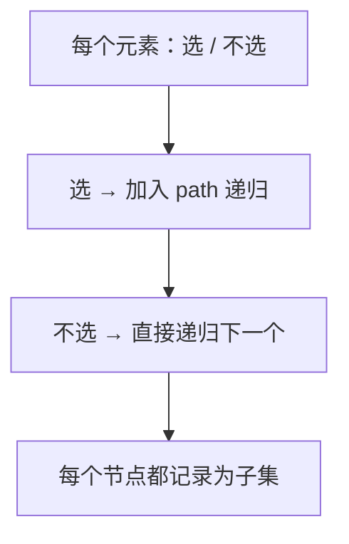

# 78. 子集

## 📌 题目

给你一个整数数组 `nums` ，数组中的元素 **互不相同** 。返回该数组所有可能的子集（幂集）。

解集 **不能** 包含重复的子集。你可以按 **任意顺序** 返回解集。

示例：
```
输入：nums = [1,2,3]
输出：[[],[1],[2],[1,2],[3],[1,3],[2,3],[1,2,3]]
```

🔗 [LeetCode 78](https://leetcode.cn/problems/subsets/description/?envType=study-plan-v2&envId=top-100-liked)

## 🛒 人话理解 & 🧠 思路演进



大家好，我是忍者算法。上次拆解了全排列问题，今天我们来攻克它的"近亲"——子集问题。这道题看似简单，但想要写出最优解却暗藏玄机。准备好了吗？让我们开启今天的算法之旅！

### 🛍 从超市购物说起

小红在超市挑选水果，货架上有苹果、香蕉、橙子。她发现：
- 每种水果都可以选择拿或不拿
- 不同的拿法会形成不同的组合
- 空袋子也是一种有效组合

这不正是子集问题的现实场景吗？

### 💡 问题的本质

LeetCode 78题"子集"的描述：
```
给定一个整数数组 nums，其中元素互不相同
返回所有可能的子集（幂集）

示例：
输入：nums = [1,2,3]
输出：[[],[1],[2],[1,2],[3],[1,3],[2,3],[1,2,3]]
```

### 🤔 关键解题思路是什么？

与全排列不同，子集问题要求：
1. 元素顺序不影响结果（[1,2]和[2,1]视为同一个子集）
2. 通过索引控制选择范围，避免重复组合
3. 每个节点状态都是有效解（即时记录路径）

### 🎬 模拟运行：回溯树深度解析

以nums=[1,2,3]为例，看算法如何生成所有子集：


初始状态：空路径[]
- 第一层决策：选择起始元素
  - 选1 → 路径[1]
    - 第二层决策：在1之后选择
      - 选2 → 路径[1,2]
        - 第三层决策：在2之后选择
          - 选3 → 路径[1,2,3]
      - 选3 → 路径[1,3]
  - 选2 → 路径[2]
    - 第三层决策：在2之后选择
      - 选3 → 路径[2,3]
  - 选3 → 路径[3]

每个决策节点都会将当前路径加入结果集！

### ⚡ 代码实现：优雅的回溯解法

> 👉 代码实现见下方「🐍 Python 代码」

### 🎯 算法核心要点

1. **索引控制**：通过start参数限制选择范围，避免重复组合
2. **即时记录**：每次递归都保存当前状态，不漏掉任何子集
3. **剪枝优化**：自然避免了逆序组合的出现

### 📊 复杂度分析

时间复杂度：O(n×2ⁿ)
- 生成所有2ⁿ个子集
- 每个子集需要O(n)时间复制

空间复杂度：O(n)
- 递归栈深度最大为n
- 临时路径存储空间

### 🎯 面试官灵魂拷问

Q：如果数组包含重复元素怎么办？  
A：先排序，回溯时跳过相邻重复元素（对应LeetCode 90题）

Q：如何只输出大小为k的子集？  
A：在终止条件中增加长度判断（对应LeetCode 77题组合问题）

Q：如何用迭代法实现？  
A：通过位掩码表示元素选择状态，例如3位二进制数对应8种子集

### 💡 举一反三

同类型问题：
- 组合总和（LeetCode 39）
- 子集II（LeetCode 90）
- 字母大小写全排列（LeetCode 784）
- 分割回文串（LeetCode 131）

### 🎁 思考题

给定一个含重复元素的数组nums，如何高效生成所有不重复子集？要求时间复杂度低于O(2ⁿ)是否可能？

欢迎在评论区分享你的思路，我们将在下期题解中揭晓答案！

### 📝 代码模板总结

子集问题的通用解法：
1. 将当前路径加入结果集
2. 遍历可选择的元素范围
3. 做出选择并更新索引
4. 递归处理后续元素
5. 撤销选择继续尝试

## 🐍 Python 代码

```python
class Solution:
    def subsets(self, nums: List[int]) -> List[List[int]]:
        result = [[]]
        
        # 遍历 nums 数组中的每个元素
        for num in nums:
            # 使用列表推导式生成新的子集并直接添加到结果集中
            result.extend(subset + [num] for subset in result)
        
        return result
```
