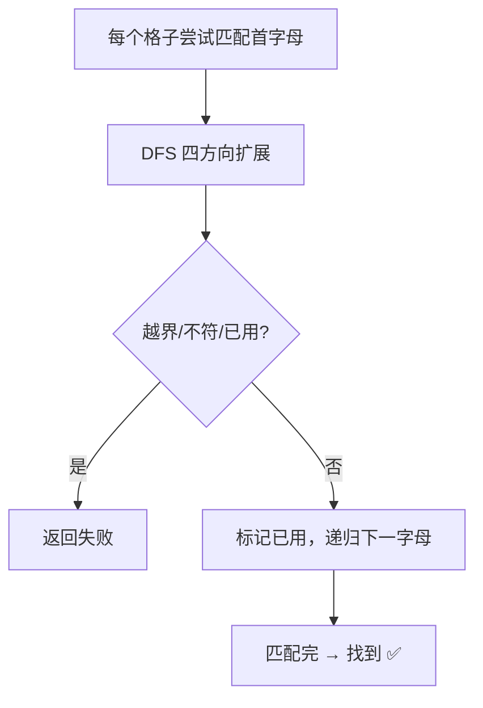

# 79. 单词搜索

## 📌 题目

给定一个 `m x n` 二维字符网格 `board` 和一个字符串单词 `word` 。如果 `word` 存在于网格中，返回 `true` ；否则，返回 `false` 。

单词必须按照字母顺序，通过相邻的单元格内的字母构成，其中“相邻”单元格是那些水平相邻或垂直相邻的单元格。同一个单元格内的字母不允许被重复使用。

示例：

```
输入：board = [["A","B","C","E"],["S","F","C","S"],["A","D","E","E"]], word = "ABCCED"
输出：true
```

🔗 [LeetCode 79](https://leetcode.cn/problems/word-search/description/?envType=study-plan-v2&envId=top-100-liked)

## 🛒 人话理解 & 🧠 思路演进



大家好，我是忍者算法。今天我们来挑战一道非常有意思的题目 - LeetCode 79「单词搜索」。这道题不少同学第一次见时都会有点懵，但别担心，跟着我用"蚂蚁觅食"的思路，保证让你豁然开朗！

### 🌟 妙趣横生的生活场景

想象一下，你是一只正在寻找食物的小蚂蚁。你站在一片格子状的区域里，需要找到一条通往食物的路径。每走一步只能在上下左右四个方向移动，而且为了避免兜圈子，走过的格子就不能再走了。

这不就是我们在字母矩阵中搜索单词的过程吗？每个字母就像是一个路标，我们需要找到一条路径，让这些路标连起来正好拼成目标单词。

### 💡 题目剖析

**题目要求**：
给定一个 m x n 的字符矩阵 board 和一个字符串 word，如果 word 在矩阵中存在，返回 true；否则返回 false。规则是：
- 单词必须按照字母顺序，通过相邻的单元格内的字母构成
- 相邻单元格就是字母周围上、下、左、右四个方向
- 同一个单元格内的字母不允许被重复使用

让我们看个例子：
```
board = [
  ['A','B','C','E'],
  ['S','F','C','S'],
  ['A','D','E','E']
]
word = "ABCCED"  // 返回 true
```

### 🤔 解题思路的演进

让我们像教小朋友玩游戏一样，一步步理解解决方案：

### 第一步：从何处开始？
就像蚂蚁需要先找到起点一样，我们要先找到单词的第一个字母。这个字母可能在矩阵的任何位置，所以我们需要搜索整个矩阵来找可能的起点。

### 第二步：怎么继续走？
找到起点后，就像蚂蚁循着气味寻找食物，我们需要看看四周的字母是否匹配单词的下一个字母。这就用到了经典的深度优先搜索（DFS）策略。

### 第三步：避免走回头路
蚂蚁会留下信息素标记走过的路，我们也需要标记已经使用过的字母，避免重复使用。这可以通过一个访问标记数组来实现。

### 🚀 代码实现

> 👉 代码实现见下方「🐍 Python 代码」

### 🎯 难点解析

### 1. 起点选择
很多同学一开始就卡在了"从哪里开始找"这个问题上。实际上，我们需要尝试每个可能的起点，只要找到一条路径就可以了。这就像蚂蚁在找食物时，会从不同的位置出发探索。

### 2. 路径记录
如何避免重复使用字母？我们使用了一个 visited 数组来标记已经访问过的位置。这就像蚂蚁留下的信息素，告诉自己"这条路已经走过了"。

### 3. 回溯处理
当一条路径走不通时，我们需要恢复现场，尝试其他路径。这就是为什么我们在探索完一个方向后，要把 visited 标记重置为 false。

### 💡 优化思路

一些实用的优化技巧：

1. **提前判断**：可以先检查矩阵中每个字母的出现次数，如果某个字母出现次数少于 word 中的出现次数，直接返回 false。

2. **方向选择优化**：根据当前位置和目标单词的关系，可以优先选择更有可能成功的方向。

3. **空间优化**：可以直接修改原矩阵来标记访问状态，省去 visited 数组。（面试时请先和面试官讨论是否允许修改输入）

### 🎯 相似题目引申

这道题的解题思路可以应用到很多类似的问题上：
- 岛屿数量（LeetCode 200）
- 矩阵中的最长递增路径（LeetCode 329）
- 单词搜索 II（LeetCode 212）

## 🐍 Python 代码

```python
class Solution:
    def exist(self, board: List[List[str]], word: str) -> bool:
        rows, cols = len(board), len(board[0])
        
        # 定义回溯函数，参数为当前搜索的行、列以及当前匹配到的字符索引
        def backtrack(r, c, index):
            if index == len(word):
                return True
            
            # 如果越界，或者当前单元格的字符不匹配，返回 False
            if r < 0 or r >= rows or c < 0 or c >= cols or board[r][c] != word[index]:
                return False
            
            # 暂时标记这个单元格为已访问，避免重复使用
            temp, board[r][c] = board[r][c], '#'
            
            # 四个方向进行探索：上、下、左、右
            found = (
                backtrack(r + 1, c, index + 1) or  # 向下
                backtrack(r - 1, c, index + 1) or  # 向上
                backtrack(r, c + 1, index + 1) or  # 向右
                backtrack(r, c - 1, index + 1)     # 向左
            )
            
            # 回溯：恢复当前单元格的值
            board[r][c] = temp
            
            return found
        
        # 遍历每一个网格中的位置，尝试寻找单词的第一个字母
        for i in range(rows):
            for j in range(cols):
                # 如果从某个位置找到了单词，直接返回 True
                if backtrack(i, j, 0):
                    return True
        
        # 如果遍历完所有的起点都没有找到，返回 False
        return False
```
