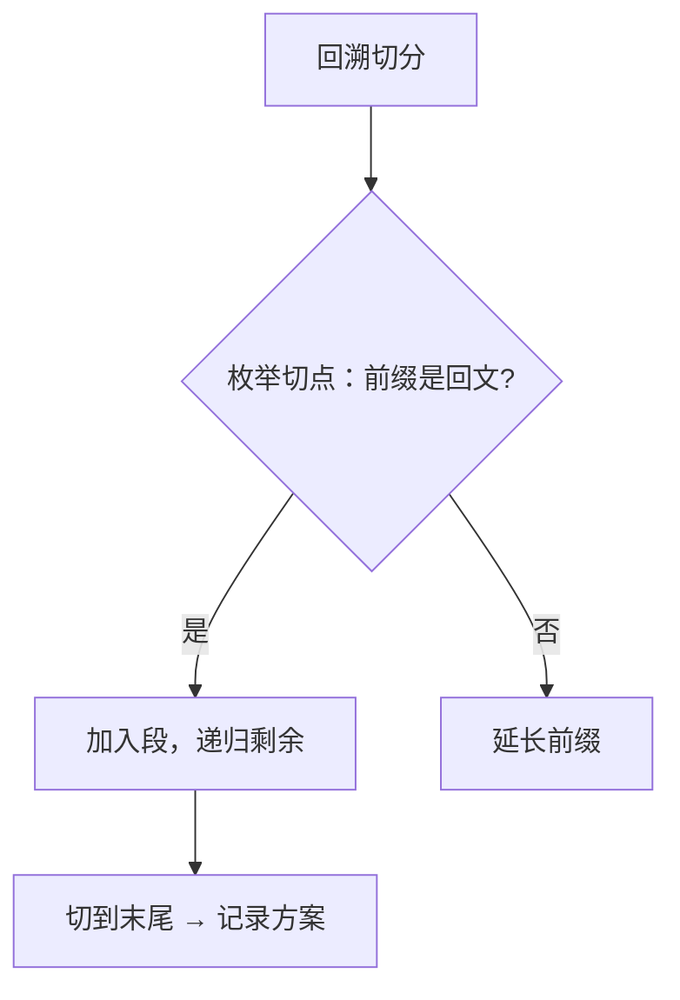

# 131. 分割回文串

## 📌 题目

给你一个字符串 `s`，请你将 `s` 分割成一些子串，使每个子串都是 **回文串** 。返回 `s` 所有可能的分割方案。

示例：
```
输入：s = "aab"
输出：[["a","a","b"],["aa","b"]]
```

🔗 [LeetCode 131](https://leetcode.cn/problems/palindrome-partitioning/description/?envType=study-plan-v2&envId=top-100-liked)

## 🛒 人话理解 & 🧠 思路演进



大家好，我是忍者算法。今天我们来挑战一道非常有趣的题目 - LeetCode 131「分割回文串」。这道题乍看有点复杂，但用我们小时候玩积木的思维来理解，你会发现它其实非常有意思！

### 🎮 妙趣横生的童年回忆

还记得小时候玩积木吗？我们经常需要把一根长积木切分成不同的小块，每个小块都要符合某种特定的规则。今天的算法题就像是在玩一个特殊的积木游戏：我们要把一个字符串切分成若干小段，每一段都必须是回文串。

比如"aab"这个积木，我们可以这样切：
- ["a", "a", "b"]  
- ["aa", "b"]

是不是一下子觉得亲切了很多？

### 💡 问题本质探索

**题目要求**：
给定一个字符串 s，将 s 分割成一些子串，使每个子串都是回文串。返回所有可能的分割方案。

让我们看个具体例子：
```
输入：s = "aab"
输出：[["a","a","b"], ["aa","b"]]
```

### 🤔 解题之前的思考

想象我们面对一个积木（字符串），需要考虑以下几个关键问题：

1. 在哪里可以切？
   - 理论上每个字符之间都可以切
   - 但切完的每一段都必须是回文串
   
2. 切还是不切？
   - 在每个可能的切割点，我们都面临"切"或"不切"的选择
   - 这暗示了我们可能需要用回溯算法来尝试所有可能性

### 🚀 积木切割大法

### 核心思路：回溯 + 动态规划优化

> 👉 代码实现见下方「🐍 Python 代码」

### 代码解释

就像玩积木时我们会：
1. 先观察每段积木是否符合要求（使用dp数组预处理所有回文子串）
2. 从起点开始，尝试不同的切割位置（回溯过程）
3. 记录所有符合要求的切割方案（result列表）

### 🎯 难点突破

### 1. 回文串判断优化
很多同学一开始都用暴力方法判断回文串，导致效率很低。使用动态规划预处理所有可能的回文子串，可以大大提高效率：
- dp[i][j] 表示 s[i..j] 是否为回文串
- 状态转移：dp[i][j] = (s[i] == s[j]) && dp[i+1][j-1]

### 2. 回溯过程处理
在每个位置，我们都面临"切"还是"不切"的选择：
- 如果切，当前子串必须是回文串
- 切完后，对剩余的字符串继续进行分割
- 记得在回溯时撤销选择

### 💡 优化思路

1. **空间优化**：
   - 可以使用滚动数组优化dp数组的空间
   - 如果内存要求特别严格，可以用中心扩展法代替dp数组

2. **剪枝优化**：
   - 如果发现剩余字符无法构成回文串，可以提前返回
   - 可以记录最长回文子串长度，超过这个长度就不用尝试

### 🔄 相似题目推荐

- 分割回文串 II（LeetCode 132）
- 回文子串（LeetCode 647）
- 最长回文子串（LeetCode 5）

这些题目都围绕着回文串的特性，掌握了今天的题目，相信你对这些题目也会有新的认识！

## 🐍 Python 代码

### 🥊 暴力解（朴素对照）

不回溯、不记忆化：枚举所有 `2^(n-1)` 种切点组合（n-1 个间隙每个「切 / 不切」），再逐段验证是否回文。

```python
from typing import List

class Solution:
    def partition(self, s: str) -> List[List[str]]:
        n = len(s)
        result = []

        def is_pal(sub: str) -> bool:        # 每次都重新判断整段是否回文
            l, r = 0, len(sub) - 1
            while l < r:
                if sub[l] != sub[r]:
                    return False
                l += 1
                r -= 1
            return True

        for mask in range(1 << (n - 1)):     # n-1 个间隙，每个切或不切
            parts, prev, ok = [], 0, True
            for i in range(n - 1):           # 按掩码切分
                if mask & (1 << i):
                    parts.append(s[prev:i + 1])
                    prev = i + 1
            parts.append(s[prev:])
            for p in parts:                  # 每段都要回文
                if not is_pal(p):
                    ok = False
                    break
            if ok:
                result.append(parts)
        return result
```

- 时间复杂度：`O(2^(n-1) × n²)`，枚举全部切法，每种切法还要逐段 O(n) 判回文
- 空间复杂度：`O(n)`，单条切分临时存储（不含输出）
- ⚠️ 既枚举了全部切点、又重复判断大量重叠子串是否回文。改用回溯「前缀是回文才递归剩余」+ 切片判断，自然剪掉无效切法 → 演进到下方回溯解。

### ⚡ 最优解

```python
class Solution:
    def partition(self, s: str) -> List[List[str]]:
        def is_palindrome(sub: str) -> bool:
            # 判断子串是否是回文
            return sub == sub[::-1]
        
        def backtrack(start: int, path: List[str]):
            # 递归终止条件：如果已经到达字符串末尾，表示完成了一次有效分割
            if start == len(s):
                result.append(path[:])
                return
            
            # 尝试从 start 开始的每一个位置分割字符串
            for end in range(start + 1, len(s) + 1):
                # 获取当前子串 s[start:end]
                substring = s[start:end]
                
                # 如果当前子串是回文，继续递归处理剩余部分
                if is_palindrome(substring):
                    path.append(substring)  # 选择当前子串
                    backtrack(end, path)    # 递归处理剩余部分
                    path.pop()              # 回溯，撤销选择
        
        result = []
        backtrack(0, [])
        return result
```
