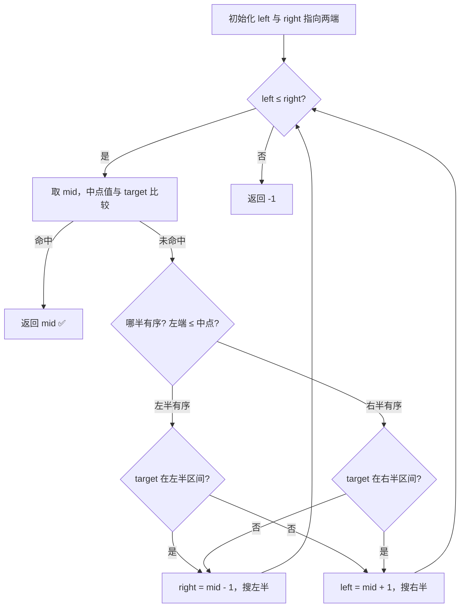
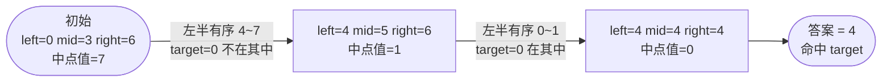

# 33. 搜索旋转排序数组

## 📌 题目

整数数组 `nums` 按升序排列，数组中的值 **互不相同** 。

在传递给函数之前，`nums` 在预先未知的某个下标 `k`（`0 <= k < nums.length`）上进行了 **旋转**，使数组变为 `[nums[k], nums[k+1], ..., nums[n-1], nums[0], nums[1], ..., nums[k-1]]`（下标 **从 0 开始** 计数）。例如， `[0,1,2,4,5,6,7]` 在下标 `3` 处经旋转后可能变为 `[4,5,6,7,0,1,2]` 。

给你 **旋转后** 的数组 `nums` 和一个整数 `target` ，如果 `nums` 中存在这个目标值 `target` ，则返回它的下标，否则返回 `-1` 。

你必须设计一个时间复杂度为 `O(log n)` 的算法解决此问题。

示例：
```
输入：nums = [4,5,6,7,0,1,2], target = 0
输出：4
```

🔗 [LeetCode 33](https://leetcode.cn/problems/search-in-rotated-sorted-array/description/?envType=study-plan-v2&envId=top-100-liked)

## 🛒 人话理解 & 🧠 思路演进



**总体一句话**：旋转数组二分后必有一半是递增的——先认出哪一半有序，再看 target 落不落在这半的有序区间内，从而每次果断砍掉另一半。

### 🔬 逐步推演（动画式）

以 `nums = [4,5,6,7,0,1,2]`，`target = 0` 为例——从左到右就是二分的时间线：**每个节点是一次指针快照（left / mid / right），箭头上写这一步认出哪半有序、target 落不落在其中、怎么收缩**：



大家好，我是忍者算法。今天要和大家分享一道特别有趣的题目 - LeetCode 33「搜索旋转排序数组」。这道题巧妙地将二分查找与旋转数组结合，是一道考察思维灵活性的经典题目。

### 📚 从时钟说起

想象你在看一个圆形时钟，如果把时钟的12点位置当作起点，顺时针记录1到12这些数字，这就是一个有序序列。现在，如果我们把时钟的指针从8点开始读数，到12点，再到7点，实际上就形成了一个"旋转"后的有序序列：8,9,10,11,12,1,2,3,4,5,6,7。这正是我们今天要处理的"旋转排序数组"！

### 💡 问题解析

**题目要求**：
给你一个整数数组 nums ，它原本是一个升序排序的数组，但在某个位置进行了旋转。现在给你一个目标值 target，请你在数组中搜索 target。如果存在则返回它的下标，否则返回 -1。

**示例**：

> 👉 代码实现见下方「🐍 Python 代码」

### 🤔 思路发展历程

### 1. 初学者思路
最简单的方法是直接遍历数组。虽然可以解决问题，但时间复杂度为O(n)，没有利用数组的特殊性质。

### 2. 进阶思路
既然原数组是有序的，只是被旋转了，那么旋转后的数组会有一个重要特性：它被分成了两个有序的部分。我们可以利用这个特性，结合二分查找来解决。

### 🚀 优雅的解决方案

> 👉 代码实现见下方「🐍 Python 代码」

### 📝 代码详解

让我们来剖析这个解决方案的精妙之处：

### 1. 核心思想
- 虽然整个数组不是有序的，但是分成两半后，必定有一半是有序的
- 通过判断哪一半有序，我们可以确定目标值在哪一半

### 2. 关键步骤
1. **找到有序部分**
   - 比较 nums[left] 和 nums[mid]
   - 如果 nums[left] <= nums[mid]，左半部分有序
   - 否则右半部分有序

2. **判断目标值位置**
   - 如果左半部分有序，判断 target 是否在区间 [nums[left], nums[mid]] 内
   - 如果右半部分有序，判断 target 是否在区间 [nums[mid], nums[right]] 内

3. **调整搜索范围**
   - 根据判断结果，调整 left 或 right 指针
   - 持续缩小搜索范围

### 🎯 易错点剖析

1. **边界条件**
   - while 循环的条件是 left <= right
   - 注意处理空数组的情况

2. **区间判断**
   - 判断区间时要考虑等号
   - nums[left] <= nums[mid] 而不是 

3. **范围收缩**
   - 在有序部分中判断时要注意区间端点
   - 收缩区间时不要漏掉或多包含元素

### 💡 举一反三

这类问题的思路可以扩展到其他场景：

1. **寻找旋转排序数组中的最小值**
   - 类似的二分思路，但判断条件不同

2. **旋转排序数组是否包含重复元素**
   - 需要考虑重复元素带来的影响

3. **在部分有序的数组中查找元素**
   - 可以利用类似的"先确定有序部分"的思路

### 🌟 面试技巧

1. **清晰的分析过程**
   - 先画图理解数组的特点
   - 分析不同情况下的处理方法

2. **代码的鲁棒性**
   - 处理好边界情况
   - 考虑输入的各种可能性

3. **优化意识**
   - 说明为什么选择二分查找
   - 分析时间复杂度的优势

### 🎨 图解算法

为了帮助大家更好地理解，我来画个示意图：

```
<svg viewBox="0 0 800 300" xmlns="http://www.w3.org/2000/svg">
  <!-- 背景 -->
  <rect width="800" height="300" fill="#f8f9fa"/>
  
  <!-- 数组框架 -->
  <g transform="translate(50,50)">
    <!-- 数组元素框 -->
    <rect x="0" y="0" width="700" height="60" fill="none" stroke="#333" stroke-width="2"/>
    <line x1="100" y1="0" x2="100" y2="60" stroke="#333" stroke-width="2"/>
    <line x1="200" y1="0" x2="200" y2="60" stroke="#333" stroke-width="2"/>
    <line x1="300" y1="0" x2="300" y2="60" stroke="#333" stroke-width="2"/>
    <line x1="400" y1="0" x2="400" y2="60" stroke="#333" stroke-width="2"/>
    <line x1="500" y1="0" x2="500" y2="60" stroke="#333" stroke-width="2"/>
    <line x1="600" y1="0" x2="600" y2="60" stroke="#333" stroke-width="2"/>
    
    <!-- 数组值 -->
    <text x="50" y="35" text-anchor="middle" font-size="20">4</text>
    <text x="150" y="35" text-anchor="middle" font-size="20">5</text>
    <text x="250" y="35" text-anchor="middle" font-size="20">6</text>
    <text x="350" y="35" text-anchor="middle" font-size="20">7</text>
    <text x="450" y="35" text-anchor="middle" font-size="20">0</text>
    <text x="550" y="35" text-anchor="middle" font-size="20">1</text>
    <text x="650" y="35" text-anchor="middle" font-size="20">2</text>
    
    <!-- 指针标注 -->
    <text x="50" y="85" text-anchor="middle" font-size="16" fill="#1e88e5">left</text>
    <text x="350" y="85" text-anchor="middle" font-size="16" fill="#e91e63">mid</text>
    <text x="650" y="85" text-anchor="middle" font-size="16" fill="#1e88e5">right</text>
  </g>
  
  <!-- 旋转点说明 -->
  <path d="M 400,140 Q 450,140 450,170" fill="none" stroke="#666" stroke-width="2" marker-end="url(#arrow)"/>
  <text x="500" y="160" font-size="16">旋转点</text>
  
  <!-- 有序区间标注 -->
  <g transform="translate(50,200)">
    <path d="M 0,20 H 300" stroke="#4caf50" stroke-width="3" marker-end="url(#arrow)"/>
    <text x="150" y="45" text-anchor="middle" font-size="16" fill="#4caf50">左半部分有序</text>
    
    <path d="M 400,20 H 700" stroke="#ff9800" stroke-width="3" marker-end="url(#arrow)"/>
    <text x="550" y="45" text-anchor="middle" font-size="16" fill="#ff9800">右半部分有序</text>
  </g>
  
  <!-- 箭头标记定义 -->
  <defs>
    <marker id="arrow" viewBox="0 0 10 10" refX="5" refY="5"
        markerWidth="6" markerHeight="6" orient="auto-start-reverse">
      <path d="M 0 0 L 10 5 L 0 10 z" fill="#666"/>
    </marker>
  </defs>
</svg>
```

## 🐍 Python 代码

### 🥊 暴力解（朴素对照）

最朴素的做法：无视「旋转」和「有序」特性，从头到尾线性扫描一遍。

```python
from typing import List

class Solution:
    def search(self, nums: List[int], target: int) -> int:
        for i, num in enumerate(nums):
            if num == target:
                return i
        return -1
```

- 时间复杂度：`O(n)`，最坏要遍历整个数组
- 空间复杂度：`O(1)`
- ⚠️ 不满足题目 `O(log n)` 的复杂度要求，仅作思路对照。利用「旋转后必有一半是有序的」这一特性做二分，即可把复杂度降到 `O(log n)`，见下方最优解。

### ⚡ 最优解

```python
class Solution:
    def search(self, nums: List[int], target: int) -> int:
        left, right = 0, len(nums) - 1
        
        while left <= right:
            mid = (left + right) // 2
            
            # 如果找到目标值，直接返回
            if nums[mid] == target:
                return mid
            
            # 判断左半部分是否有序
            if nums[left] <= nums[mid]:
                # 如果目标值在左半部分的有序区间中
                if nums[left] <= target < nums[mid]:
                    right = mid - 1  # 缩小右边界，继续在左半部分查找
                else:
                    left = mid + 1   # 否则，目标值可能在右半部分
            # 否则右半部分有序
            else:
                # 如果目标值在右半部分的有序区间中
                if nums[mid] < target <= nums[right]:
                    left = mid + 1   # 缩小左边界，继续在右半部分查找
                else:
                    right = mid - 1  # 否则，目标值可能在左半部分
        
        return -1
```
