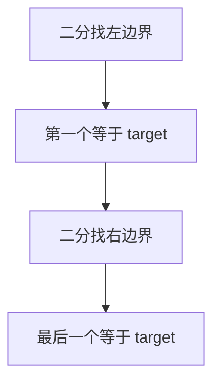

# 34. 在排序数组中查找元素的第一个和最后一个位置

## 📌 题目

给你一个按照非递减顺序排列的整数数组 `nums`，和一个目标值 `target`。请你找出给定目标值在数组中的开始位置和结束位置。

如果数组中不存在目标值 `target`，返回 `[-1, -1]`。

你必须设计并实现时间复杂度为 `O(log n)` 的算法解决此问题。

示例：
```
输入：nums = [5,7,7,8,8,10], target = 8
输出：[3,4]
```

🔗 [LeetCode 34](https://leetcode.cn/problems/find-first-and-last-position-of-element-in-sorted-array/description/?envType=study-plan-v2&envId=top-100-liked)

## 🛒 人话理解 & 🧠 思路演进



大家好，我是忍者算法。今天我要和大家分享一道非常经典的二分查找题目 - LeetCode 34「在排序数组中查找元素的第一个和最后一个位置」。这道题看似简单，实则暗藏玄机，是理解二分查找边界处理的绝佳材料。

### 📚 从生活场景说起

想象你在整理一叠按时间顺序排好的照片，其中有多张是同一天拍的。如果要找出某一天最早和最晚拍的那张照片，你会怎么做？高效的方法是先用二分找到这一天的任意一张照片，然后再分别向左右寻找边界。这正是我们今天要解决的问题的生活映射！

### 💡 问题解析

**题目要求**：
给定一个按升序排列的整数数组 nums，和一个目标值 target。找出给定目标值在数组中的开始位置和结束位置。如果数组中不存在目标值，返回 [-1, -1]。

**示例**：

> 👉 代码实现见下方「🐍 Python 代码」

### 🤔 思路发展历程

让我们看看解决这个问题时，思维是如何层层递进的：

### 1. 朴素思路
最直观的方法是遍历一遍数组，记录第一次和最后一次出现的位置。但这种方法的时间复杂度是O(n)，没有利用数组已排序的特性。

### 2. 二分查找思路
既然数组已排序，我们可以用二分查找将时间复杂度优化到O(log n)。关键在于设计两个二分查找：一个找左边界，一个找右边界。

### 🚀 优雅的解决方案

> 👉 代码实现见下方「🐍 Python 代码」

### 📝 代码详解

让我们深入理解这个优雅的解决方案：

### 1. 整体架构
我们设计了一个统一的边界查找函数，通过布尔参数控制是查找左边界还是右边界。这种设计既减少了代码重复，又让逻辑更加清晰。

### 2. 边界查找的精妙之处
当找到目标值时，我们并不立即返回，而是：
- 查找左边界时，我们要确认前一个数不是目标值
- 查找右边界时，我们要确认后一个数不是目标值
这样就能精确定位边界位置。

### 3. 条件判断的艺术
代码中的边界检查（mid == 0 或 mid == nums.length - 1）确保了我们不会发生数组越界。这些细节体现了代码的健壮性。

### 🎯 易错点剖析

1. **返回值处理**
   - 必须先判断数组为空的情况
   - 当目标值不存在时，要返回[-1, -1]
   
2. **边界条件**
   - 别忘了检查数组首尾的特殊情况
   - 当找到目标值时，不要急于返回

3. **循环终止条件**
   - while循环的条件是 left <= right
   - 这确保了不会漏掉单个元素的情况

### 💡 举一反三

这道题的思路可以延伸到很多场景：

1. **查找最后一个小于目标值的位置**
   - 只需稍微修改边界判断条件

2. **查找第一个大于目标值的位置**
   - 类似的二分思路，不同的判断条件

3. **统计目标值的出现次数**
   - 可以用右边界减去左边界再加1

### 🌟 面试技巧

1. **展示思维过程**
   - 先说明暴力解法，再优化到二分
   - 体现你的算法思维能力

2. **代码优化意识**
   - 展示代码复用和模块化的能力
   - 注意代码的可读性和维护性

3. **考虑周全**
   - 主动提及边界情况的处理
   - 展示你考虑问题的全面性

## 🐍 Python 代码

### 🥊 暴力解（朴素对照）

最直白的做法：从头到尾扫一遍，记录 `target` 第一次和最后一次出现的位置。

```python
from typing import List

class Solution:
    def searchRange(self, nums: List[int], target: int) -> List[int]:
        first = last = -1
        for i, num in enumerate(nums):
            if num == target:
                if first == -1:
                    first = i          # 第一次出现
                last = i               # 持续更新到最后一次出现
        return [first, last]
```

- 时间复杂度：`O(n)`，遍历整个数组
- 空间复杂度：`O(1)`
- ⚠️ 不满足题目 `O(log n)` 的复杂度要求，仅作思路对照。数组已排序，改用「找左边界 + 找右边界」两次二分，即可降到 `O(log n)`，见下方最优解。

### ⚡ 最优解

```python
class Solution:
    def searchRange(nums, target):
        def binary_search(nums, target, find_first):
            left, right = 0, len(nums) - 1
            result = -1
            while left <= right:
                mid = (left + right) // 2
                if nums[mid] == target:
                    result = mid              # 记下位置但别急着返回，继续往边界挤
                    if find_first:
                        right = mid - 1  # 寻找左边界
                    else:
                        left = mid + 1   # 寻找右边界
                elif nums[mid] < target:
                    left = mid + 1
                else:
                    right = mid - 1
            return result

        start = binary_search(nums, target, True)
        end = binary_search(nums, target, False)

        return [start, end] if start != -1 else [-1, -1]
```
