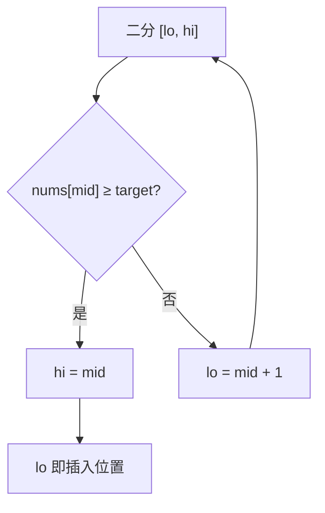

# 35. 搜索插入位置

## 📌 题目

给定一个排序数组和一个目标值，在数组中找到目标值，并返回其索引。如果目标值不存在于数组中，返回它将会被按顺序插入的位置。
请必须使用时间复杂度为 `O(log n)` 的算法。

示例：

```
输入：nums = [1,3,5,6], target = 5
输出：2

输入：nums = [1,3,5,6], target = 7
输出：4
```

🔗 [LeetCode 35](https://leetcode.cn/problems/search-insert-position/description/?envType=study-plan-v2&envId=top-100-liked)

## 🛒 人话理解 & 🧠 思路演进



大家好，我是忍者算法。今天我想和大家聊一道特别适合入门的算法题 - LeetCode 35「搜索插入位置」。这道题虽然看起来简单，但它蕴含了二分查找的精髓，是我最喜欢用来教学的题目之一。

### 📚 从图书馆说起

想象你在图书馆整理书架。手里有一本新书要插入已经按编号排序的书架中。你会怎么做？相信大多数人不会从头到尾一本本对比，而是会先看看中间的书，判断新书应该放在左边还是右边，这样反复几次就能找到正确的位置。

这正是二分查找的思想，也是我们今天要解决的问题！

### 💡 问题解析

**题目要求**：
给定一个排序数组和一个目标值，在数组中找到目标值并返回其索引。如果目标值不存在于数组中，返回它将会被按顺序插入的位置。

**示例**：

> 👉 代码实现见下方「🐍 Python 代码」

### 🤔 思路发展历程

让我们看看解决这个问题时，思维是如何逐步进化的：

### 1. 最直观的思路（新手常用）

> 👉 代码实现见下方「🐍 Python 代码」

这种方法虽然直观，但时间复杂度是O(n)，没有利用数组已排序的特性。

### 2. 二分查找思路（进阶方案）
既然数组已经排序，我们可以用二分查找将时间复杂度降到O(log n)。

### 🚀 优雅的解决方案

> 👉 代码实现见下方「🐍 Python 代码」

### 📝 代码详解

让我们一步步理解这个解法：

### 1. 初始化
- left和right指针分别指向数组的开始和结束
- 先处理特殊情况，如果目标值比所有元素都大

### 2. 二分查找过程
- 每次取中间位置mid
- 比较nums[mid]和target：
  - 相等：找到目标值，直接返回
  - nums[mid]小于target：说明目标在右边
  - nums[mid]大于target：说明目标在左边

### 3. 返回插入位置
- 循环结束时，left就是正确的插入位置
- 无需特别处理，因为left自然会停在正确位置

### 🎯 易错点分析

1. **边界条件**
   - while循环的条件是 left <= right 而不是 left < right
   - 这确保了不会漏掉任何一个位置

2. **中间位置计算**
   - 使用 left + (right - left) / 2 而不是 (left + right) / 2
   - 避免整数溢出的隐患

3. **返回值选择**
   - 最后返回left而不是right
   - left自然停在插入位置，而right总是在其左边

### 💡 举一反三

这道题的思路可以应用到很多类似场景：

1. **查找第一个不小于目标值的位置**
   - 这就是我们这道题的本质

2. **查找最后一个不大于目标值的位置**
   - 只需要稍微改变一下判断条件

3. **在排序数组中查找元素的第一个和最后一个位置**
   - LeetCode 34题，是这道题的进阶版

### 🌟 面试技巧

1. **理解二分查找的本质**
   - 不是简单的查找，而是在查找的过程中缩小范围
   - 每次都能排除一半的搜索空间

2. **处理边界情况**
   - 数组为空
   - 目标值在数组范围之外
   - 数组中有重复元素

3. **代码优化**
   - 考虑代码的简洁性和可读性
   - 处理好整数溢出问题

## 🐍 Python 代码

### 🥊 暴力解（朴素对照）

最直观的做法：从头到尾扫一遍，找到第一个 `>= target` 的位置即为插入点。

```python
from typing import List

class Solution:
    def searchInsert(self, nums: List[int], target: int) -> int:
        for i, num in enumerate(nums):
            if num >= target:
                return i          # 找到第一个不小于 target 的位置
        return len(nums)          # target 比所有元素都大，插到末尾
```

- 时间复杂度：`O(n)`，最坏遍历整个数组
- 空间复杂度：`O(1)`
- ⚠️ 不满足题目 `O(log n)` 的复杂度要求，仅作思路对照。利用数组已排序的特性做二分，每次排除一半搜索空间，即可降到 `O(log n)`，见下方最优解。

### ⚡ 最优解

```python
class Solution:
    def searchInsert(self, nums: List[int], target: int) -> int:
        left, right = 0, len(nums) - 1      
        while left <= right:                    # 用 <=：哪怕只剩一个元素也要查
            mid = left + (right - left) // 2     # 这种写法防止 (left+right) 整数溢出
            if nums[mid] == target:
                return mid
            elif nums[mid] > target:
                right = mid - 1                  # 目标在左半，右边界左移
            else:
                left = mid + 1                   # 目标在右半，左边界右移
        return left                              # 没找到时，left 正好停在"该插入的位置"
```
