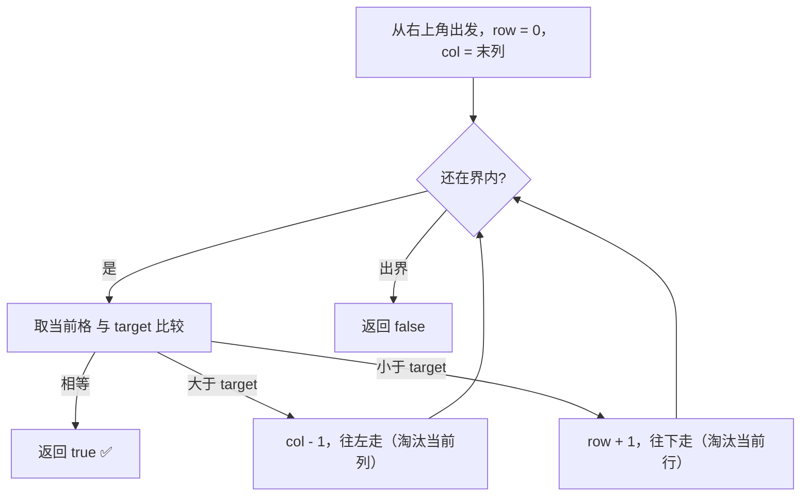
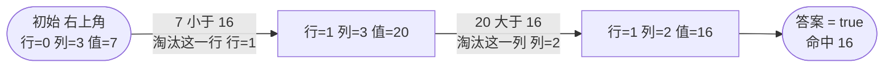

# 74. 搜索二维矩阵

## 📌 题目

给你一个满足下述两条属性的 `m x n` 整数矩阵：
- 每行中的整数从左到右按非严格递增顺序排列。
- 每行的第一个整数大于前一行的最后一个整数。

给你一个整数 `target` ，如果 `target` 在矩阵中，返回 `true` ；否则，返回 `false` 。

示例：


```
输入：matrix = [[1,3,5,7],[10,11,16,20],[23,30,34,60]], target = 3
输出：true
```

🔗 [LeetCode 74](https://leetcode.cn/problems/search-a-2d-matrix/description/?envType=study-plan-v2&envId=top-100-liked)

## 🛒 人话理解 & 🧠 思路演进



**总体一句话**：从右上角出发，每次拿当前值和 target 比——大了往左走（淘汰一整列），小了往下走（淘汰一整行），每步都能干掉一行或一列，最快 O(m+n) 定位。

### 🔬 逐步推演（动画式）

以 `matrix = [[1,3,5,7],[10,11,16,20],[23,30,34,60]]`，`target = 16` 为例——从左到右就是搜索的时间线：**每个节点是一次指针快照（行,列 与当前值），箭头上写这一步比大小、淘汰一行还是一列**：



大家好，我是忍者算法。今天我要带大家攻克一道非常有趣的题目 - LeetCode 74「搜索二维矩阵」。这道题乍看有点唬人，但用我们玩数独游戏的思维去理解，你会发现它其实很优雅！

### 🎮 从数独游戏说起

还记得玩数独时，我们要在9×9的格子里查找数字吗？每次找数字时，我们都会先看这个数字可能在哪一行，然后再在那一行中定位。今天的题目就像是在玩一个简化版的数独，只不过格子里的数字是有规律排列的！

### 💡 问题本质探索

**题目要求**：
在一个m×n的矩阵中搜索一个目标值。这个矩阵有两个特点：
1. 每行从左到右是升序的
2. 每一行的第一个数都大于上一行的最后一个数

让我们看个具体例子：
```
matrix = [
  [1,  3,  5,  7],
  [10, 11, 16, 20],
  [23, 30, 34, 60]
]
target = 3

返回 true （因为3在矩阵中）
```

### 🤔 深入思考

这个矩阵有什么特别之处？让我们仔细观察：
1. 从左上角到右下角是严格递增的
2. 把矩阵"拉直"后就是一个排序数组！

这个发现太关键了！它提示我们可以把二维搜索转化为一维搜索。

### 🚀 优雅的解决方案

> 👉 代码实现见下方「🐍 Python 代码」

### 📝 解题思路全解析

### 1. 坐标转换的智慧
这个解法最精妙的地方在于坐标转换：
- 一维索引 = 行 × 列数 + 列
- 反过来：行号 = 一维索引 / 列数
- 列号 = 一维索引 % 列数

就像我们在实际生活中把二维的街道地址转换成一维的门牌号！

### 2. 二分查找的应用
有了坐标转换，问题就变成了普通的二分查找：
1. 把矩阵看作一个长度为 m×n 的有序数组
2. 用二分查找在这个"虚拟"的一维数组中搜索
3. 需要时再把一维索引转回二维坐标

### 3. 边界处理
要特别注意以下边界情况：
- 矩阵为空
- 矩阵只有一行或一列
- 目标值在范围之外

### 💡 优化思维进阶

### 方案一：传统二分（上述方案）
时间复杂度：O(log(m×n))
空间复杂度：O(1)

### 方案二：两次二分
可以先对第一列二分查找确定行，再在目标行中二分查找：

> 👉 代码实现见下方「🐍 Python 代码」

### 🎯 相关题目引申

1. 搜索二维矩阵 II（LeetCode 240）
   - 类似但矩阵只保证行列有序
   - 需要不同的搜索策略

2. 有序矩阵中的第k小元素（LeetCode 378）
   - 利用类似的矩阵性质
   - 但需要结合二分查找和计数

### 🌟 面试常见追问

1. **如何处理重复元素？**
   - 当前题目不涉及重复元素
   - 但可以考虑查找第一个/最后一个位置

2. **能否优化空间复杂度？**
   - 当前方案已经是O(1)空间复杂度
   - 主要优化点在于减少不必要的计算

3. **如果矩阵很大，如何优化？**
   - 考虑分块处理
   - 可以使用并行计算

## 🐍 Python 代码

### 🥊 暴力解（朴素对照）

最朴素的做法：无视矩阵的有序特性，双重循环逐个元素比较。

```python
from typing import List

class Solution:
    def searchMatrix(self, matrix: List[List[int]], target: int) -> bool:
        for row in matrix:
            for num in row:
                if num == target:
                    return True
        return False
```

- 时间复杂度：`O(m × n)`，最坏要遍历矩阵所有元素
- 空间复杂度：`O(1)`
- ⚠️ 完全没利用矩阵「逐行有序、行首大于上行行尾」的特性。从右上角出发，根据当前值与 target 的大小每次淘汰一行或一列，可降到 `O(m + n)`（下方最优解）；进一步把矩阵「拉直」成一维有序数组做二分，可压到 `O(log(m × n))`。

### ⚡ 最优解

```python
class Solution:
    def searchMatrix(self, matrix: List[List[int]], target: int) -> bool:
        # 获取矩阵的行数和列数
        if not matrix or not matrix[0]:
            return False
        rows, cols = len(matrix), len(matrix[0])
        
        # 从右上角开始
        row, col = 0, cols - 1
        
        while row < rows and col >= 0:
            if matrix[row][col] == target:
                return True
            elif matrix[row][col] > target:
                # 如果当前元素比目标大，向左移动
                col -= 1
            else:
                # 如果当前元素比目标小，向下移动
                row += 1
        
        return False
```
