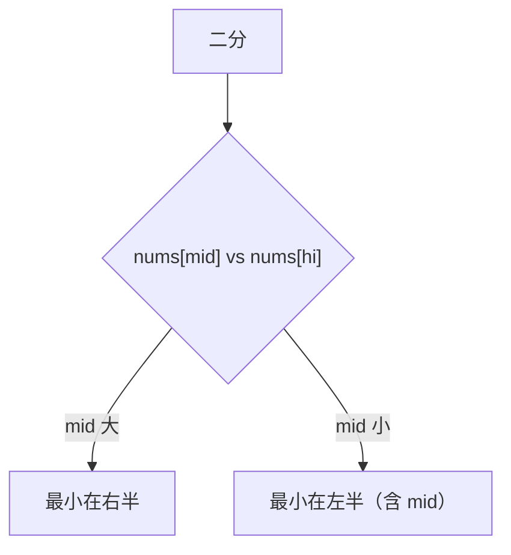

# 153. 寻找旋转排序数组中的最小值

## 📌 题目

已知一个长度为 `n` 的数组，预先按照升序排列，经由 `1` 到 `n` 次 **旋转** 后，得到输入数组。例如，原数组 `nums = [0,1,2,4,5,6,7]` 在变化后可能得到：

- 若旋转 `4` 次，则可以得到 `[4,5,6,7,0,1,2]`
- 若旋转 `7` 次，则可以得到 `[0,1,2,4,5,6,7]`

注意，数组 `[a[0], a[1], a[2], ..., a[n-1]]` **旋转一次** 的结果为数组 `[a[n-1], a[0], a[1], a[2], ..., a[n-2]]` 。

给你一个元素值 **互不相同** 的数组 `nums` ，它原来是一个升序排列的数组，并按上述情形进行了多次旋转。请你找出并返回数组中的 **最小元素** 。

你必须设计一个时间复杂度为 `O(log n)` 的算法解决此问题。

示例：
```
输入：nums = [3,4,5,1,2]
输出：1
解释：原数组为 [1,2,3,4,5] ，旋转 3 次得到输入数组。
```

🔗 [LeetCode 153](https://leetcode.cn/problems/find-minimum-in-rotated-sorted-array/description/?envType=study-plan-v2&envId=top-100-liked)

## 🛒 人话理解 & 🧠 思路演进



大家好，我是忍者算法。今天我们要一起探讨一道非常有意思的题目 - LeetCode 153「寻找旋转排序数组中的最小值」。这道题是我们之前讨论的搜索旋转排序数组的姐妹题，同样需要我们以创新的方式运用二分查找。

### 📚 从日出日落说起

让我们用一个生动的比喻来理解今天的问题：想象一下太阳从东边升起，温度逐渐升高，到正午达到最高点，然后开始下降，直到日落。如果我们从某个时刻开始记录温度，到第二天同一时刻结束，这些温度数据就形成了一个"旋转"的有序序列。找出最低温度，就像我们要在旋转排序数组中找最小值！

### 💡 问题解析

**题目要求**：
假设一个按升序排序的数组在未知的某个点上进行了旋转（例如，[0,1,2,4,5,6,7] 旋转成了 [4,5,6,7,0,1,2]）。请找出其中的最小元素。注意数组中不包含重复元素。

**示例**：

> 👉 代码实现见下方「🐍 Python 代码」

### 🤔 思路发展历程

### 1. 朴素思路
遍历一遍数组找最小值。这个方法虽然直观，但时间复杂度是O(n)，没有充分利用数组的特性。

### 2. 优化思路
仔细观察旋转后的数组，我们会发现一个重要特点：最小值一定位于数组的"断崖"处——也就是前一个数比后一个数大的位置。这启发我们可以用二分查找来寻找这个位置。

### 🚀 优雅的解决方案

> 👉 代码实现见下方「🐍 Python 代码」

### 📝 代码详解

让我们深入理解这个解决方案的每个细节：

### 1. 前置判断
我们首先处理了几个特殊情况：
- 空数组或单元素数组
- 数组未发生旋转的情况（通过比较首尾元素判断）

### 2. 二分查找的核心逻辑
每次二分，我们都做三个关键判断：

1. **是否找到"断崖"**：
   - 如果 nums[mid] > nums[mid + 1]，说明找到了旋转点
   - nums[mid + 1] 就是最小值

2. **是否是最小值**：
   - 如果 nums[mid - 1] > nums[mid]，说明 mid 就是最小值

3. **确定搜索方向**：
   - 通过比较 nums[mid] 和 nums[0] 确定最小值在哪一侧
   - 如果 nums[mid] > nums[0]，说明左半部分是有序的，最小值在右侧
   - 否则最小值在左侧

### 🎯 易错点剖析

1. **边界处理**
   - 注意数组为空或只有一个元素的情况
   - 处理数组未旋转的特殊情况

2. **区间选择**
   - 比较时要注意数组越界
   - mid 和 mid+1 的比较要在数组范围内

3. **终止条件**
   - 仔细处理 left == right 的情况
   - 确保不会陷入死循环

### 💡 举一反三

这道题的思路可以应用到多个类似场景：

1. **寻找旋转排序数组中的最大值**
   - 只需稍微修改判断条件

2. **判断数组是否是旋转排序数组**
   - 可以利用类似的性质判断

3. **处理包含重复元素的情况**
   - LeetCode 154 题就是这个问题的进阶版

### 🌟 面试技巧

1. **思路解释**
   - 先解释为什么普通的二分查找不能直接用
   - 说明如何利用旋转数组的特性

2. **代码优化**
   - 展示对边界情况的全面考虑
   - 解释代码的每个关键判断

3. **性能分析**
   - 解释为什么时间复杂度是 O(log n)
   - 比较不同解法的优劣

### 🎨 图解演示

为了帮助大家更好地理解算法的执行过程，我绘制了一个直观的示意图：

```
<svg viewBox="0 0 800 400" xmlns="http://www.w3.org/2000/svg">
  <!-- 背景 -->
  <rect width="800" height="400" fill="#f8f9fa"/>
  
  <!-- 坐标轴 -->
  <g transform="translate(50,350)">
    <!-- X轴 -->
    <line x1="0" y1="0" x2="700" y2="0" stroke="#333" stroke-width="2"/>
    <!-- Y轴 -->
    <line x1="0" y1="0" x2="0" y2="-300" stroke="#333" stroke-width="2"/>
    
    <!-- 数据点和连线 -->
    <polyline points="0,-100 100,-150 200,-200 300,-250 400,-50 500,-75 600,-90" 
              fill="none" stroke="#2196f3" stroke-width="3"/>
              
    <!-- 最小值标记 -->
    <circle cx="400" cy="-50" r="6" fill="#e91e63"/>
    <text x="420" y="-40" font-size="14">最小值</text>
    
    <!-- 二分查找过程 -->
    <g stroke="#4caf50" stroke-width="2" stroke-dasharray="5,5">
      <line x1="0" y1="-280" x2="700" y2="-280"/>
      <line x1="350" y1="-280" x2="350" y2="0"/>
      <text x="360" y="-270" fill="#4caf50" font-size="14">二分查找路径</text>
    </g>
  </g>
  
  <!-- 说明文字 -->
  <g transform="translate(50,50)">
    <text x="0" y="0" font-size="16">查找过程：</text>
    <text x="20" y="30" font-size="14">1. 比较中点值与两端</text>
    <text x="20" y="60" font-size="14">2. 确定最小值所在区间</text>
    <text x="20" y="90" font-size="14">3. 寻找"断崖"位置</text>
  </g>
</svg>
```

## 🐍 Python 代码

### 🥊 暴力解（朴素对照）

最朴素的做法：无视「旋转」特性，直接遍历整个数组取最小值。

```python
from typing import List

class Solution:
    def findMin(self, nums: List[int]) -> int:
        ans = nums[0]
        for num in nums:
            if num < ans:
                ans = num
        return ans
```

- 时间复杂度：`O(n)`，遍历整个数组
- 空间复杂度：`O(1)`
- ⚠️ 不满足题目 `O(log n)` 的复杂度要求，仅作思路对照。利用「旋转后最小值在断崖处」的特性做二分，比较 `nums[mid]` 与 `nums[right]` 判断最小值在哪一半，即可降到 `O(log n)`，见下方最优解。

### ⚡ 最优解

```python
class Solution:
    def findMin(self, nums: List[int]) -> int:
        left, right = 0, len(nums) - 1

        while left < right:
            mid = (left + right) // 2

            # 如果中间值大于最右边的值，说明最小值在右半部分
            if nums[mid] > nums[right]:
                left = mid + 1
            # 否则，最小值在左半部分（包括 mid 自己）
            else:
                right = mid

        # 当 left == right 时，找到了最小值
        return nums[left]
```
