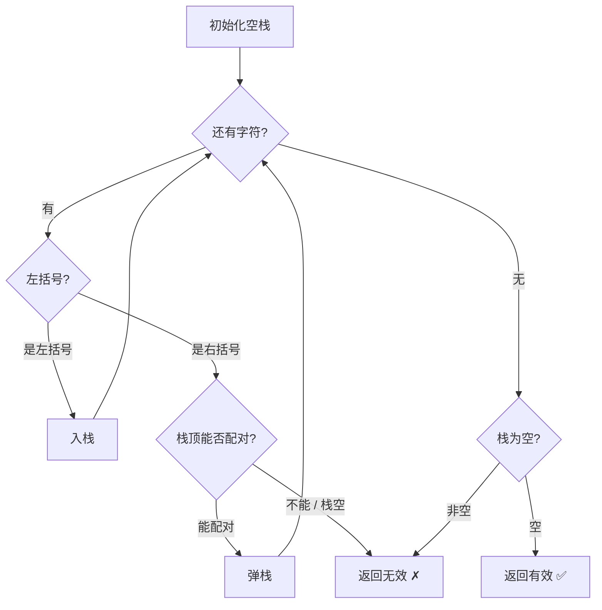
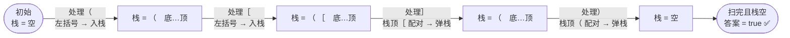

# 20. 有效的括号

## 📌 题目

给定一个只包括 `'('`，`')'`，`'{'`，`'}'`，`'['`，`']'` 的字符串 `s` ，判断字符串是否有效。

有效字符串需满足：

1. 左括号必须用相同类型的右括号闭合。
2. 左括号必须以正确的顺序闭合。
3. 每个右括号都有一个对应的相同类型的左括号。

示例：

```
输入：s = "()"

输出：true

输入：s = "()[]{}"

输出：true
```

🔗 [LeetCode 20](https://leetcode.cn/problems/valid-parentheses/description/?envType=study-plan-v2&envId=top-100-liked)

## 🛒 人话理解 & 🧠 思路演进



**总体一句话**：用栈做「后进先出」的配对——遇左括号入栈、遇右括号看栈顶是否恰好是同型左括号能配对则弹栈，扫完整串后栈空即有效。

### 🔬 逐步推演（动画式）

以 `s = "( [ ] )"`（即 `"([])"`）为例——从左到右就是算法的时间线：**每个节点是一次栈的状态快照，箭头上写这一步处理了哪个字符、做了什么决策**：



大家好，我是忍者算法。今天我们来聊一道经典的算法题 - LeetCode 20「有效的括号」。这道题虽然看起来简单，却蕴含着栈这个数据结构的精髓，是我非常喜欢用来讲解栈的入门题目。

### 📚 从生活场景说起

想象你在阅读一本书，遇到了很多层嵌套的括号。作为读者，你是如何确保括号的配对是正确的呢？其实我们的大脑在处理这个问题时，就像一个栈一样工作：每当看到一个左括号，就在心里"压入"一个期待；看到右括号时，就和最近的那个未配对的左括号进行匹配。今天我们就用代码来实现这个过程！

### 💡 问题解析

**题目要求**：
给定一个只包括 '('，')'，'{'，'}'，'['，']' 的字符串 s，判断字符串是否有效。有效字符串需要满足：
1. 左括号必须用相同类型的右括号闭合。
2. 左括号必须以正确的顺序闭合。
3. 每个右括号都有一个对应的相同类型的左括号。

**示例**：

> 👉 代码实现见下方「🐍 Python 代码」

### 🤔 思路发展历程

### 1. 初学者思路
很多初学者会想到用计数的方法：统计左右括号的数量是否相等。但这种方法无法处理 "([)]" 这样的错误情况。

### 2. 优化思路
我们需要考虑括号的匹配顺序。栈的特点是"后进先出"，正好符合括号匹配的规则：最后出现的左括号应该最先被匹配。

### 🚀 优雅的解决方案

> 👉 代码实现见下方「🐍 Python 代码」

### 📝 代码详解

让我们深入理解这个解决方案的每个环节：

### 1. 前置优化
我们首先通过检查字符串长度是否为偶数来快速排除一些无效情况。这是因为有效的括号字符串必须是成对的。

### 2. 栈的使用
栈的使用是这个解决方案的核心。我们用栈来记录所有出现的左括号，这样在遇到右括号时，就可以和最近的左括号进行匹配。

### 3. 匹配过程
对于每个字符，我们有两种处理方式：
- 如果是左括号，直接压入栈中
- 如果是右括号，将其与栈顶的左括号进行匹配

### 4. 验证逻辑
在遍历完成后，我们还需要检查栈是否为空。这是因为可能存在未匹配的左括号。

### 🎯 易错点剖析

1. **栈的判空**
   - 遇到右括号时，必须先检查栈是否为空
   - 遍历结束后也要检查栈是否为空

2. **字符匹配**
   - 不能只判断括号数量相等
   - 要确保括号类型匹配正确

3. **处理顺序**
   - 遇到右括号时的判断顺序很重要
   - 先检查栈是否为空，再进行匹配

### 💡 举一反三

这道题的思路可以扩展到很多类似场景：

1. **HTML标签匹配**
   - 检查HTML标签是否正确闭合
   - 例如：`<div><span></span></div>`

2. **程序代码块匹配**
   - 检查代码中的大括号是否配对
   - 可以扩展处理多种括号类型

3. **表达式求值**
   - 在计算表达式时也常用栈来处理括号

### 🎨 图解演示

为了帮助大家更好地理解栈的工作原理，我准备了一个可视化的示例：

```
<svg viewBox="0 0 800 400" xmlns="http://www.w3.org/2000/svg">
  <!-- 背景 -->
  <rect width="800" height="400" fill="#f8f9fa"/>
  
  <!-- 字符串显示区域 -->
  <g transform="translate(50,50)">
    <text x="0" y="0" font-size="16">输入字符串: "( { [ ] } )"</text>
    
    <!-- 字符框 -->
    <g transform="translate(0,20)">
      <rect x="0" y="0" width="40" height="40" fill="none" stroke="#1976d2" stroke-width="2"/>
      <text x="20" y="25" text-anchor="middle" font-size="20">(</text>
      
      <rect x="50" y="0" width="40" height="40" fill="none" stroke="#1976d2" stroke-width="2"/>
      <text x="70" y="25" text-anchor="middle" font-size="20">{</text>
      
      <rect x="100" y="0" width="40" height="40" fill="none" stroke="#1976d2" stroke-width="2"/>
      <text x="120" y="25" text-anchor="middle" font-size="20">[</text>
      
      <rect x="150" y="0" width="40" height="40" fill="none" stroke="#1976d2" stroke-width="2"/>
      <text x="170" y="25" text-anchor="middle" font-size="20">]</text>
      
      <rect x="200" y="0" width="40" height="40" fill="none" stroke="#1976d2" stroke-width="2"/>
      <text x="220" y="25" text-anchor="middle" font-size="20">}</text>
      
      <rect x="250" y="0" width="40" height="40" fill="none" stroke="#1976d2" stroke-width="2"/>
      <text x="270" y="25" text-anchor="middle" font-size="20">)</text>
    </g>
  </g>
  
  <!-- 栈的可视化 -->
  <g transform="translate(50,150)">
    <text x="0" y="0" font-size="16">栈的变化过程：</text>
    
    <!-- 栈容器 -->
    <rect x="0" y="20" width="100" height="200" fill="none" stroke="#388e3c" stroke-width="2"/>
    
    <!-- 栈内元素（从下到上） -->
    <g transform="translate(0,200)">
      <rect x="10" y="-40" width="80" height="30" fill="#c8e6c9"/>
      <text x="50" y="-20" text-anchor="middle">(</text>
      
      <rect x="10" y="-80" width="80" height="30" fill="#c8e6c9"/>
      <text x="50" y="-60" text-anchor="middle">{</text>
      
      <rect x="10" y="-120" width="80" height="30" fill="#c8e6c9"/>
      <text x="50" y="-100" text-anchor="middle">[</text>
    </g>
  </g>
  
  <!-- 操作说明 -->
  <g transform="translate(200,150)">
    <text x="0" y="30" font-size="14">1. 遇到 '(' 压入栈</text>
    <text x="0" y="60" font-size="14">2. 遇到 '{' 压入栈</text>
    <text x="0" y="90" font-size="14">3. 遇到 '[' 压入栈</text>
    <text x="0" y="120" font-size="14">4. 遇到 ']' 弹出 '['</text>
    <text x="0" y="150" font-size="14">5. 遇到 '}' 弹出 '{'</text>
    <text x="0" y="180" font-size="14">6. 遇到 ')' 弹出 '('</text>
  </g>
</svg>
```

### 🌟 面试技巧

1. **思路表达**
   - 先说明为什么选择使用栈
   - 解释栈的特性如何完美契合题目需求

2. **代码优化**
   - 提到可以用Map存储括号对应关系
   - 讨论空间复杂度的优化可能

3. **扩展思考**
   - 讨论如何处理其他类型的配对问题
   - 考虑如何扩展支持更多种类的括号

### 🎩 高级优化

如果你想让代码更优雅，可以使用HashMap来存储括号对应关系：

> 👉 代码实现见下方「🐍 Python 代码」

这个优化版本的代码有以下优点：
1. 更容易扩展支持新的括号类型
2. 代码更简洁清晰
3. 逻辑判断更统一

## 🐍 Python 代码

### 🥊 暴力解（朴素对照）

最朴素：反复把成对的 `()`、`{}`、`[]` 替换成空串，直到替换不动为止——若最终为空即有效。

```python
class Solution:
    def isValid(self, s: str) -> bool:
        # 反复删除所有成对括号，直到没有可删的为止
        prev = None
        while prev != s:
            prev = s
            s = s.replace("()", "").replace("{}", "").replace("[]", "")
        return s == ""
```

- 时间复杂度：`O(n²)`，最坏每轮只删掉一对，共约 n/2 轮，每轮 O(n)
- 空间复杂度：`O(n)`，replace 会生成新字符串
- ⚠️ 每轮全串扫描太慢，且无法在遍历中途即时判错。用栈「遇左括号入栈、遇右括号匹配栈顶」即可一次遍历 O(n) 完成，见下方最优解。

### ⚡ 最优解

```python
class Solution:
    def isValid(self, s: str) -> bool:
        stack=[]
        bracketsMatch={"(":1,"[":2,"{":3,"}":4,"]":5,")":6}
        for i in range(len(s)):
            #若为左括号，则入栈
            if bracketsMatch[s[i]]<=3:
                stack.append(s[i])
            else:#若为右括号
                #首先，若栈此时为空，则return false
                if len(stack)==0:
                    return False
                else:
                    # 配对靠"和为7"判定：(=1↔)=6、[=2↔]=5、{=3↔}=4，左右编码相加恰为 7
                    if bracketsMatch[s[i]]+bracketsMatch[stack.pop()]!=7:
                        return False
        return True if len(stack)==0 else False
```
