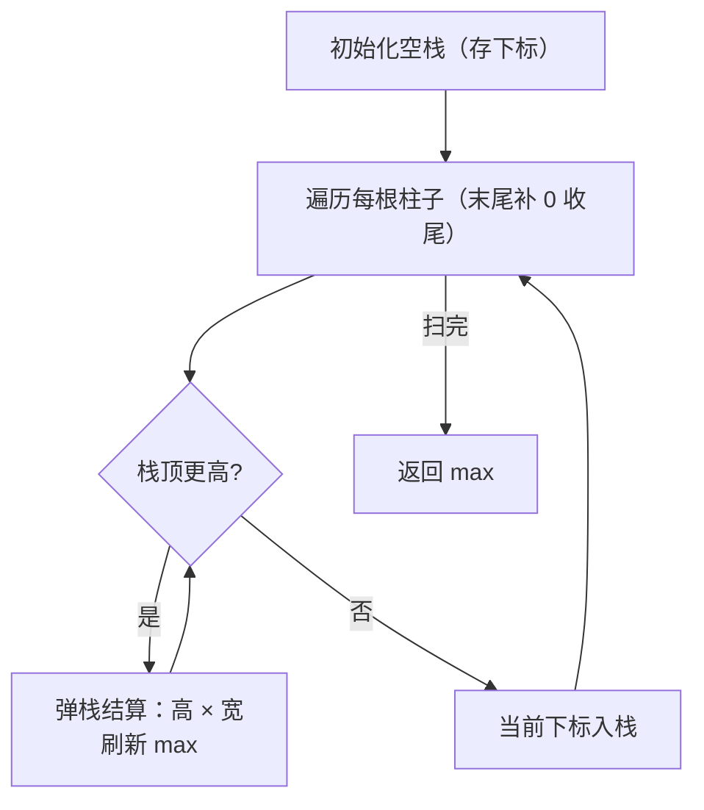
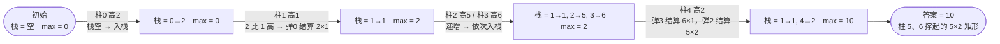

# 84. 柱状图中最大的矩形

## 🛒 人话理解 & 🧠 思路演进



**总体一句话**：维护高度单调递增的下标栈——遇更矮的柱就反复弹出更高的柱「结算面积」（高 × 当前位置到新栈顶的宽度），扫完即得最大矩形。

### 🔬 逐步推演（动画式）

以 `heights = 2, 1, 5, 6, 2`（末尾补哨兵 0）为例——从左到右就是算法的时间线：**每个节点是一次「栈 + max」状态快照，箭头上写这一步处理了哪根柱、弹栈结算还是入栈**：



大家好，我是忍者算法。今天我们要攻克一道经典难题 - LeetCode 84「柱状图中最大的矩形」。这道题虽然看起来吓人，但只要我们掌握了正确的思维方法，就能优雅地解决它。

### 📚 从实际场景理解

想象你是一位建筑师，面前有一排高度不同的立柱。你的任务是在这些立柱之间找到一块最大的矩形空间来放置一块展示板。这块展示板的高度不能超过它所跨越的任何一根立柱，而宽度就是它所跨越的立柱数量。这就是我们今天要解决的问题的本质！

### 💡 问题详解

🔗 [LeetCode 84](https://leetcode.cn/problems/largest-rectangle-in-histogram/description/?envType=study-plan-v2&envId=top-100-liked)

**题目要求**：
给定一个非负整数数组 heights ，数组中的数字代表柱子的高度。求在该柱状图中能够勾勒出的矩形的最大面积。

**举个简单的例子**：

> 👉 代码实现见下方「🐍 Python 代码」

### 🤔 解题思路发展

让我们一步步发展解题思路：

1. **暴力解法的思考**
   对每个柱子，向两边扩展，直到遇到比自己矮的柱子。但这样做的时间复杂度是O(n²)。

2. **优化方向**
   关键是要快速找到每个柱子能扩展到的左右边界。这让我们想到了单调栈！

3. **单调栈的应用**
   我们可以维护一个高度递增的栈，这样对于每个柱子，都能快速找到左右第一个比它矮的柱子。

### 🚀 代码实现

> 👉 代码实现见下方「🐍 Python 代码」

### 📝 深入理解代码

让我们用一个具体的例子来理解代码的运行过程：
假设输入：heights = [2,1,5,6,2,3]

1. **寻找左边界**：
   - 对于高度2：左边没有更矮的，left[0] = -1
   - 对于高度1：左边是2(比1高)，继续找，left[1] = -1
   - 对于高度5：左边是1(比5矮)，left[2] = 1
   依此类推...

2. **寻找右边界**：
   - 对于高度3：右边没有更矮的，right[5] = 6
   - 对于高度2：右边是3(比2高)，right[4] = 6
   - 对于高度6：右边是2(比6矮)，right[3] = 4
   依此类推...

3. **计算面积**：
   对每个柱子，用 heights[i] * (right[i] - left[i] - 1) 计算面积。

### 🎯 易错点剖析

1. **边界处理**
   - 左边界：当栈为空时，设为-1
   - 右边界：当栈为空时，设为n

2. **单调性维护**
   - 要保持栈内高度严格递增
   - 相等高度也需要出栈

3. **数组越界**
   - 访问数组前确保索引有效
   - 特别是在处理边界情况时

### 💡 相关问题扩展

这种思路可以应用到很多类似问题：

1. **接雨水**
   - 同样使用单调栈
   - 但是计算逻辑略有不同

2. **最大矩形**（LeetCode 85）
   - 将二维问题转化为一维
   - 复用本题的解法

### 🎨 图解演示

```
<svg viewBox="0 0 800 400" xmlns="http://www.w3.org/2000/svg">
  <!-- 背景 -->
  <rect width="800" height="400" fill="#f8f9fa"/>
  
  <!-- 标题 -->
  <text x="50" y="40" font-size="20" fill="#1976d2">柱状图最大矩形面积示例</text>
  
  <!-- 坐标系 -->
  <g transform="translate(50,350)">
    <!-- X轴 -->
    <line x1="0" y1="0" x2="600" y2="0" stroke="black"/>
    <!-- Y轴 -->
    <line x1="0" y1="0" x2="0" y2="-300" stroke="black"/>
    
    <!-- 柱状图 -->
    <g fill="#bbdefb" stroke="#1976d2">
      <rect x="50" y="-100" width="50" height="100"/>
      <rect x="100" y="-50" width="50" height="50"/>
      <rect x="150" y="-250" width="50" height="250"/>
      <rect x="200" y="-300" width="50" height="300"/>
      <rect x="250" y="-100" width="50" height="100"/>
      <rect x="300" y="-150" width="50" height="150"/>
    </g>
    
    <!-- 最大矩形标注 -->
    <rect x="150" y="-250" width="100" height="250" 
          fill="rgba(255,87,34,0.3)" stroke="#ff5722" stroke-width="2"/>
    
    <!-- 标注文字 -->
    <text x="200" y="-270" text-anchor="middle" fill="#d32f2f">最大面积：10</text>
  </g>
  
  <!-- 图例 -->
  <g transform="translate(500,100)">
    <text x="0" y="0" font-size="14">柱子高度：[2,1,5,6,2,3]</text>
    <text x="0" y="30" font-size="14">最大矩形范围：</text>
    <rect x="0" y="40" width="20" height="20" fill="rgba(255,87,34,0.3)" stroke="#ff5722"/>
  </g>
</svg>
```

### 🌟 面试技巧

1. **思路解释**
   - 先说明为什么需要找到左右边界
   - 解释单调栈在这里的作用

2. **复杂度分析**
   - 时间复杂度：O(n)，每个元素最多入栈出栈各一次
   - 空间复杂度：O(n)，需要额外的数组和栈

3. **优化建议**
   - 可以只用一次遍历完成
   - 可以节省left和right数组的空间

### 🎩 优化版本

这里是一个空间优化的版本，只需要一次遍历：

> 👉 代码实现见下方「🐍 Python 代码」

这个优化版本的特点：
1. 只需要一次遍历
2. 不需要额外的数组存储边界
3. 代码更简洁，但需要理解得更深入

## 🐍 Python 代码

### 🥊 暴力解（朴素对照）

枚举每根柱子作为矩形高度，向左右两边扩展直到遇到更矮的柱子，宽 = 右边界 - 左边界 - 1，取最大面积。

```python
from typing import List

class Solution:
    def largestRectangleArea(self, heights: List[int]) -> int:
        n = len(heights)
        max_area = 0
        for i in range(n):
            # 向左找第一根比 heights[i] 矮的柱子
            left = i - 1
            while left >= 0 and heights[left] >= heights[i]:
                left -= 1
            # 向右找第一根比 heights[i] 矮的柱子
            right = i + 1
            while right < n and heights[right] >= heights[i]:
                right += 1
            width = right - left - 1
            max_area = max(max_area, heights[i] * width)
        return max_area
```

- 时间复杂度：`O(n²)`，每根柱子都要向两侧扫描
- 空间复杂度：`O(1)`
- ⚠️ 左右边界被反复扫描。用单调（递增）栈一次遍历即可确定每根柱子的左右边界，降到 `O(n)`，见下方最优解。

### ⚡ 最优解

```python
class Solution:
    def largestRectangleArea(self, heights: List[int]) -> int:
        stack = []                                # 存下标，高度单调递增
        max_area = 0
        for i in range(len(heights) + 1):         # 末尾补个 0 把栈清空
            h = 0 if i == len(heights) else heights[i]
            while stack and heights[stack[-1]] > h:  # 遇到更矮，结算更高柱
                height = heights[stack.pop()]
                # 宽度：弹出后若栈空，说明这根柱子能一直延伸到最左(宽=i)；
                # 否则左边界是新栈顶，宽 = i - 新栈顶 - 1
                width = i if not stack else i - stack[-1] - 1
                max_area = max(max_area, height * width)
            stack.append(i)
        return max_area
```
