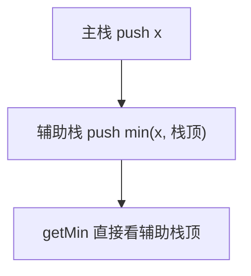

# 155. 最小栈

## 📌 题目

设计一个支持 `push` ，`pop` ，`top` 操作，并能在常数时间内检索到最小元素的栈。

实现 `MinStack` 类:

- `MinStack()` 初始化堆栈对象。
- `void push(int val)` 将元素val推入堆栈。
- `void pop()` 删除堆栈顶部的元素。
- `int top()` 获取堆栈顶部的元素。
- `int getMin()` 获取堆栈中的最小元素。

示例：
```
输入：
["MinStack","push","push","push","getMin","pop","top","getMin"]
[[],[-2],[0],[-3],[],[],[],[]]

*输出：
[null,null,null,null,-3,null,0,-2]

解释：
MinStack minStack = new MinStack();
minStack.push(-2);
minStack.push(0);
minStack.push(-3);
minStack.getMin();   --> 返回 -3.
minStack.pop();
minStack.top();      --> 返回 0.
minStack.getMin();   --> 返回 -2.
```

🔗 [LeetCode 155](https://leetcode.cn/problems/min-stack/description/?envType=study-plan-v2&envId=top-100-liked)

## 🛒 人话理解 & 🧠 思路演进



大家好，我是忍者算法。今天我们来深入探讨一道非常精彩的数据结构设计题 - LeetCode 155「最小栈」。这道题不仅考察了栈的基本操作，更蕴含着优化思维的艺术。

### 📚 从实际场景理解

想象你是一位股票交易员，需要随时跟踪当前持仓中的最低价格股票。每次买入新股票或卖出旧股票后，都要能立即知道组合中的最低价。这个场景就很像我们今天要解决的最小栈问题！

### 💡 问题解析

**题目要求**：
设计一个支持 push、pop、top 和 getMin 操作的栈数据结构：
1. push(x) —— 将元素 x 推入栈中
2. pop() —— 删除栈顶的元素
3. top() —— 获取栈顶元素
4. getMin() —— 检索栈中的最小元素

所有操作必须在 O(1) 时间复杂度内完成。

**示例**：

> 👉 代码实现见下方「🐍 Python 代码」

### 🤔 思维发展过程

### 1. 初学者思路
很多人的第一反应是：用一个变量记录最小值。但这种方法在pop操作后无法知道新的最小值。

### 2. 进阶思路
可以在每次push时都遍历栈找最小值，但这样getMin的时间复杂度就变成了O(n)。

### 3. 最优思路
使用辅助栈同步记录当前状态下的最小值，这样所有操作都能保持O(1)时间复杂度。

### 🚀 优雅的解决方案

> 👉 代码实现见下方「🐍 Python 代码」

### 📝 代码详解

让我们深入理解这个设计的精妙之处：

### 1. 双栈设计
我们使用两个栈：主栈存储所有元素，辅助栈同步维护最小值状态。这是实现O(1)时间复杂度的关键。

### 2. Push操作的智慧
- 主栈：无条件压入新元素
- 辅助栈：只在新元素小于等于当前最小值时压入
这样确保辅助栈顶始终是当前状态下的最小值

### 3. Pop操作的巧妙
当主栈弹出的元素等于当前最小值时，辅助栈也要相应弹出，保持同步。

### 4. 获取最小值
直接返回辅助栈顶元素，时间复杂度O(1)。

### 🎯 易错点提醒

1. **数值比较**
   - 使用equals而不是==比较Integer对象
   - 考虑空栈情况的处理

2. **辅助栈处理**
   - push时要用<=而不是
   - pop时需要先比较再操作

3. **边界条件**
   - 栈为空时的处理
   - 重复元素的处理

### 💡 举一反三

这种设计思想可以扩展到许多类似场景：

1. **最大栈**
   - 类似实现，但维护最大值
   - 适用于需要追踪最大值的场景

2. **范围最值**
   - 维护滑动窗口的最值
   - 股票价格跟踪系统

3. **频率栈**
   - 扩展实现最频繁元素的快速访问
   - 设计新闻热点排行系统

### 🎨 图解演示

```
<svg viewBox="0 0 800 400" xmlns="http://www.w3.org/2000/svg">
  <!-- 背景 -->
  <rect width="800" height="400" fill="#f8f9fa"/>
  
  <!-- 标题 -->
  <text x="50" y="40" font-size="20" fill="#1976d2">最小栈的工作原理</text>
  
  <!-- 主栈 -->
  <g transform="translate(100,80)">
    <text x="0" y="0" font-size="16">主栈</text>
    <rect x="0" y="20" width="100" height="250" fill="none" stroke="#388e3c" stroke-width="2"/>
    
    <!-- 主栈元素 -->
    <g transform="translate(10,250)">
      <rect x="0" y="-40" width="80" height="30" fill="#c8e6c9"/>
      <text x="40" y="-20" text-anchor="middle">5</text>
      
      <rect x="0" y="-80" width="80" height="30" fill="#c8e6c9"/>
      <text x="40" y="-60" text-anchor="middle">2</text>
      
      <rect x="0" y="-120" width="80" height="30" fill="#c8e6c9"/>
      <text x="40" y="-100" text-anchor="middle">6</text>
      
      <rect x="0" y="-160" width="80" height="30" fill="#c8e6c9"/>
      <text x="40" y="-140" text-anchor="middle">1</text>
    </g>
  </g>
  
  <!-- 辅助栈 -->
  <g transform="translate(300,80)">
    <text x="0" y="0" font-size="16">辅助栈（最小值）</text>
    <rect x="0" y="20" width="100" height="250" fill="none" stroke="#1976d2" stroke-width="2"/>
    
    <!-- 辅助栈元素 -->
    <g transform="translate(10,250)">
      <rect x="0" y="-40" width="80" height="30" fill="#bbdefb"/>
      <text x="40" y="-20" text-anchor="middle">2</text>
      
      <rect x="0" y="-80" width="80" height="30" fill="#bbdefb"/>
      <text x="40" y="-60" text-anchor="middle">2</text>
      
      <rect x="0" y="-120" width="80" height="30" fill="#bbdefb"/>
      <text x="40" y="-100" text-anchor="middle">1</text>
      
      <rect x="0" y="-160" width="80" height="30" fill="#bbdefb"/>
      <text x="40" y="-140" text-anchor="middle">1</text>
    </g>
  </g>
  
  <!-- 操作说明 -->
  <g transform="translate(500,100)">
    <text x="0" y="0" font-size="14">操作过程：</text>
    <text x="0" y="30" font-size="14">1. push(1) → 两栈都入栈</text>
    <text x="0" y="60" font-size="14">2. push(6) → 主栈入栈，最小值不变</text>
    <text x="0" y="90" font-size="14">3. push(2) → 两栈都入栈（新最小值）</text>
    <text x="0" y="120" font-size="14">4. push(5) → 主栈入栈，最小值不变</text>
  </g>
</svg>
```

### 🌟 面试技巧

1. **设计思路表达**
   - 先说明为什么需要辅助栈
   - 解释如何保证O(1)时间复杂度

2. **优化讨论**
   - 可以讨论空间优化的可能性
   - 提到处理特殊情况的考虑

3. **扩展思考**
   - 讨论如何扩展支持其他操作
   - 考虑并发场景的实现

### 🎩 空间优化版本

如果对空间要求严格，我们可以在辅助栈中只存储差值：

> 👉 代码实现见下方「🐍 Python 代码」

这个优化版本通过存储差值而不是实际值，在某些情况下可以节省空间，但需要注意处理整数溢出的问题。

## 🐍 Python 代码

### 🥊 暴力解（朴素对照）

最朴素：只用一个 list 当主栈，`getMin` 时直接调用 `min()` 全栈扫描——其余操作都 O(1)，只有 `getMin` 是 O(n)。

```python
class MinStack:

    def __init__(self):
        self.stack = []

    def push(self, val: int) -> None:
        self.stack.append(val)

    def pop(self) -> None:
        self.stack.pop()

    def top(self) -> int:
        return self.stack[-1]

    def getMin(self) -> int:
        return min(self.stack)   # 每次都全栈扫描
```

- 时间复杂度：`getMin` 为 `O(n)`，其余操作 `O(1)`
- 空间复杂度：`O(n)`
- ⚠️ `getMin` 不满足「O(1) 检索最小值」的题目要求。加一个辅助栈，在 `push`/`pop` 时同步维护「当前最小值」，即可让 `getMin` 变为 `O(1)`，见下方最优解。

### ⚡ 最优解

```python
class MinStack:

    def __init__(self):
        self.stack = []
        self.min_stack = []

    def push(self, val: int) -> None:
        self.stack.append(val)
        # 新值 <= 当前最小才入辅助栈(用 <= 让重复最小值也入栈，pop 时才不会误删)
        if not self.min_stack or val <= self.min_stack[-1]:
            self.min_stack.append(val)

    def pop(self) -> None:
        val = self.stack.pop()
        # 弹出的恰好是当前最小 → 辅助栈同步弹出，否则最小值记录就过期了
        if val == self.min_stack[-1]:
            self.min_stack.pop()

    def top(self) -> int:
        return self.stack[-1]

    def getMin(self) -> int:
        return self.min_stack[-1]
```
