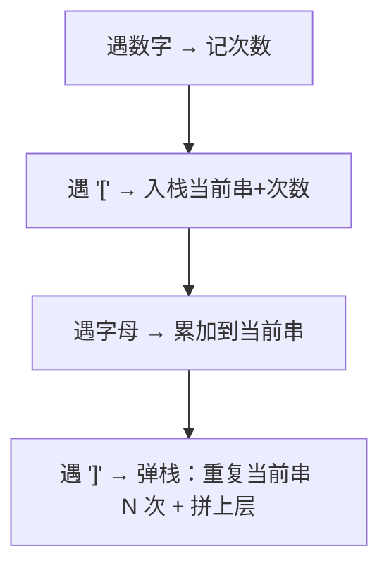

# 394. 字符串解码

## 📌 题目

给定一个整数数组 `temperatures` ，表示每天的温度，返回一个数组 `answer` ，其中 `answer[i]` 是指对于第 `i` 天，下一个更高温度出现在几天后。如果气温在这之后都不会升高，请在该位置用 `0` 来代替。

示例：
```
输入：temperatures = [73,74,75,71,69,72,76,73]
输出：[1,1,4,2,1,1,0,0]
```

🔗 [LeetCode 394](https://leetcode.cn/problems/decode-string/description/?envType=study-plan-v2&envId=top-100-liked)

## 🛒 人话理解 & 🧠 思路演进



大家好，我是忍者算法。今天我们来探讨一道非常有趣的算法题 - LeetCode 394「字符串解码」。这道题考察了栈和递归的灵活运用，是一道非常能锻炼编程思维的好题目。

### 📚 从生活场景理解

想象你正在开发一个文本压缩软件。比如要表达"hellohellobello"，与其写三遍，我们可以写成"3[hello]"来节省空间。如果字符串中还包含重复的部分，可以继续嵌套压缩，这就是今天要解决的问题！

### 💡 问题解析

**题目要求**：
给定一个经过编码的字符串，返回它解码后的字符串。编码规则是：
1. k[encoded_string] 表示 encoded_string 重复 k 次
2. encoded_string 里可能包含更多的方括号结构
3. 数字 k 保证为正整数

**示例**：

> 👉 代码实现见下方「🐍 Python 代码」

### 🤔 思维发展历程

### 1. 初学者思路
可能会想到用简单的字符串替换。但遇到嵌套结构时（如"3[a2[c]]"），这种方法就难以处理了。

### 2. 栈的思路
利用栈来处理嵌套结构，遇到']'时弹出栈内元素直到遇到'['，处理这一层的重复。

### 3. 递归思路
将问题分解为子问题：每遇到一个'['就是一个新的子问题的开始，遇到对应的']'就是子问题的结束。

### 🚀 优雅的递归解决方案

> 👉 代码实现见下方「🐍 Python 代码」

### 📝 代码详解

让我们深入理解这个递归解决方案的精妙之处：

### 1. 全局索引设计
使用全局索引来追踪当前处理的字符位置，这样可以在递归调用间共享处理进度。

### 2. 状态处理
代码处理三种主要状态：
- 遇到数字：收集完整数字，然后递归处理方括号内的内容
- 遇到字母：直接添加到结果中
- 遇到']'：表示当前层级处理完成，返回结果

### 3. 数字处理
考虑到数字可能是多位数，使用循环来获取完整的数字值：

> 👉 代码实现见下方「🐍 Python 代码」

### 4. 递归精髓
每次遇到'['就会触发一次递归调用，处理括号内的内容。递归函数返回时，正好处理完一对括号内的内容。

### 🎯 易错点剖析

1. **数字处理**
   - 别忘了处理多位数字
   - 注意数字到字符的转换

2. **嵌套处理**
   - 正确处理嵌套的括号结构
   - 保持对递归层级的清晰理解

3. **索引管理**
   - 准确移动和更新索引位置
   - 处理边界情况

### 💡 举一反三

这种解码思想可以应用到多种场景：

1. **HTML解析**
   - 处理嵌套的HTML标签结构
   - 构建DOM树

2. **表达式求值**
   - 处理带括号的数学表达式
   - 计算器的实现

3. **文件压缩**
   - 实现简单的文本压缩算法
   - 处理重复模式

### 🎨 图解演示

```
<svg viewBox="0 0 800 400" xmlns="http://www.w3.org/2000/svg">
  <!-- 背景 -->
  <rect width="800" height="400" fill="#f8f9fa"/>
  
  <!-- 标题 -->
  <text x="50" y="40" font-size="20" fill="#1976d2">字符串解码递归过程</text>
  
  <!-- 输入字符串显示 -->
  <g transform="translate(50,80)">
    <text x="0" y="0" font-size="16">输入：3[a2[c]]</text>
    
    <!-- 字符框 -->
    <g transform="translate(0,20)">
      <rect x="0" y="0" width="40" height="40" fill="#e3f2fd" stroke="#1976d2"/>
      <text x="20" y="25" text-anchor="middle">3</text>
      
      <rect x="40" y="0" width="40" height="40" fill="#e3f2fd" stroke="#1976d2"/>
      <text x="60" y="25" text-anchor="middle">[</text>
      
      <rect x="80" y="0" width="40" height="40" fill="#e3f2fd" stroke="#1976d2"/>
      <text x="100" y="25" text-anchor="middle">a</text>
      
      <rect x="120" y="0" width="40" height="40" fill="#e3f2fd" stroke="#1976d2"/>
      <text x="140" y="25" text-anchor="middle">2</text>
      
      <rect x="160" y="0" width="40" height="40" fill="#e3f2fd" stroke="#1976d2"/>
      <text x="180" y="25" text-anchor="middle">[</text>
      
      <rect x="200" y="0" width="40" height="40" fill="#e3f2fd" stroke="#1976d2"/>
      <text x="220" y="25" text-anchor="middle">c</text>
      
      <rect x="240" y="0" width="40" height="40" fill="#e3f2fd" stroke="#1976d2"/>
      <text x="260" y="25" text-anchor="middle">]</text>
      
      <rect x="280" y="0" width="40" height="40" fill="#e3f2fd" stroke="#1976d2"/>
      <text x="300" y="25" text-anchor="middle">]</text>
    </g>
  </g>
  
  <!-- 递归树 -->
  <g transform="translate(50,180)">
    <text x="0" y="0" font-size="16">递归解析过程：</text>
    
    <!-- 第一层 -->
    <circle cx="200" cy="40" r="30" fill="#c8e6c9" stroke="#388e3c"/>
    <text x="200" y="45" text-anchor="middle">3[...]</text>
    
    <!-- 连接线 -->
    <line x1="200" y1="70" x2="200" y2="100" stroke="#388e3c" stroke-width="2"/>
    
    <!-- 第二层 -->
    <circle cx="200" cy="130" r="30" fill="#bbdefb" stroke="#1976d2"/>
    <text x="200" y="135" text-anchor="middle">2[c]</text>
    
    <!-- 结果显示 -->
    <g transform="translate(350,40)">
      <text x="0" y="0" font-size="14">解析步骤：</text>
      <text x="0" y="30" font-size="14">1. 外层：3[a2[c]]</text>
      <text x="0" y="60" font-size="14">2. 内层：2[c] → cc</text>
      <text x="0" y="90" font-size="14">3. 组合：a+cc → acc</text>
      <text x="0" y="120" font-size="14">4. 重复：acc×3 → accaccacc</text>
    </g>
  </g>
</svg>
```

### 🌟 面试技巧

1. **思路说明**
   - 先解释为什么选择递归方案
   - 说明递归终止条件和状态传递

2. **复杂度分析**
   - 时间复杂度：O(n)，其中n是解码后的字符串长度
   - 空间复杂度：O(n)，递归调用栈的深度

3. **优化讨论**
   - 可以讨论迭代方案的实现
   - 考虑内存优化的可能性

### 🎩 栈解法版本

除了递归，我们还可以用栈来解决这个问题：

> 👉 代码实现见下方「🐍 Python 代码」

这个栈解法的优点是：
1. 避免了递归调用的开销
2. 更容易理解状态的变化过程
3. 适合处理超大规模的输入

## 🐍 Python 代码

```python
class Solution:
    def dailyTemperatures(self, temperatures: List[int]) -> List[int]:
        n = len(temperatures)  # 获取温度列表的长度
        answer = [0] * n  # 初始化答案列表，初始值为 0，表示没有比当前温度高的日子
        stack = []  # 栈，用来存储尚未找到更高温度的索引

        for i in range(n):
            # 使用 while 循环检查栈顶元素对应的温度是否小于当前温度
            # 如果是，则说明当前温度高于栈顶对应的温度，我们可以计算等待的天数
            while stack and temperatures[i] > temperatures[stack[-1]]:
                index = stack.pop()  # 栈顶的温度索引
                answer[index] = i - index  # 计算等待的天数，并将其存入答案列表
            
            # 将当前温度的索引压入栈中，以便后续处理
            stack.append(i)
        
        return answer
```
