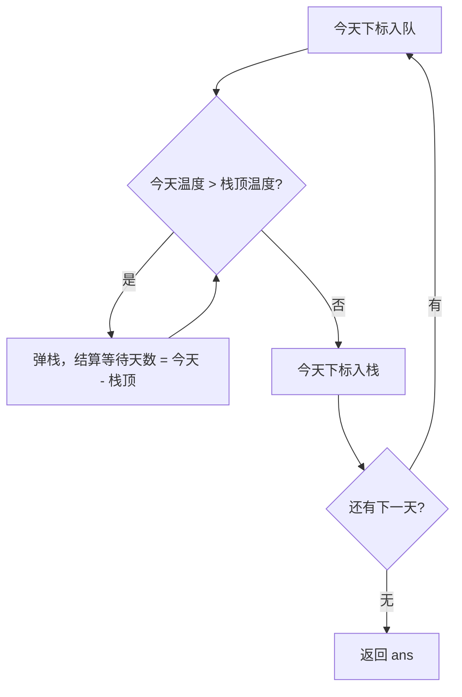
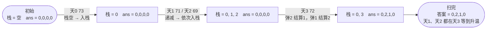

# 739. 每日温度

## 🛒 人话理解 & 🧠 思路演进



**总体一句话**：用一个存下标、对应温度单调递减的栈当「等待室」——今天更暖就把之前更冷的日子逐个弹出结算（等待天数 = 今天 − 那天），今天再入栈继续等，一趟遍历全员结清。

### 🔬 逐步推演（动画式）

以 `temperatures = 73, 71, 69, 72` 为例——从左到右就是算法的时间线：**每个节点是一次「栈 + ans」状态快照，箭头上写这一步处理了哪天、弹出结算还是入栈**：



大家好，我是忍者算法。今天我们来聊一道热门题目 - LeetCode 739「每日温度」。这道题乍看简单，实则蕴含着单调栈这个强大工具的妙用。不用担心！我会用最通俗的语言，带你一步步掌握这个看似高深的数据结构。

### 📚 生活中的温度预测

想象你是个天气预报员，手上有未来几天的温度预报。如果有人问："从今天开始，要等几天才会遇到一个更暖和的天气？" 这就是我们今天要解决的问题！只不过我们要为每一天都回答这个问题。

### 💡 问题是什么

🔗 [LeetCode 739](https://leetcode.cn/problems/daily-temperatures/description/?envType=study-plan-v2&envId=top-100-liked)

用大白话说就是：给你一串每天的温度数据，对于每一天，你要告诉我要往后等几天才能遇到一个更暖和的天气。如果后面都没有更暖和的天气，就记0天。

比如说：

> 👉 代码实现见下方「🐍 Python 代码」

我们一起分析第一个例子：
- 第1天是73度，第2天是74度，所以等1天就遇到更暖和的天气
- 第2天是74度，第3天是75度，也是等1天
- 第3天是75度，要等到第7天的76度才更暖和，所以等4天
- 以此类推...

### 🤔 怎么解决这个问题？

### 1. 最简单的想法
新手可能会想：对每一天，我都往后找一个比它暖和的天气。但这样做太费时间了，就像每次都要翻完整本日历才能找到答案。

### 2. 聪明的方法
我们可以反过来想：与其一天天往后找，不如我们记住之前的天气，遇到暖和的天气时，就回头告诉之前在等待的日子们："等待结束了！"

这就是单调栈的思路：它就像一个备忘录，记录着"正在等待更暖和天气"的日子。

### 🚀 写代码啦！

> 👉 代码实现见下方「🐍 Python 代码」

### 📝 代码是怎么工作的？

让我们用个具体的例子来看代码是怎么工作的。
假设温度数据是：[73, 74, 75, 71, 69, 72, 76, 73]

1. 第一天：73度
   - 栈是空的
   - 把第1天放入栈：[0]

2. 第二天：74度
   - 新温度74比栈顶（第1天的73）高
   - 告诉第1天：等待1天
   - 把第2天放入栈：[1]

3. 第三天：75度
   - 新温度75比栈顶（第2天的74）高
   - 告诉第2天：等待1天
   - 把第3天放入栈：[2]

以此类推...就像是在玩多米诺骨牌，一个温暖的天气可能会让好几个之前的日子都找到答案！

### 🎯 容易出错的地方

1. **栈里存什么？**
   - 存日期（数组下标），不是温度
   - 因为我们需要计算等待天数

2. **比较的是什么？**
   - 比较温度，但用的是日期找到温度
   - temperatures[today] 和 temperatures[stack.peek()]

3. **为什么要用栈？**
   - 栈能保持日期的顺序
   - 新温度可能同时影响多个之前的日子

### 💡 举些生活中的例子

这种思路在生活中很常见：

1. **股票价格追踪**
   - 等待股票价格上涨
   - 记录每个买入点要等多久才能盈利

2. **排队买票**
   - 前面什么时候才会有空位
   - 新开窗口时，很多人都能同时受益

3. **等待公交车**
   - 下一班大容量公交车什么时候来
   - 一辆大巴可能同时解决很多人的等待

### 🎨 图解演示

```
<svg viewBox="0 0 800 400" xmlns="http://www.w3.org/2000/svg">
  <!-- 背景 -->
  <rect width="800" height="400" fill="#f8f9fa"/>
  
  <!-- 标题 -->
  <text x="50" y="40" font-size="20" fill="#1976d2">温度变化和等待天数</text>
  
  <!-- 温度曲线图 -->
  <g transform="translate(50,100)">
    <!-- 坐标轴 -->
    <line x1="0" y1="200" x2="600" y2="200" stroke="black"/>
    <line x1="0" y1="0" x2="0" y2="200" stroke="black"/>
    
    <!-- 温度折线 -->
    <path d="M 0 54 L 75 52 L 150 50 L 225 58 L 300 62 L 375 56 L 450 48 L 525 54" 
          fill="none" stroke="#e91e63" stroke-width="2"/>
    
    <!-- 数据点 -->
    <circle cx="0" cy="54" r="4" fill="#e91e63"/>
    <circle cx="75" cy="52" r="4" fill="#e91e63"/>
    <circle cx="150" cy="50" r="4" fill="#e91e63"/>
    <circle cx="225" cy="58" r="4" fill="#e91e63"/>
    <circle cx="300" cy="62" r="4" fill="#e91e63"/>
    <circle cx="375" cy="56" r="4" fill="#e91e63"/>
    <circle cx="450" cy="48" r="4" fill="#e91e63"/>
    <circle cx="525" cy="54" r="4" fill="#e91e63"/>
    
    <!-- 温度标签 -->
    <text x="0" y="44" text-anchor="middle">73°</text>
    <text x="75" y="42" text-anchor="middle">74°</text>
    <text x="150" y="40" text-anchor="middle">75°</text>
    <text x="225" y="48" text-anchor="middle">71°</text>
    <text x="300" y="52" text-anchor="middle">69°</text>
    <text x="375" y="46" text-anchor="middle">72°</text>
    <text x="450" y="38" text-anchor="middle">76°</text>
    <text x="525" y="44" text-anchor="middle">73°</text>
  </g>
  
  <!-- 等待天数说明 -->
  <g transform="translate(50,350)">
    <text x="0" y="0" font-size="14">等待天数：</text>
    <text x="0" y="20" font-size="14">[1, 1, 4, 2, 1, 1, 0, 0]</text>
  </g>
</svg>
```

### 🌟 面试时怎么说？

1. **先说思路**
   - "我们可以用单调栈来记录正在等待更暖和天气的日子"
   - "新来一个温度时，就看看能不能解决之前日子的等待"

2. **解释选择**
   - 为什么不用简单方法：会重复太多次查找
   - 为什么选择单调栈：一次遍历就能解决所有等待

3. **补充说明**
   - 时间复杂度是O(n)：每个元素最多进出栈一次
   - 空间复杂度是O(n)：最坏情况下温度递减，所有天数都在栈中

### 🎩 更多玩法

我们还可以用这个思路解决类似的问题：

1. **找下一个更大的数**
   
> 👉 代码实现见下方「🐍 Python 代码」

2. **股票跨度问题**
   
> 👉 代码实现见下方「🐍 Python 代码」

记住：单调栈就像是一个"等待室"，当新来的元素满足条件时，就可以解决之前元素的等待问题。这个思路在很多地方都能用到！

## 🐍 Python 代码

### 🥊 暴力解（朴素对照）

对每一天，从它的下一天起向后线性扫描，找到第一个更高温度，记录等待天数；找不到就记 0。

```python
from typing import List

class Solution:
    def dailyTemperatures(self, temperatures: List[int]) -> List[int]:
        n = len(temperatures)
        ans = [0] * n
        for i in range(n):
            for j in range(i + 1, n):       # 往后找第一个更高温度
                if temperatures[j] > temperatures[i]:
                    ans[i] = j - i
                    break                   # 找到就停，记录距离
        return ans
```

- 时间复杂度：`O(n²)`，双重循环
- 空间复杂度：`O(1)`（不计返回数组）
- ⚠️ 每天都重复往后扫描，效率低。用单调（递减）栈让「正在等待更暖天气」的日子排队，一次遍历即可结算所有答案，降到 `O(n)`，见下方最优解。

### ⚡ 最优解

```python
class Solution:
    def dailyTemperatures(self, temperatures: List[int]) -> List[int]:
        n = len(temperatures)
        ans = [0] * n
        stack = []                                # 存下标，对应温度单调递减
        for today in range(n):
            # 今天更暖，之前那些 colder 的日子都能结算了
            while stack and temperatures[today] > temperatures[stack[-1]]:
                prev = stack.pop()
                ans[prev] = today - prev
            stack.append(today)
        return ans
```
