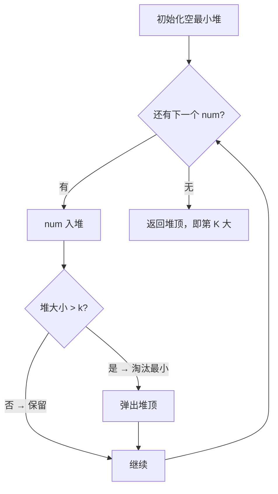

# 215. 数组中的第 K 个最大元素

## 📌 题目

给定整数数组 `nums` 和整数 `k`，请返回数组中第 `k` 个最大的元素。

请注意，你需要找的是数组排序后的第 `k` 个最大的元素，而不是第 `k` 个不同的元素。
你必须设计并实现时间复杂度为 `O(n)` 的算法解决此问题。

示例：
```
输入：[3,2,1,5,6,4], k = 2
输出：5
```

🔗 [LeetCode 215](https://leetcode.cn/problems/kth-largest-element-in-an-array/description/?envType=study-plan-v2&envId=top-100-liked)

## 🛒 人话理解



**总体一句话**：用一个大小为 k 的最小堆当「候补席」，每来一个数就进席；席满就踢掉最小的那个——扫完后席里留的就是最大的 k 个，而坐在最差位置（堆顶）的那个，正是第 K 大。

### 🔬 逐步推演（动画式）

以 `nums = [3, 2, 1, 5, 6]`，`k = 2` 为例——从左到右就是扫描数组的时间线：**每个节点是一次最小堆的状态快照（堆顶在前），箭头上写这一步处理了谁、做了什么决策**：


**类比**：选秀节目要留「前 K 强」。你维护一个只有 K 个座位的候补席，**席里留的是目前最大的 K 个，而坐在最差位置（堆顶）的那个，就是第 K 大**。

**做法**：用大小为 k 的**最小堆**。每来一个数就进堆；堆一超过 k 就弹掉堆顶（最小的那个被淘汰）。扫完后，堆顶就是第 K 大。

### 思路步骤

1. 维护大小为 k 的最小堆：
    - 在遍历数组 nums 时，我们使用一个堆，且堆的大小始终保持为 k。这是关键点：堆的大小总是 k。
    - 堆的特点是堆顶元素是堆中最小的元素。因此，堆中的元素始终是当前遍历过的元素中最大的 k 个元素，而堆顶元素将是这些元素中最小的，也就是整个数组中第 k 大的元素。

2. 堆操作的流程：
    - 每次遇到一个新的元素 num 时，我们将它加入到最小堆中。
    - 然后检查堆的大小，如果堆的大小超过 k，我们会移除堆顶元素。因为堆顶是最小的元素，这样做的目的是确保堆中只保留最大的 k 个元素。

3. 最终的结果：
    - 当遍历完所有元素后，最小堆中包含的是数组 nums 中最大的 k 个元素，而堆顶的最小元素正好是这 k 个元素中最小的一个，也就是整个数组中的第 k 大元素。

- 时间复杂度：对于每个元素插入堆的时间复杂度是 O(log⁡k)，我们有 n 个元素，因此总体的时间复杂度为 O(nlog⁡k)。
- 空间复杂度：堆的大小始终为 k，因此空间复杂度为 O(k)。

## 🐍 Python 代码

```python
class Solution:
    def findKthLargest(self, nums: list[int], k: int) -> int:
        # 使用大小为 k 的最小堆
        min_heap = []
        
        for num in nums:
            heapq.heappush(min_heap, num)
            # 如果堆的大小超过 k，弹出堆顶最小值
            if len(min_heap) > k:
                heapq.heappop(min_heap)
        
        # 堆顶即为第 k 大的元素
        return min_heap[0]
```
```python
class Solution:
    def findKthLargest(self, nums: List[int], k: int) -> int:
        def quick_select(nums, k):
            """
            Quickselect 函数：通过递归在数组中找到第 k 大的元素。
            通过选择一个 pivot（枢轴），将数组分成两部分：
              - `larger`: 所有大于 pivot 的元素
              - `smaller`: 所有小于 pivot 的元素
            然后根据 k 判断在哪部分递归继续查找。
            """
            # 随机选择一个 pivot 来避免最坏情况
            pivot = random.choice(nums)
            
            # 分成三部分：比 pivot 大的、比 pivot 小的和等于 pivot 的
            larger = [num for num in nums if num > pivot]
            smaller = [num for num in nums if num < pivot]
            
            # k <= len(larger) 意味着我们正在寻找的第 k 大元素在 larger 部分中。
            if k <= len(larger):
                return quick_select(larger, k)
            
            # 如果 k 大于 len(larger) + len(equal)，我们需要在 smaller 部分中递归查找
            # 由于我们已经排除了 larger 和 equal 部分的元素
            # 因此是在剩下的 smaller 部分寻找第 k - (len(larger) + len(equal)) 大的元素。
            if k > len(nums) - len(smaller):
                return quick_select(smaller, k - (len(nums) - len(smaller)))
            
            # 否则，pivot 就是第 k 大的元素
            return pivot

        return quick_select(nums, k)
```
