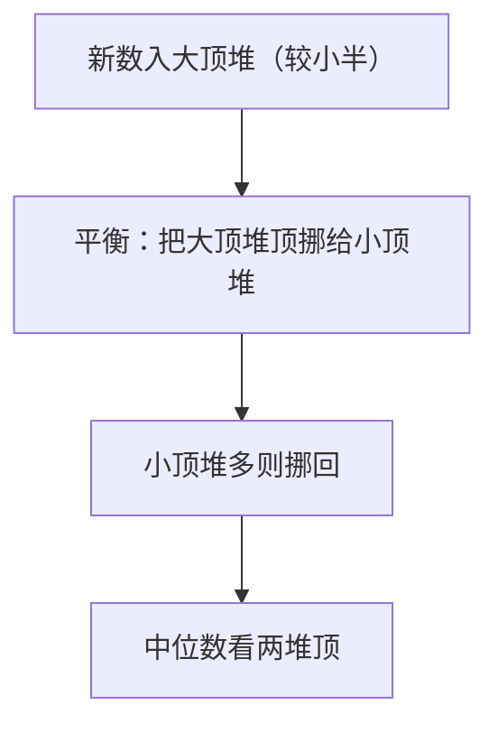

# 295. 数据流的中位数

## 🛒 人话理解

🔗 [LeetCode 295](https://leetcode.cn/problems/find-median-from-data-stream/description/?envType=study-plan-v2&envId=top-100-liked)



**核心**：要随时取中位数，用两个堆把数据切成两半——**大顶堆**（Python 存负数模拟）放较小一半、堆顶是这半最大；**小顶堆**放较大一半、堆顶是这半最小。保持大顶堆可多一个，中位数：奇数取大顶堆顶、偶数取两堆顶平均。插入 O(logn)、查询 O(1)。

## 🐍 Python 代码

### 🥊 暴力解（朴素对照）

每次 `findMedian` 都把当前所有数排序后取中间——思路最直白，无需维护额外结构。

```python
class MedianFinder:
    def __init__(self):
        self.nums = []

    def addNum(self, num: int) -> None:
        self.nums.append(num)   # 直接往数组里塞

    def findMedian(self) -> float:
        self.nums.sort()        # 每次查询都重新排序
        n = len(self.nums)
        mid = n >> 1
        if n & 1:               # 奇数个：取正中
            return self.nums[mid]
        return (self.nums[mid - 1] + self.nums[mid]) / 2.0  # 偶数个：取中间两个的平均
```

- 时间复杂度：`addNum` `O(1)`，`findMedian` `O(n log n)`（每次都要排序）
- 空间复杂度：`O(n)`
- ⚠️ 查询频繁时每次都全量排序，开销太大。用**两个堆**把数据切成大小两半、堆顶即中位数相关元素，即可把插入降到 `O(log n)`、查询降到 `O(1)` → 演进到下方最优解。

### ⚡ 最优解

```python
import heapq

class MedianFinder:
    def __init__(self):
        self.max_heap = []  # 较小一半（存负数模拟大顶堆）
        self.min_heap = []  # 较大一半

    def addNum(self, num: int) -> None:
        # 三步走：先丢进较小半(大顶堆)→把它的最大挪到较大半(小顶堆)→较大半偏多就回挪一个。
        # 效果：max_heap(较小半)个数 ≥ min_heap(较大半)，且任一左半元素 ≤ 任一右半元素
        heapq.heappush(self.max_heap, -num)
        heapq.heappush(self.min_heap, -heapq.heappop(self.max_heap))  # 较小半的最大 → 较大半
        if len(self.min_heap) > len(self.max_heap):                    # 较大半更多，回挪一个保持平衡
            heapq.heappush(self.max_heap, -heapq.heappop(self.min_heap))

    def findMedian(self) -> float:
        if len(self.max_heap) > len(self.min_heap):
            return -self.max_heap[0]
        return (-self.max_heap[0] + self.min_heap[0]) / 2.0
```
