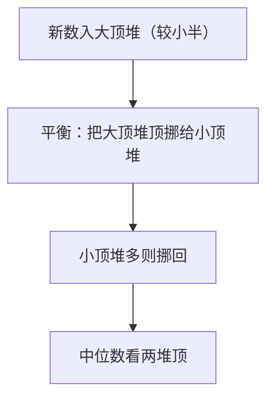

# 295. 数据流的中位数

## 🛒 人话理解

🔗 [LeetCode 295](https://leetcode.cn/problems/find-median-from-data-stream/description/?envType=study-plan-v2&envId=top-100-liked)



**核心**：要随时取中位数，用两个堆把数据切成两半——**大顶堆**（Python 存负数模拟）放较小一半、堆顶是这半最大；**小顶堆**放较大一半、堆顶是这半最小。保持大顶堆可多一个，中位数：奇数取大顶堆顶、偶数取两堆顶平均。插入 O(logn)、查询 O(1)。

## 🐍 Python 代码

```python
import heapq

class MedianFinder:
    def __init__(self):
        self.max_heap = []  # 较小一半（存负数模拟大顶堆）
        self.min_heap = []  # 较大一半

    def addNum(self, num: int) -> None:
        heapq.heappush(self.max_heap, -num)
        heapq.heappush(self.min_heap, -heapq.heappop(self.max_heap))
        if len(self.min_heap) > len(self.max_heap):
            heapq.heappush(self.max_heap, -heapq.heappop(self.min_heap))

    def findMedian(self) -> float:
        if len(self.max_heap) > len(self.min_heap):
            return -self.max_heap[0]
        return (-self.max_heap[0] + self.min_heap[0]) / 2.0
```
