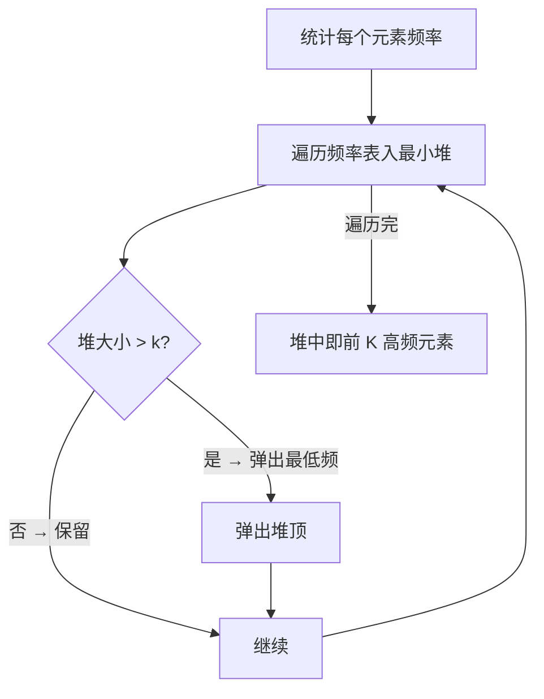
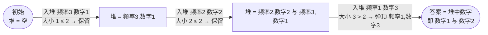
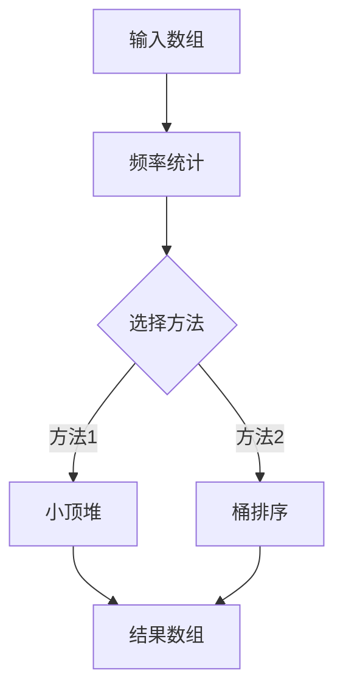

# 347. 前 K 个高频元素

## 📌 题目

给你一个整数数组 `nums` 和一个整数 `k` ，请你返回其中出现频率前 `k` 高的元素。你可以按 **任意顺序** 返回答案。

示例：
```
输入：nums = [1,1,1,2,2,3], k = 2
输出：[1,2]
```

🔗 [LeetCode 347](https://leetcode.cn/problems/top-k-frequent-elements/description/?envType=study-plan-v2&envId=top-100-liked)

## 🛒 人话理解 & 🧠 思路演进



**总体一句话**：先用哈希表统计每个数的频率，再用一个大小为 k 的最小堆当「候补席」——每来一个频率就进席，席满就踢掉频率最低的那个，扫完后席里留下的就是频率前 K 高的元素。

### 🔬 逐步推演（动画式）

以 `nums = [1,1,1,2,2,3]`，`k = 2` 为例——先统计得 `1→3 次、2→2 次、3→1 次`，再从左到右把各频率入堆：**每个节点是最小堆的状态快照（堆顶在前，存 频率,数字），箭头上写这一步处理了谁、做了什么决策**：



大家好，我是忍者算法。今天我们来攻克一道非常实用的题目 - LeetCode 347「前K个高频元素」。这个问题不仅在面试中常见，在实际工作中也经常遇到。让我们一起探索几种解决方案！

### 📚 生活中的场景

想象你是一个商场经理，想知道哪些商品最受欢迎。你手上有一串销售记录，需要找出销量前K名的商品。这就是我们今天要解决的问题的现实版本！

### 💡 问题定义

给你一个整数数组 nums 和一个整数 k，请你返回其中出现频率前 k 高的元素。

比如说：

> 👉 代码实现见下方「🐍 Python 代码」

### 🤔 解决方案

### 1. 小顶堆解法

> 👉 代码实现见下方「🐍 Python 代码」

### 2. 桶排序解法（最优解）

> 👉 代码实现见下方「🐍 Python 代码」

### 📝 方法比较

1. **小顶堆法**
   - 时间复杂度：O(nlogk)
   - 空间复杂度：O(n)
   - 优点：适合处理动态数据
   - 缺点：需要额外的堆空间

2. **桶排序法**
   - 时间复杂度：O(n)
   - 空间复杂度：O(n)
   - 优点：最优的时间复杂度
   - 缺点：需要额外的桶空间

### 💡 算法思路解析

### 小顶堆法的思路：
1. 先用哈希表统计每个元素的频率
2. 维护一个大小为k的小顶堆
3. 遍历频率表，更新堆
4. 最后堆中剩下的就是前k个高频元素

### 桶排序法的思路：
1. 同样先统计频率
2. 创建n+1个桶（频率范围是0到n）
3. 根据频率把元素放入对应的桶
4. 从后往前收集k个元素

### 🎯 易错点提醒

1. **频率统计**
   - 别忘了先统计频率
   - 使用HashMap的getOrDefault方法更简洁

2. **堆的比较器**
   - 小顶堆要按频率比较，不是数字本身
   - lambda表达式注意参数顺序

3. **结果收集**
   - 注意收集够k个元素就停止
   - 桶可能为空，要跳过

### 🎨 数据结构图解



### 🌟 面试技巧

1. **先说思路**
   - "我们首先需要统计每个元素的频率"
   - "然后可以用小顶堆或桶排序来找出前k个"

2. **比较方法**
   - 分析各种方法的优缺点
   - 说明在不同场景下的选择

3. **补充优化**
   - 提到空间优化的可能性
   - 讨论处理动态数据的方案

### 🎩 延伸应用

这个问题在实际工作中有很多应用：

1. **热门商品分析**
   - 找出销量最高的商品
   - 实时监控热销商品

2. **网站访问统计**
   - 统计最常访问的页面
   - 分析用户行为模式

3. **系统监控**
   - 发现最频繁的错误类型
   - 优化系统性能瓶颈

## 🐍 Python 代码

```python
class Solution:
    def topKFrequent(self, nums: list[int], k: int) -> list[int]:
        # 1. 使用 Counter 统计每个数字的出现频率
        count = Counter(nums)
        
        # 2. 构建一个最小堆，大小为 k
        # heapq 可以维护一个最小堆，堆中存储的是 (频率, 数字)
        min_heap = []
        
        for num, freq in count.items():
            # 将当前元素及其频率加入堆中
            heapq.heappush(min_heap, (freq, num))
            # 如果堆的大小超过 k，移除频率最低的元素
            if len(min_heap) > k:
                heapq.heappop(min_heap)
        
        # 3. 从最小堆中提取出频率最高的 k 个元素（此时堆中正好有 k 个元素）
        return [num for freq, num in min_heap]
```
```python
class Solution:
    def topKFrequent(self, nums: list[int], k: int) -> list[int]:
        # 1. 使用 Counter 统计每个数字的出现频率
        count = Counter(nums)
        
        # 2. 使用 most_common 方法找到频率最高的 k 个元素
        # most_common(k) 返回频率最高的前 k 个元素
        result = []
        for num, freq in count.most_common(k):
            result.append(num)
        
        return result
```
