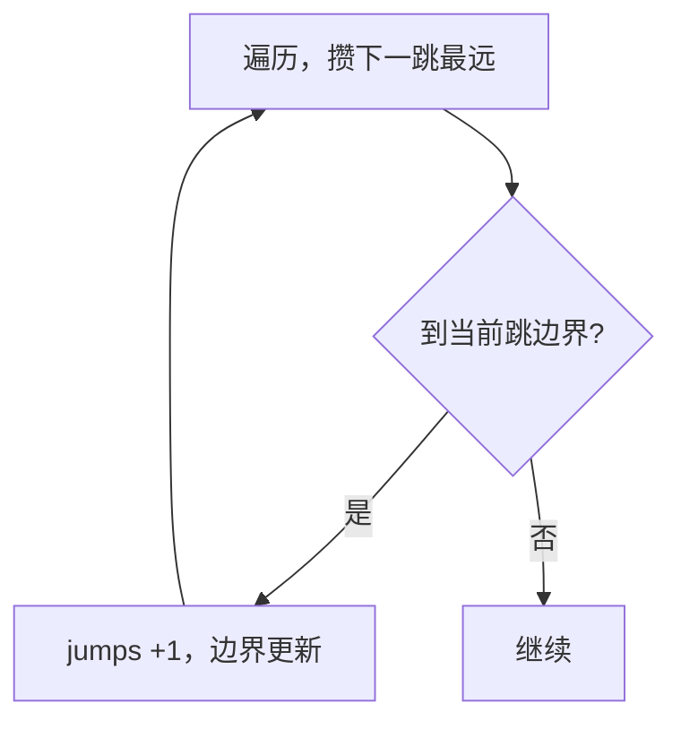

# 45. 跳跃游戏 II

## 📌 题目

给定一个长度为 `n` 的 **0 索引**整数数组 `nums`。初始位置为 `nums[0]`。

每个元素 `nums[i]` 表示从索引 `i` 向前跳转的最大长度。换句话说，如果你在 `nums[i]` 处，你可以跳转到任意 `nums[i + j]` 处：
- `0 <= j <= nums[i]` 
- `i + j < n`

返回到达 `nums[n - 1]` 的最小跳跃次数。生成的测试用例可以到达 `nums[n - 1]`。

示例：
```
输入：nums = [2,3,1,1,4]
输出：2
解释：跳到最后一个位置的最小跳跃数是 2。
```

🔗 [LeetCode 45](https://leetcode.cn/problems/jump-game-ii/description/?envType=study-plan-v2&envId=top-100-liked)

## 🛒 人话理解



**类比**：上一题问「能不能到」，这题问「最少几跳」。策略：**在当前这一跳能覆盖的范围内，尽量为下一跳积攒更远的覆盖**。

**做法**：维护当前一跳的边界 `end` 和下一跳能到的最远 `max_reach`。每走到 `end` 就必须跳一次（`jumps++`），并把 `end` 更新为 `max_reach`。贪心最优。

### 思路步骤

1. 贪心策略：在每一步中，我们尝试跳到当前能够到达的最远位置，并在需要的时候增加跳跃次数。
    
2. 变量初始化：
    - max_reach：表示从当前及之前的位置能够到达的最远下标。
    - steps：表示当前跳跃次数下能够到达的最远位置。
    - jumps：记录跳跃次数，初始为 1，因为至少需要一次跳跃。
3. 遍历数组：
    - 从索引 1 开始遍历（因为起始位置已被初始化考虑）。
    - 如果当前索引 i 超过了 steps，这意味着需要进行一次新的跳跃才能继续前进，因此增加 jumps 并更新 steps 为 max_reach。
    - 每次更新 max_reach 为 max(max_reach, i + nums[i])，以确保记录从当前位置能够到达的最远位置。
4. 跳跃条件： 
    - 通过比较 i 和 steps 来决定是否增加跳跃次数。
    - steps 的更新保证了每次跳跃后能够尽可能远地前进。

时间复杂度：该算法只需遍历数组一次，因此时间复杂度为 O(n)。
空间复杂度：该算法只使用了常数个额外变量，因此空间复杂度为 O(1)。

## 🐍 Python 代码

```python
class Solution:
    def jump(self, nums: List[int]) -> int:
        if len(nums) == 1:  # 如果数组只有一个元素，不需要跳跃
            return 0
    
        max_reach = nums[0]  # 当前能够达到的最远位置
        steps = nums[0]      # 当前步数能够达到的最远位置
        jumps = 1            # 跳跃次数
        
        for i in range(1, len(nums)):
            if i > steps:  # 如果当前位置超出了当前步数能够达到的最远位置
                jumps += 1
                steps = max_reach  # 更新当前步数能够达到的最远位置
                
            max_reach = max(max_reach, i + nums[i])  # 更新当前能够达到的最远位置
        
        return jumps
```
