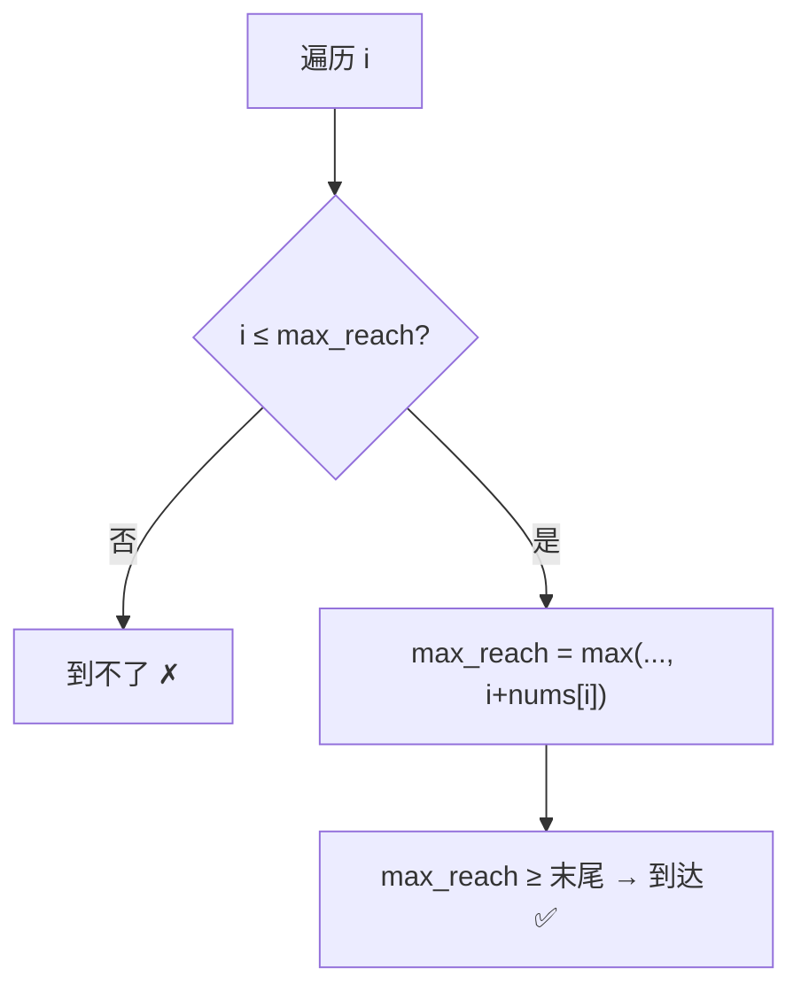

# 55. 跳跃游戏

## 📌 题目

给你一个非负整数数组 `nums` ，你最初位于数组的 **第一个下标** 。数组中的每个元素代表你在该位置可以跳跃的最大长度。
判断你是否能够到达最后一个下标，如果可以，返回 `true` ；否则，返回 `false` 。

示例：
```
输入：nums = [2,3,1,1,4]
输出：true
解释：可以先跳 1 步，从下标 0 到达下标 1, 然后再从下标 1 跳 3 步到达最后一个下标。
```

🔗 [LeetCode 55](https://leetcode.cn/problems/jump-game/description/?envType=study-plan-v2&envId=top-100-liked)

## 🛒 人话理解



**类比**：跳一列石头，每块石头上写着「从这儿最多再跳几步」。你关心的是**目前能触及的最远位置**。

**贪心**：维护 `max_reach`（能到的最远下标）。一路扫，只要当前位置 `i` 还在 `max_reach` 之内，就更新 `max_reach = max(max_reach, i + nums[i])`；一旦 `i` 超过 `max_reach`，说明跳不过来了，返回 False。

### 思路步骤

1. 贪心策略：每次在当前位置，计算从该位置能够到达的最远位置，并更新一个变量 max_reachable 来记录能够到达的最远下标。
    
2. 遍历数组：从第一个下标开始遍历数组：
    - 如果当前下标 i 超过了 max_reachable，这意味着无法从之前的任何位置跳到当前位置，因此直接返回 False。
    - 否则，更新 max_reachable 为 max(max_reachable, i + nums[i])，即在当前位置 i，尝试跳跃 nums[i] 步，更新最远可达位置。
    - 如果在遍历过程中，max_reachable 已经大于或等于最后一个下标，说明可以到达最后一个下标，返回 True。

时间复杂度：该算法只需遍历数组一次，因此时间复杂度为 O(n)。这是最优的时间复杂度，因为我们至少需要查看每个元素一次以确定是否可以到达最后一个位置。
空间复杂度：该算法只使用了常数个额外变量，因此空间复杂度为 O(1)。

## 🐍 Python 代码

```python
class Solution:
    def canJump(self, nums: List[int]) -> bool:
        max_reachable = 0
        for i in range(len(nums)):
            if i > max_reachable:
                return False
            max_reachable = max(max_reachable, i + nums[i])
        return True
```
