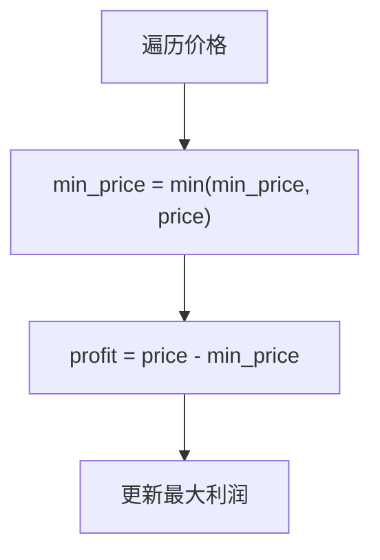

# 121. 买卖股票的最佳时机

## 📌 题目

给定一个数组 `prices` ，它的第 `i` 个元素 `prices[i]` 表示一支给定股票第 `i` 天的价格。

你只能选择 **某一天** 买入这只股票，并选择在 **未来的某一个不同的日子** 卖出该股票。设计一个算法来计算你所能获取的最大利润。

返回你可以从这笔交易中获取的最大利润。如果你不能获取任何利润，返回 `0` 。

示例：
```
输入：[7,1,5,3,6,4]
输出：5
解释：在第 2 天（股票价格 = 1）的时候买入，在第 5 天（股票价格 = 6）的时候卖出，最大利润 = 6-1 = 5 。
     注意利润不能是 7-1 = 6, 因为卖出价格需要大于买入价格；同时，你不能在买入前卖出股票。
```

🔗 [LeetCode 121](https://leetcode.cn/problems/best-time-to-buy-and-sell-stock/description/?envType=study-plan-v2&envId=top-100-liked)

## 🛒 人话理解



**类比**：炒股就是「在最低点买入、最高点卖出」。但你只能**先买后卖**，所以边走边记「到目前为止见过的最低价」，每天算「要是今天卖能赚多少」，取所有天的最大值。

**贪心**：`min_price` 记录历史最低，`max_profit = max(max_profit, price - min_price)`，一趟扫描搞定。

### 思路步骤

【贪心算法】

1. 保持最低价格：记录到目前为止的最低股价 `min_price`。
2. 计算最大利润：
   - 对于每一天的股价，计算如果在这一天卖出股票的利润，即 `prices[i] - min_price`。
   - 不断更新最大利润 `max_profit`。

总结：通过维护一个最低买入价和当前最大利润，每天更新这两个数值来计算最大可能利润。

## 🐍 Python 代码

```python
class Solution(object):
    def maxProfit(self, prices):
        if len(prices) == 1:
            return 0
        min_price = prices[0]
        max_profit = 0
        for i in range(1, len(prices)):
            min_price = min(min_price, prices[i])
            max_profit = max(max_profit, prices[i] - min_price)
        
        return max_profit
```
