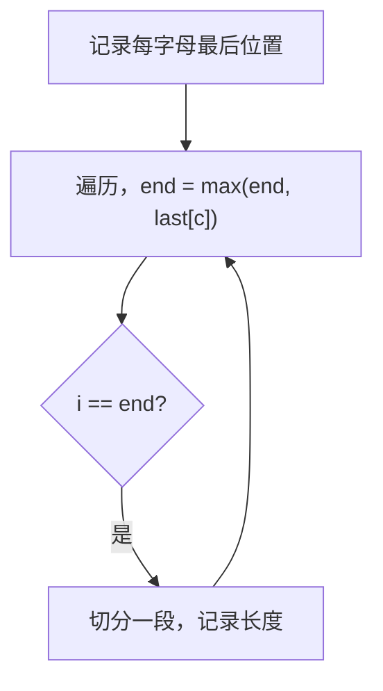

# 763. 划分字母区间

## 📌 题目

给你一个字符串 `s` 。我们要把这个字符串划分为尽可能多的片段，同一字母最多出现在一个片段中。

注意，划分结果需要满足：将所有划分结果按顺序连接，得到的字符串仍然是 `s` 。

返回一个表示每个字符串片段的长度的列表。

示例：
```
输入：s = "ababcbacadefegdehijhklij"
输出：[9,7,8]
解释：
划分结果为 "ababcbaca"、"defegde"、"hijhklij" 。
每个字母最多出现在一个片段中。像 "ababcbacadefegde", "hijhklij" 这样的划分是错误的，因为划分的片段数较少。
```

🔗 [LeetCode 763](https://leetcode.cn/problems/partition-labels/description/?envType=study-plan-v2&envId=top-100-liked)

## 🛒 人话理解 & 🧠 思路演进



作为一名开发者，你一定遇到过需要分割字符串的场景。今天我们来聊聊LeetCode 763题，一个看似简单实则暗藏玄机的字符串划分问题。

### 📝 问题的精髓

题目要求我们把字符串划分成尽可能多的片段，使得同一个字母只会出现在其中的一个片段中。比如说：

```
输入: S = "ababcbacadefegdehijhklij"
输出: [9,7,8]
解释: 
划分结果为 "ababcbaca", "defegde", "hijhklij"
每个字母最多出现在一个片段中
像 "ababcbacadefegde", "hijhklij" 的划分是错误的，因为划分的片段数较少。
```

乍一看，这个问题似乎有点让人摸不着头脑。但别着急，让我们一起来剖析它的本质。

### 💡 思路启发：贪心的艺术

想象你在玩一个特殊的拼图游戏。每个字母就像一块特殊的拼图块，它可能在字符串的多个位置出现。如果某个字母出现在位置A和位置B，那么从A到B之间的所有字母都必须在同一个片段中。

这就是解决问题的关键：我们需要找到每个字母最后出现的位置，然后确定每个片段的边界。这听起来是不是有点像贪心算法？

### ⚡ 代码实现：优雅与效率的平衡

> 👉 代码实现见下方「🐍 Python 代码」

这段代码的精妙之处在于它巧妙地运用了贪心的思想。让我们来看看它是如何工作的：

首先，我们用一个数组记录每个字母最后出现的位置。这就像是在为每个字母画一个范围，标记它们的势力范围。

然后，我们用双指针技术来确定每个片段的边界。`start`指针标记当前片段的起始位置，`end`指针则会随着遍历动态更新，始终指向当前片段中所有字母的最远位置。

当我们遍历到`end`位置时，就意味着找到了一个完整的片段。为什么？因为这个位置之后不会再出现任何属于当前片段的字母了。

### 🎯 复杂度与优化

时间复杂度是O(n)，因为我们只需要遍历两次字符串。空间复杂度是O(1)，因为我们使用的额外空间（lastPos数组）大小是固定的26。

有趣的是，这个解法已经是最优解了。因为我们必须至少遍历一次字符串来收集字母的位置信息，然后再遍历一次来划分片段。

### 💡 举一反三

这道题的思想可以应用到很多类似的问题中：
- 区间合并问题
- 会议室安排问题
- 任务调度问题

关键是要找到问题中的"不可分割性"特征，然后用贪心的思想来解决。

### 🤔 思考题

如果我们要求每个片段中的字母必须完全相同，比如"aaabbb"应该划分为["aaa","bbb"]，该如何修改我们的解法呢？

### 📝 面试技巧

在面试中遇到这类问题，建议按以下步骤思考：

首先阐述问题的关键点 - 每个字母只能出现在一个片段中，这暗示了我们需要考虑字母的完整范围。然后解释为什么贪心算法是合适的 - 因为我们总是希望让每个片段尽可能小，同时满足条件。最后，可以谈谈如何处理边界情况，以展示你考虑问题的全面性。

记住，有时候面试官可能会问到如何处理超大规模的输入。这时候可以讨论使用流式处理或者分布式计算的可能性。

## 🐍 Python 代码

### 🥊 暴力解（朴素对照）

从左到右切分，每切一段时不再用预处理的 last 表，而是把段内每个字母全部出现的位置都纳入「段必须延伸到的右边界」，反复扩展直到段内再无字母越界——思路最直白，但每次扩展都要重新扫描字符串找字母位置。

```python
from typing import List

class Solution:
    def partitionLabels(self, s: str) -> List[int]:
        n = len(s)
        res = []
        i = 0
        while i < n:
            end = s.rfind(s[i], i)        # 当前段内字母至少延伸到的最右位置
            j = i
            while j < end:                # 段内每个字母都要纳入右边界
                end = max(end, s.rfind(s[j], i))
                j += 1
            res.append(end - i + 1)
            i = end + 1                   # 下一段从 end+1 开始
        return res
```

- 时间复杂度：`O(n²)`，最坏每段扩展都要对整个串做 rfind
- 空间复杂度：`O(1)`（不计返回值）
- ⚠️ 多次重复 rfind 浪费。观察到「每个字母的最右位置是固定的，可一次性预处理成 last 表」→ 演进到下方 `O(n)` 贪心解。

### ⚡ 最优解

```python
class Solution:
    def partitionLabels(self, s: str) -> List[int]:
        last = {c: i for i, c in enumerate(s)}   # 每个字母最后出现的位置
        res = []
        start = end = 0
        for i, c in enumerate(s):
            end = max(end, last[c])   # 当前段至少要延伸到段内字母的最后位置
            if i == end:              # 走到段尽头，可以切分
                res.append(end - start + 1)
                start = i + 1
        return res
```
