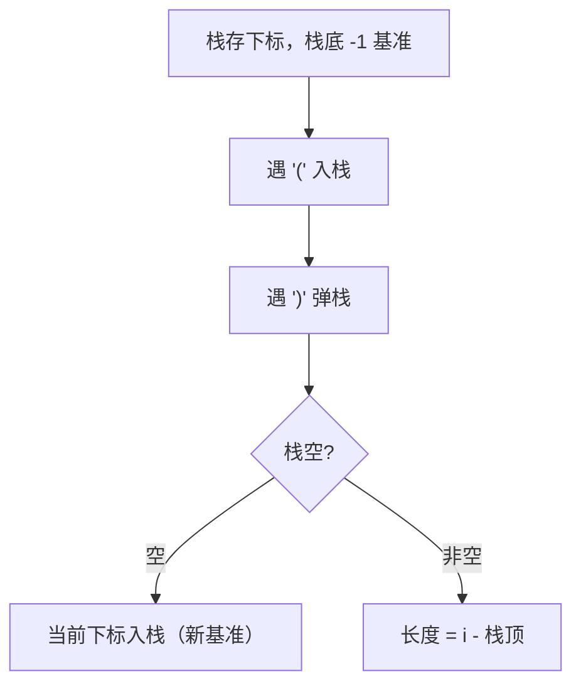

# 32. 最长有效括号

## 🛒 人话理解



**栈法**：栈里存**下标**，栈底预置 `-1` 作计算基准。遇 `(` 入栈；遇 `)` 先弹栈——弹完若**栈空**，说明这段 `)` 无法配对，把当前下标入栈当新基准；若栈非空，`当前下标 - 栈顶` 就是以当前位置结尾的最长有效括号长度，更新最大值。一趟 O(n)。

## 🐍 Python 代码

```python
class Solution:
    def longestValidParentheses(self, s: str) -> int:
        stack = [-1]  # 栈底放基准下标
        max_len = 0
        for i, c in enumerate(s):
            if c == '(':
                stack.append(i)
            else:
                stack.pop()
                if not stack:
                    stack.append(i)  # 更新基准
                else:
                    max_len = max(max_len, i - stack[-1])
        return max_len
```
