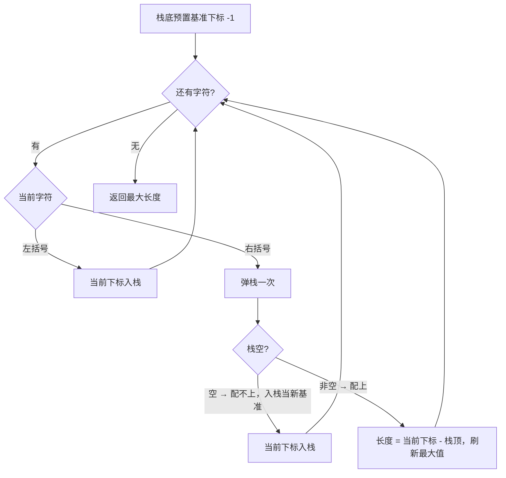
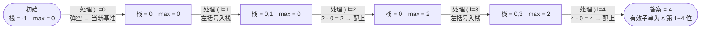

# 32. 最长有效括号

## 🛒 人话理解

🔗 [LeetCode 32](https://leetcode.cn/problems/longest-valid-parentheses/description/?envType=study-plan-v2&envId=top-100-liked)



**总体一句话**：栈里存**下标**、栈底预置 `-1` 当基准；遇 `(` 入栈，遇 `)` 弹栈——弹空说明这个 `)` 配不上、用它当新基准；没弹空就以 `当前下标 - 栈顶` 算出以当前位置结尾的有效长度。

### 🔬 逐步推演（动画式）

以 `s = ")()())"` 为例——从左到右就是算法的时间线：**每个节点是一次状态快照（栈 / max_len），箭头上写这一步处理了谁、怎么决策**：



## 🐍 Python 代码

### 🥊 暴力解（朴素对照）

枚举每个起点，从该起点向后扫描，用计数器模拟括号匹配，记录每段合法长度。

```python
class Solution:
    def longestValidParentheses(self, s: str) -> int:
        n = len(s)
        max_len = 0
        for i in range(n):          # 枚举子串起点
            left = right = 0
            for j in range(i, n):   # 向后扫描，用计数判断是否合法
                if s[j] == '(':
                    left += 1
                else:
                    right += 1
                if right > left:    # 右括号多了，这段已废
                    break
                if left == right:   # 左右相等即合法子串
                    max_len = max(max_len, j - i + 1)
        return max_len
```

- 时间复杂度：`O(n²)`，双重循环枚举所有子串
- 空间复杂度：`O(1)`
- ⚠️ n 一大就超时。观察到「合法长度只与最近的失配位置有关」→ 用栈存下标一趟扫描即可降到 `O(n)`。

### ⚡ 最优解

```python
class Solution:
    def longestValidParentheses(self, s: str) -> int:
        stack = [-1]  # 栈底放基准下标
        max_len = 0
        for i, c in enumerate(s):
            if c == '(':
                stack.append(i)
            else:
                stack.pop()
                if not stack:
                    stack.append(i)  # 更新基准
                else:
                    max_len = max(max_len, i - stack[-1])
        return max_len
```
