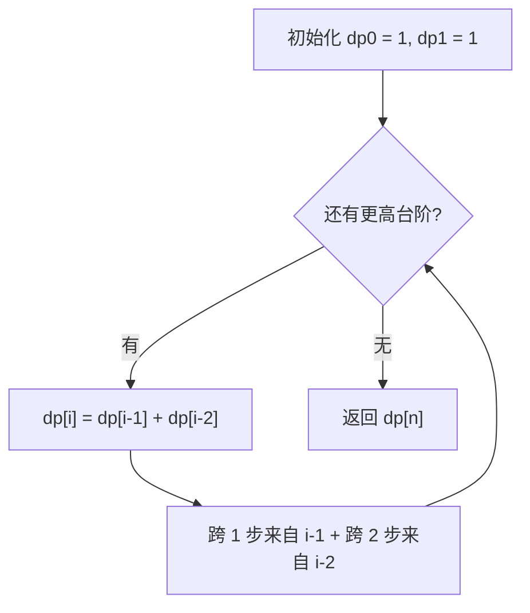
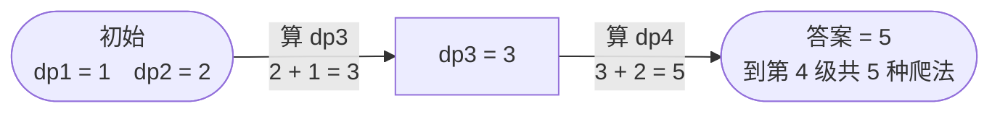

# 70. 爬楼梯

## 📌 题目

假设你正在爬楼梯。需要 `n` 阶你才能到达楼顶。

每次你可以爬 `1` 或 `2` 个台阶。你有多少种不同的方法可以爬到楼顶呢？

示例：
```
输入：n = 2
输出：2
解释：有两种方法可以爬到楼顶。
1. 1 阶 + 1 阶
2. 2 阶
```

🔗 [LeetCode 70](https://leetcode.cn/problems/climbing-stairs/description/?envType=study-plan-v2&envId=top-100-liked)

## 🛒 人话理解 & 🧠 思路演进



**总体一句话**：到第 i 级的方法数 = 到第 i-1 级（再跨 1 步）+ 到第 i-2 级（再跨 2 步），即斐波那契递推，从前往后逐级累加。

### 🔬 逐步推演（动画式）

以 `n = 4` 为例——从左到右就是算法的时间线：**每个节点是一次状态快照（当前台阶的方法数 dp），箭头上写这一步怎么由前两级算出来**：



记得刚开始学编程时，看到动态规划这三个字就头大。直到遇到了 LeetCode 70 题「爬楼梯」，它就像一把打开动态规划大门的钥匙，让我对这个算法思想有了全新的认识。今天，让我们一起通过这道题，揭开动态规划的神秘面纱。

### 🎯 问题本质：生活中的场景

想象你正在爬楼梯，每次可以爬1步或2步。给定一个楼梯的总阶数n，你想知道有多少种不同的爬法。比如：

```
输入：n = 3
输出：3
解释：有三种方法可以爬到楼顶
1. 1 步 + 1 步 + 1 步
2. 1 步 + 2 步
3. 2 步 + 1 步
```

看起来很简单对吧？但这道题蕴含着动态规划最核心的思想。

### 💡 从递归到动态规划：思维的蜕变

让我们像孩子学走路一样，一步步理解这个问题：

### 第一步：递归的直觉

站在第n级台阶上，我们是怎么到达这里的？
- 要么从第(n-1)级跨了1步上来
- 要么从第(n-2)级跨了2步上来

这就意味着：到达第n级的方法数 = 到达第(n-1)级的方法数 + 到达第(n-2)级的方法数

这是不是让你想起了什么？没错，斐波那契数列！

### 第二步：发现重叠子问题

如果我们直接用递归实现：

> 👉 代码实现见下方「🐍 Python 代码」

看到递归代码的那一刻，你可能会想："这不就结了吗？"但等你实际运行，就会发现性能惨不忍睹。为什么？

画出递归树，你会发现大量的重复计算。比如计算f(5)时，f(3)会被重复计算多次。这就是动态规划中最关键的概念之一：重叠子问题。

### 第三步：优化的艺术

发现重复计算后，我们自然会想到用一个数组把计算过的结果存起来，这就是"记忆化"技术。但还能更好吗？

仔细观察发现，我们其实只需要保存前两个状态就够了！这就引出了动态规划最精髓的地方：状态转移。

### 🔍 动态规划的四个核心要素

通过爬楼梯这个例子，我们可以总结出动态规划的核心要素：

1. 找到状态定义：dp[i]表示爬到第i级台阶的方法数
2. 确定状态转移方程：dp[i] = dp[i-1] + dp[i-2]
3. 明确初始状态：dp[1] = 1, dp[2] = 2
4. 确定计算顺序：从小到大递推

这四个要素，就像盖房子的地基、墙壁、屋顶和施工顺序，缺一不可。

### 🎯 举一反三

理解了爬楼梯，你就掌握了动态规划的入门钥匙。类似的题目还有：
- 打家劫舍（House Robber）
- 最大子数组和（Maximum Subarray）
- 买卖股票的最佳时机（Best Time to Buy and Sell Stock）

它们都遵循相似的思维模式：寻找状态定义→推导转移方程→优化空间复杂度。

### 💡 思考题

如果我们改变规则：可以爬1、2或3步，代码该如何修改？这种情况下，空间优化还能实现吗？

### 🎓 面试技巧

面试中遇到动态规划的题目，建议这样展示你的思路：

先说明问题的特征 - 最优子结构和重叠子问题。然后从最简单的递归解法开始，一步步优化到动态规划。这样不仅展示了你解决问题的能力，还体现了你对性能优化的理解。

记住，动态规划不是一个神秘的算法，而是一种解决问题的思维方式。它教会我们如何把大问题分解成小问题，并通过存储中间结果来提高效率。

## 🐍 Python 代码

### 🥊 暴力解（朴素对照）

直接按定义递归：到第 n 级只能从第 n-1 级跨 1 步或第 n-2 级跨 2 步——思路最直白，但存在大量重复计算。

```python
class Solution:
    def climbStairs(self, n: int) -> int:
        if n <= 2:
            return n
        # 从第 n 级回退：要么来自 n-1，要么来自 n-2
        return self.climbStairs(n - 1) + self.climbStairs(n - 2)
```

- 时间复杂度：`O(2ⁿ)`，递归树呈指数爆炸，大量重叠子问题被反复计算
- 空间复杂度：`O(n)`，递归栈深度
- ⚠️ n 一大就超时（n=38 已极慢）。发现重叠子问题后，把算过的结果存起来 → 演进到下方 `O(n)` 的动态规划。

### ⚡ 最优解

```python
class Solution:
    def climbStairs(self, n: int) -> int:
        dp = [0] * (n + 1)            # dp[i] = 爬到第 i 级的方法数
        dp[0], dp[1] = 1, 1           # 边界：0 级、1 级都各 1 种
        for i in range(2, n + 1):
            dp[i] = dp[i - 1] + dp[i - 2]   # 最后一步跨 1 级(来自 i-1) 或跨 2 级(来自 i-2)
        return dp[n]
```
