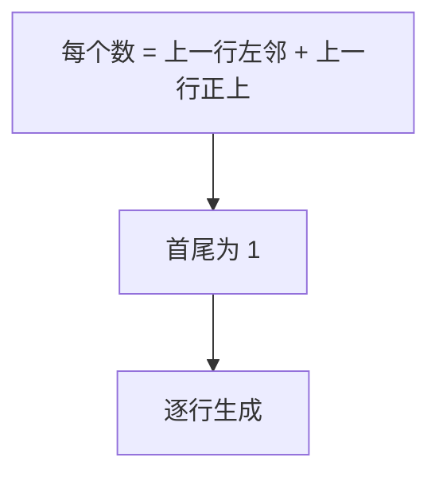

# 118. 杨辉三角

## 📌 题目

给定一个非负整数 `numRows`，生成「杨辉三角」的前 `numRows` 行。

在「杨辉三角」中，每个数是它左上方和右上方的数的和。


示例：

```
输入: numRows = 5
输出: [[1],[1,1],[1,2,1],[1,3,3,1],[1,4,6,4,1]]
```

🔗 [LeetCode 118](https://leetcode.cn/problems/pascals-triangle/description/?envType=study-plan-v2&envId=top-100-liked)

## 🛒 人话理解 & 🧠 思路演进



还记得高中数学课本上那个优雅的三角形吗？每个数都是上面两个数的和，像金字塔一样层层堆叠。今天我们聊聊 LeetCode 118 题，看看这个数学界的明星在编程世界里是如何绽放光彩的。

### 📐 重温杨辉三角

在开始编码之前，让我们先回顾一下杨辉三角的特点：

```
     1
    1 1
   1 2 1
  1 3 3 1
 1 4 6 4 1
```

这个看似简单的数字结构隐藏着丰富的数学内涵。每个数都是它肩上两个数的和，就像父母基因的传承。数学家们会告诉你，这里面藏着二项式系数的秘密，但今天我们关注的是如何优雅地构建它。

### 💡 从数学规律到代码实现

仔细观察杨辉三角，我们能发现一些有趣的特点：

1. 每一行的第一个和最后一个数字都是1
2. 对于非边缘位置的数字：`当前数 = 上一行的左肩数 + 右肩数`
3. 第n行有n个数字

这些规律为我们的代码实现提供了清晰的思路。让我们看看如何将这种数学美转化为代码：

> 👉 代码实现见下方「🐍 Python 代码」

这段代码像搭积木一样，一层层构建出杨辉三角。每一步都遵循着数学规律，将抽象的数学概念转化为具体的计算过程。

### 🔍 代码中的数学之美

让我们深入理解代码的每个部分：

第一层循环表示我们正在构建第几行，从1开始（因为第0行已经初始化为[1]）。这就像是在垒金字塔，一层层往上加。

第二层循环处理每一行中间的数字。这里用到了杨辉三角最核心的性质：每个数字都是上一行相邻两个数字的和。这种"遗传关系"在代码中表现为简单的加法运算。

特别要注意的是边界处理：每行的开始和结束都是1，这个规律永远不变。这让我们的代码既要处理通用情况，又要考虑特殊位置。

### 🎯 时间与空间的权衡

时间复杂度是O(n²)，其中n是行数。这是不可避免的，因为要生成的数字总数就是n(n+1)/2。

空间复杂度也是O(n²)，因为我们需要存储所有生成的数字。有趣的是，如果我们只需要打印出来，而不需要存储整个三角形，其实可以优化到O(n)的空间复杂度。

### 💡 扩展思考：杨辉三角的应用

杨辉三角不仅仅是一个数学趣题，它在实际编程中有着广泛的应用：

1. 组合数的快速计算
2. 概率统计中的二项分布
3. 某些动态规划问题的解决思路

### 🤔 思考题

想象一下，如果我们只需要获取杨辉三角的某一行，而不是整个三角形，如何优化我们的代码？提示：可以用组合数公式，也可以只维护一行的数据。

### 📝 面试技巧

遇到这道题时，建议这样展示你的思路：

首先说明你理解杨辉三角的数学特性，然后解释如何将这些特性转化为代码逻辑。特别强调边界条件的处理，因为这体现了你考虑问题的严谨性。

如果面试官追问空间优化，可以讨论只存储上一行数据的方案。这展示了你对空间复杂度的深入理解。

记住，很多看似复杂的问题，当我们理解了其中的规律，代码实现反而会变得简单优雅。杨辉三角就是一个完美的例子，它展示了数学之美如何在编程世界中重现。

## 🐍 Python 代码

### 🥊 暴力解（朴素对照）

逐行生成，每一行的中间元素直接套定义「左肩 + 右肩」相加——朴素直观，不依赖任何额外技巧。

```python
from typing import List

class Solution:
    def generate(self, numRows: int) -> List[List[int]]:
        if numRows <= 0:
            return []
        triangle = [[1]]  # 第一行
        for i in range(1, numRows):
            prev = triangle[-1]
            row = [1]  # 行首为 1
            for j in range(1, i):  # 中间元素 = 上一行左邻 + 正上
                row.append(prev[j - 1] + prev[j])
            row.append(1)  # 行尾为 1
            triangle.append(row)
        return triangle
```

- 时间复杂度：`O(n²)`，需生成 n(n+1)/2 个数，已是本题下界
- 空间复杂度：`O(n²)`，存储整个三角形（题目要求返回全部，无法省）
- ⚠️ 本题的「朴素」与「最优」复杂度相同——下方最优解只是写法上更紧凑（用 `[1]*(i+1)` 预填后原地改中间值），并非复杂度上的优化。

### ⚡ 最优解

```python
class Solution:
    def generate(self, numRows: int) -> List[List[int]]:
        if numRows <= 0:
            return []
        # Initialize the first row
        triangle = [[1]]
        
        for i in range(1, numRows):
            row = [1] * (i + 1)  # First step: initialize current row with 1s
            for j in range(1, i):  # 中间元素 = 上一行左肩 + 右肩
                row[j] = triangle[i-1][j-1] + triangle[i-1][j]
            triangle.append(row)

        return triangle
```
