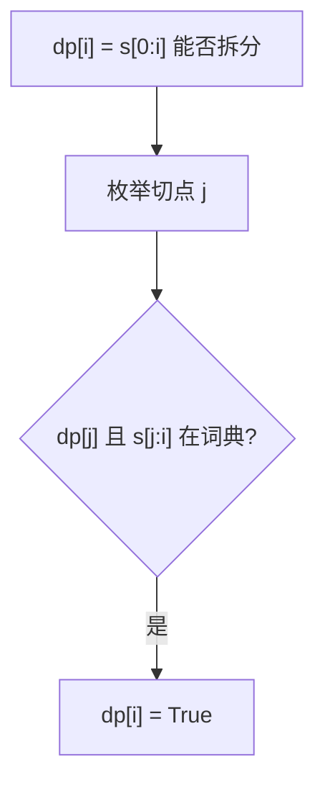

# 139. 单词拆分

## 📌 题目

给你一个字符串 `s` 和一个字符串列表 `wordDict` 作为字典。如果可以利用字典中出现的一个或多个单词拼出 `s` 则返回 `true`。

**注意：不要求字典中出现的单词全部都使用，并且字典中的单词可以重复使用。

示例：

```
输入：s = "leetcode", wordDict = ["leet", "code"]
输出：true
解释：返回 true 因为 "leetcode" 可以由 "leet" 和 "code" 拼接成。
```

🔗 [LeetCode 139](https://leetcode.cn/problems/word-break/description/?envType=study-plan-v2&envId=top-100-liked)

## 🛒 人话理解 & 🧠 思路演进



我第一次遇到 LeetCode 139 题「单词拆分」时，着实被难住了。这道题不像零钱兑换那样直观，但通过这篇文章，我希望能帮你理解这道经典题目背后的思维逻辑。让我们一起深入探索这个迷人的算法问题。

### 🎯 问题本质：文字的拼接游戏

想象你是一个文字游戏的设计师，需要判断一个字符串是否能被拆分成字典中的单词。具体来说：

```
输入：s = "leetcode", wordDict = ["leet", "code"]
输出：true
解释："leetcode" 可以被拆分成 "leet" 和 "code"

输入：s = "applepenapple", wordDict = ["apple", "pen"]
输出：true
解释："applepenapple" 可以被拆分成 "apple" "pen" "apple"

输入：s = "catsandog", wordDict = ["cats", "dog", "sand", "and", "cat"]
输出：false
解释：无法用字典中的词拼出 "catsandog"
```

这个问题乍看简单，但其实暗藏玄机。为什么呢？因为我们不仅要判断单词是否在字典中，还要考虑所有可能的拆分方式。

### 💡 解题思路：从暴力到优化的进阶之路

### 第一步：暴力递归（超时是必然的）

最直观的想法是：从字符串的每个位置开始，尝试匹配字典中的单词。如果匹配成功，继续处理剩余部分。

> 👉 代码实现见下方「🐍 Python 代码」

### 第二步：发现问题的本质

让我们通过一个例子来理解为什么这个方法会超时：
```
s = "aaab"
wordDict = ["a", "aa"]
```

画出递归树，你会发现：
- 第一次选择"a"后，需要处理"aab"
- 第一次选择"aa"后，也需要处理"ab"
- 这些子问题在递归过程中被重复计算了多次

这就是典型的"重叠子问题"！启发我们使用动态规划来优化。

### 第三步：设计动态规划解法

关键在于设计状态定义和转移方程：

1. 状态定义：
   dp[i] 表示字符串s的前i个字符能否被拆分成字典中的单词

2. 转移方程：
   dp[i] = dp[j] && check(s[j..i])
   其中j < i，check函数判断子串s[j..i]是否在字典中

3. 边界情况：
   dp[0] = true，表示空字符串可以被拆分

> 👉 代码实现见下方「🐍 Python 代码」

### 第四步：优化细节

为了进一步提升性能，我们可以添加一些剪枝条件：

> 👉 代码实现见下方「🐍 Python 代码」

### 🔍 解题技巧与优化思路

1. 使用HashSet存储字典，提高查询效率
2. 记录最大最小单词长度，减少无效的子串检查
3. 当找到一种可行的拆分方式时立即break内层循环
4. 可以考虑使用字符串哈希等技术进一步优化子串判断

### 💡 举一反三

理解了单词拆分，你会发现很多字符串的动态规划问题都是相通的：
- 回文串的分割
- 正则表达式匹配
- 编辑距离

### 🎯 思考题

如果要求返回所有可能的拆分方式（LeetCode 140 单词拆分 II），该如何修改我们的代码？这个问题会比当前这个版本难在哪里？

### 🎓 面试指南

遇到这类字符串动态规划问题，建议这样思考：

1. 先尝试写出递归解法，理解问题的本质
2. 找出重叠子问题，这是使用动态规划的关键依据
3. 设计状态定义，这往往是最难的部分
4. 推导状态转移方程，可以通过具体例子来帮助思考
5. 考虑边界情况，比如空字符串的处理
6. 最后思考优化空间，比如剪枝、哈希等技术

记住，字符串的动态规划题目往往看起来很难，但只要我们能够正确地定义状态，理清楚状态之间的转移关系，就能一步步找到解决方案。

## 🐍 Python 代码

```python
class Solution:
    def wordBreak(self, s: str, wordDict: List[str]) -> bool:
        # 将 wordDict 转换为集合，方便查找
        word_set = set(wordDict)
        # 创建一个长度为 len(s) + 1 的数组 dp，初始为 False
        dp = [False] * (len(s) + 1)
        # 初始化 dp[0] 为 True，因为空字符串是可以构成的
        dp[0] = True

        # 遍历字符串的每一个位置 i
        for i in range(1, len(s) + 1):
            # 对于每个位置 i，尝试从 j 切分
            for j in range(i):
                # 如果 dp[j] 为 True 且 s[j:i] 在字典中
                if dp[j] and s[j:i] in word_set:
                    dp[i] = True
                    break  # 已经找到一个方案，不需要继续切分

        # 最终结果在 dp[len(s)]
        return dp[len(s)]
```
