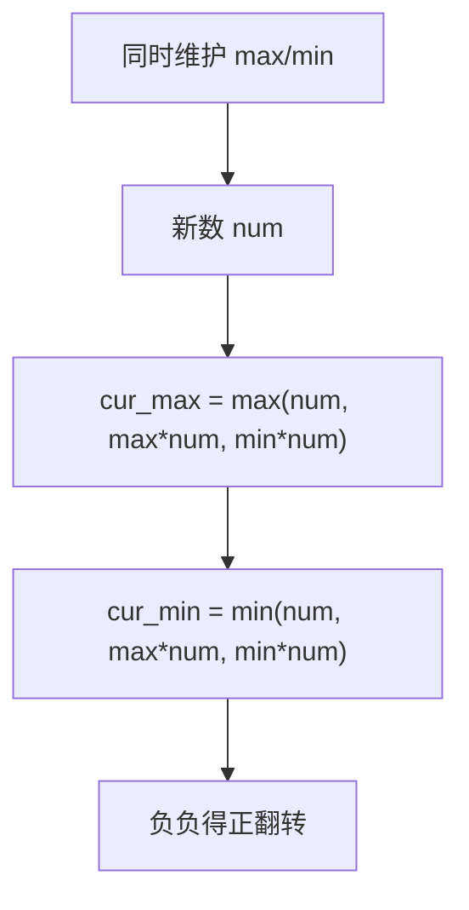

# 152. 乘积最大子数组

## 📌 题目

给你一个整数数组 `nums` ，请你找出数组中乘积最大的非空连续子数组（该子数组中至少包含一个数字），并返回该子数组所对应的乘积。

测试用例的答案是一个 **32位** 整数。

示例：
```
输入：nums = [2,3,-2,4]
输出： 6
解释：子数组 [2,3] 有最大乘积 6。
```

🔗 [LeetCode 152](https://leetcode.cn/problems/maximum-product-subarray/description/?envType=study-plan-v2&envId=top-100-liked)

## 🛒 人话理解



**坑点**：乘法里**负数会翻转大小**——一个负数乘上「最小值（很负）」反而变成最大值。所以只记最大值不够。

**做法**：同时维护以当前位置结尾的**最大乘积** `cur_max` 和**最小乘积** `cur_min`。转移时三者比较：`num`、`cur_max*num`、`cur_min*num`，分别更新 max/min。全局最大即为答案。

### 思路步骤

该题的关键在于处理正负数的影响，因为负数的乘积可能会使最小值变成最大值。因此，需要特别关注如何维护最大值和最小值。

为了在遍历数组的过程中随时保持最大和最小的乘积，关键是要同时记录当前位置之前的最大乘积和最小乘积。原因如下：
	- 当前的数字如果是正数，我们希望它乘以之前的最大乘积，得到一个更大的值。
	- 当前的数字如果是负数，那么我们希望它乘以之前的最小乘积，因为负负得正，可能得到更大的值。
因此，我们需要在每一步同时跟踪最大乘积和最小乘积，并通过更新它们来保证遍历结束时可以得到全局的最大乘积。

1. 定义状态
	- max_prod[i]：表示以 nums[i] 结尾的子数组的最大乘积。
	- min_prod[i]：表示以 nums[i] 结尾的子数组的最小乘积（负数的可能性）。
2. 初始化：
	- max_prod[0] = nums[0]：因为以第一个元素开始的子数组的最大乘积就是它自己。
	- min_prod[0] = nums[0]：同理，以第一个元素开始的子数组的最小乘积也是它自己。
3. 状态转移方程：
	- 如果 nums[i] 是正数，则 max_prod[i] = max(max_prod[i-1] * nums[i], nums[i])。
	- 如果 nums[i] 是负数，则 max_prod[i] = max(min_prod[i-1] * nums[i], nums[i])，因为负数会反转最大和最小的关系。

## 🐍 Python 代码

### 🥊 暴力解（朴素对照）

枚举所有连续子数组，边累乘边取最大——思路最直白，双重循环。

```python
from typing import List

class Solution:
    def maxProduct(self, nums: List[int]) -> int:
        n = len(nums)
        ans = nums[0]
        for i in range(n):            # 子数组起点
            prod = 1
            for j in range(i, n):     # 子数组终点，边乘边更新
                prod *= nums[j]
                ans = max(ans, prod)
        return ans
```

- 时间复杂度：`O(n²)`，双重循环
- 空间复杂度：`O(1)`
- ⚠️ n 一大就超时。坑点在于「负数会翻转大小」，朴素法靠暴力覆盖了所有情况才正确；观察到只需同时维护以当前位置结尾的最大/最小乘积即可一趟 `O(n)` 解决。

### ⚡ 最优解

```python
class Solution:
    def maxProduct(self, nums: List[int]) -> int:
        # 初始化最大乘积和最小乘积
        current_max = current_min = global_max = nums[0]
        
        # 从第二个元素开始遍历
        for i in range(1, len(nums)):
            num = nums[i]
            temp_max = current_max   # 先存住旧 max，算 min 时还要用(否则已被新 max 覆盖)

            # 三者取大/小：num(另起一段)、接上旧 max、接上旧 min(负负得正时 min*num 反而最大)
            current_max = max(num, current_max * num, current_min * num)
            current_min = min(num, temp_max * num, current_min * num)
            
            # 更新全局最大值
            global_max = max(global_max, current_max)
        
        return global_max
```
