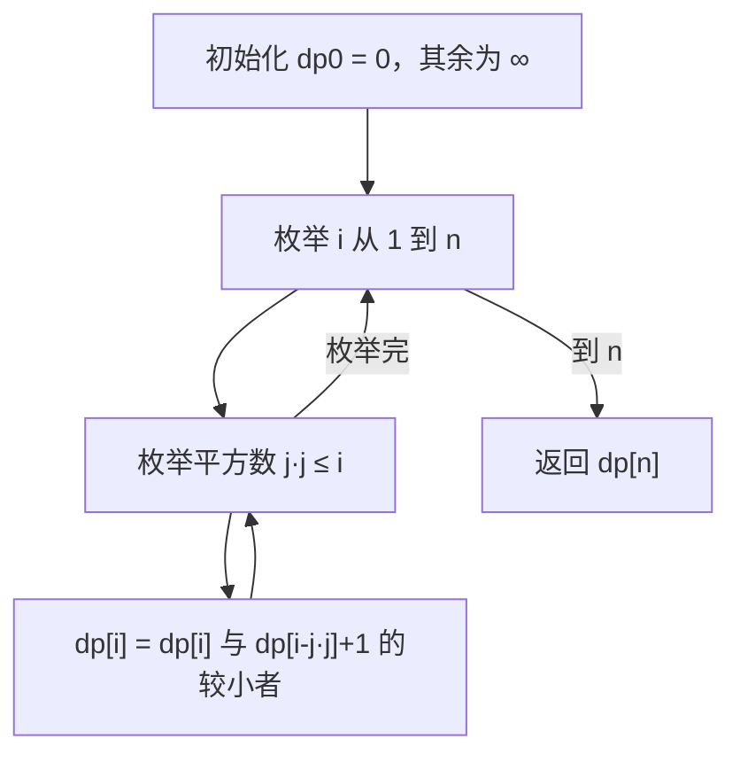
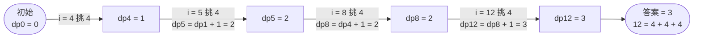

# 279. 完全平方数

## 📌 题目

给你一个整数 `n` ，返回 _和为 `n` 的完全平方数的最少数量_ 。

**完全平方数** 是一个整数，其值等于另一个整数的平方；换句话说，其值等于一个整数自乘的积。例如，`1`、`4`、`9` 和 `16` 都是完全平方数，而 `3` 和 `11` 不是。

示例：
```
输入：n = 12
输出：3 
解释：12 = 4 + 4 + 4
```

🔗 [LeetCode 279](https://leetcode.cn/problems/perfect-squares/description/?envType=study-plan-v2&envId=top-100-liked)

## 🛒 人话理解 & 🧠 思路演进



**总体一句话**：`dp[i]` 表示凑成 `i` 所需的最少完全平方数个数——枚举每一个平方数 `j·j`，从 `dp[i-j·j] + 1` 里取最小，自底向上填表。

### 🔬 逐步推演（动画式）

以 `n = 12`（可用平方数 1、4、9）为例——从左到右就是算法的时间线：**每个节点是一次状态快照（dp 值），箭头上写这一步填到哪个 i、挑了哪个平方数**：



还记得小学时学过的平方数吗？1, 4, 9, 16, 25...这些数有着独特的魅力。今天我们要聊的 LeetCode 279 题就和这些数字有关，它将带我们领略动态规划与数论的完美结合。

### 🎯 问题本质

给你一个正整数 n，要求找到最少需要多少个完全平方数相加得到 n。比如：

```
输入：n = 12
输出：3
解释：12 = 4 + 4 + 4
```
```
输入：n = 13
输出：2
解释：13 = 4 + 9
```

乍看这道题，你可能会想："要不要把所有可能的组合都试一遍？"但等等，让我们用动态规划的思维来思考这个问题。

### 💡 思维转变：从暴力到动态规划

想象你正在玩一个数字游戏。要拼出数字n，你每次可以选择一个完全平方数。这不就像是用最少的硬币凑出一定金额吗？这种联想让我们找到了突破口。

### 🔍 动态规划的设计过程

让我们一步步构建解决方案：

### 1. 定义状态
dp[i] 表示组成数字 i 需要的最少完全平方数个数。这个定义直接对应我们要解决的问题。

### 2. 寻找状态转移方程
假设我们现在要求 dp[n]，我们可以：
- 先选一个完全平方数 j*j
- 然后问题就变成了求 dp[n - j*j]
- 遍历所有可能的 j，取最小值

所以状态转移方程就呼之欲出了：
`dp[i] = min(dp[i], dp[i - j*j] + 1)`，其中 j*j ≤ i

> 👉 代码实现见下方「🐍 Python 代码」

### 🎯 代码的精髓

我们的解法提供了两种思路：动态规划和数学方法。让我们深入理解动态规划解法的每个部分：

1. 预处理完全平方数：
   - 提前计算所有可能用到的完全平方数
   - 避免重复计算，提高效率

2. 状态转移的实现：
   - 对每个数i，尝试减去每个小于它的完全平方数
   - 取所有可能情况的最小值
   - 这个过程直观地体现了"选择"的概念

3. 初始化的考虑：
   - dp[0] = 0 作为基础case
   - 其他位置初始化为最大值，方便取最小值

### 💡 优化的艺术：数学方法

除了动态规划，这道题还有一个令人惊叹的数学解法 —— 四平方和定理：任何自然数都可以表示为最多四个完全平方数的和。

更进一步，我们可以证明：
1. 当n本身是完全平方数时，答案是1
2. 当n可以表示为两个完全平方数之和时，答案是2
3. 当n = 4^k * (8m + 7)时，答案是4
4. 其他情况下，答案是3

### 🤔 思考题

如果问题变成：要求所有加数都必须是不同的完全平方数，解法会有什么变化？提示：状态的定义可能需要加入"已使用的最大完全平方数"这个维度。

### 📝 面试技巧

在面试中遇到这道题，建议这样展示你的思路：

1. 先说明动态规划的思路：
   - 定义状态表示的含义
   - 推导状态转移方程
   - 解释为什么这个方程是正确的

2. 然后可以提到优化方向：
   - 预处理完全平方数
   - 提到数学方法的存在（加分项！）

记住，面试官更关心你的思维过程，而不仅仅是最终的解法。通过清晰地表达你如何一步步构建解决方案，你能展示出自己的问题解决能力。

## 🐍 Python 代码

### 🥊 暴力解（朴素对照）

每次从 `1` 枚举一个平方数 `j*j` 去减，递归地求「凑出剩余值最少几个平方数」——纯递归不记忆，所有方案都试一遍。

```python
class Solution:
    def numSquares(self, n: int) -> int:
        import math

        # 凑出和为 remain 至少需要多少个完全平方数
        def dfs(remain: int) -> int:
            if remain == 0:
                return 0
            best = remain          # 最差全用 1，共 remain 个
            j = 1
            while j * j <= remain:
                best = min(best, dfs(remain - j * j) + 1)
                j += 1
            return best

        return dfs(n)
```

- 时间复杂度：`O(n^(n/2))` 级别，递归分支指数膨胀（无记忆化）
- 空间复杂度：`O(n)`，递归栈深度
- ⚠️ 同一个 `remain` 被反复求，存在大量重叠子问题 → 用 dp 数组自底向上填表，即为下方 `O(n√n)` 的最优解。

### ⚡ 最优解

```python
class Solution:
    def numSquares(self, n: int) -> int:

        # 创建一个长度为 n+1 的数组 dp
        dp = [float('inf')] * (n + 1)
        
        # 初始化 dp[0] 为 0，因为凑成 0 不需要任何数
        dp[0] = 0
        
        # 从 1 开始，逐步计算 dp[i] 的最优解
        for i in range(1, n + 1):
            # 尝试每一个小于 i 的平方数 j*j
            j = 1
            while j * j <= i:
                dp[i] = min(dp[i], dp[i - j * j] + 1)
                j += 1
        
        # 最终答案在 dp[n]
        return dp[n]
```
