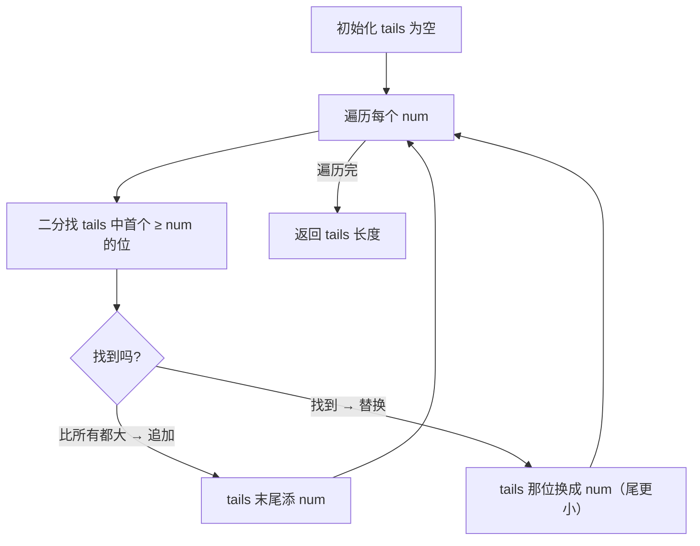
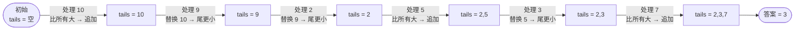

# 300. 最长递增子序列

## 📌 题目

给你一个整数数组 `nums` ，找到其中最长严格递增子序列的长度。

**子序列** 是由数组派生而来的序列，删除（或不删除）数组中的元素而不改变其余元素的顺序。例如，`[3,6,2,7]` 是数组 `[0,3,1,6,2,2,7]` 的子序列。

示例：
```
输入：nums = [10,9,2,5,3,7,101,18]
输出：4
解释：最长递增子序列是 [2,3,7,101]，因此长度为 4 。
```

🔗 [LeetCode 300](https://leetcode.cn/problems/longest-increasing-subsequence/description/?envType=study-plan-v2&envId=top-100-liked)

## 🛒 人话理解



**总体一句话**：维护 `tails`，`tails[i]` 是长度为 `i+1` 的递增子序列的最小尾值——每来一个数用二分定位，比所有都大就追加（序列变长），否则替换该位让尾更小，最终 `tails` 长度即答案。

### 🔬 逐步推演（动画式）

以 `nums = 10,9,2,5,3,7` 为例——从左到右就是算法的时间线：**每个节点是一次状态快照（tails 数组），箭头上写这一步处理了哪个数、追加还是替换**：



**类比**：要拼尽可能长的递增序列，希望每个位置上的尾数**越小越好**，这样后面才更容易接上。

**做法**：维护 `tails` 数组，`tails[i]` 表示「长度为 i+1 的递增子序列的最小尾值」。每来一个数，用**二分**在 `tails` 里找第一个 ≥ 它的位置：比所有都大就追加（序列变长），否则替换该位（让尾值更小）。最终 `len(tails)` 即答案，O(nlogn)。

### 思路步骤

1. 初始化：
	- tails = []。这个数组最终会保存每个长度的递增子序列的最小结尾值。
	- 如果 tails[2] = 7，表示存在一个长度为 3 的递增子序列，其结尾元素为 7。
	- 为什么关心最小结尾元素？因为最小的结尾使得后续的序列更有可能继续延展，从而形成更长的递增子序列。
2. 定义 binary_search 函数：二分查找用来找到 tails 中第一个大于等于目标值 target 的位置。该函数返回的 left 就是我们需要插入或替换的索引位置。
3. 遍历 nums 数组：
    - 对于每个 num，在 tails 中通过二分查找找到第一个大于等于 num 的位置 idx。
    - 如果 num 比 tails 中所有元素都大，即 idx == len(tails)，则将 num 添加到 tails 末尾。
    - 如果找到了合适的位置 idx，则替换掉 tails[idx]，表示找到了一个更小的结尾元素，使得当前长度的递增子序列更有潜力继续延展。
4. 最终返回 tails 数组的长度：tails 的长度即为最长递增子序列的长度。

示例

以输入 [10, 9, 2, 5, 3, 7, 101, 18] 为例：

1. 初始化 tails = []。
2. 遍历第一个元素 10：
    - tails 是空的，所以将 10 添加到 tails 中：tails = [10]。
3. 遍历第二个元素 9：
    - 9 小于 10，所以用 9 替换 tails[0]，得到 tails = [9]。
4. 遍历第三个元素 2：    
    - 2 小于 9，所以用 2 替换 tails[0]，得到 tails = [2]。
5. 遍历第四个元素 5：
    - 5 大于 2，将 5 添加到 tails 末尾：tails = [2, 5]。
6. 遍历第五个元素 3：
    - 3 大于 2 但小于 5，用 3 替换 tails[1]，得到 tails = [2, 3]。
7. 遍历第六个元素 7：
    - 7 大于 3，将 7 添加到 tails 末尾：tails = [2, 3, 7]。
8. 遍历第七个元素 101：
    - 101 大于 7，将 101 添加到 tails 末尾：tails = [2, 3, 7, 101]。
9. 遍历最后一个元素 18：
    - 18 小于 101 但大于 7，用 18 替换 tails[3]，得到 tails = [2, 3, 7, 18]。

最终 tails 数组的长度为 4，因此最长递增子序列的长度为 4。

贪心策略：通过维护一个 tails 数组，确保对于每个可能长度的递增子序列，其结尾元素尽可能小，以便后续元素更容易接上。
二分查找：在 tails 中找到可以插入或替换的位置，用二分查找加速这个过程，从而将整体时间复杂度优化到 O(nlogn)。

## 🐍 Python 代码

### 🥊 暴力解（朴素对照）

以每个位置为结尾，往前枚举所有更小的元素做转移——经典 `O(n²)` 动态规划，思路最直白。

```python
from typing import List

class Solution:
    def lengthOfLIS(self, nums: List[int]) -> int:
        n = len(nums)
        # dp[i] = 以 nums[i] 结尾的最长严格递增子序列长度
        dp = [1] * n
        for i in range(n):
            for j in range(i):
                if nums[j] < nums[i]:
                    dp[i] = max(dp[i], dp[j] + 1)
        return max(dp) if dp else 0
```

- 时间复杂度：`O(n²)`，双重循环
- 空间复杂度：`O(n)`
- ⚠️ 每个位置都要扫一遍前面所有元素。观察到「只关心每个长度对应的最小尾值」即可把内层查找换成二分 → 演进到下方 `O(nlogn)` 的贪心 + 二分解。

### ⚡ 最优解

```python
class Solution:
    def lengthOfLIS(self, nums: List[int]) -> int:
        # tails 数组记录每个长度的递增子序列的最小结尾值
        tails = []
        
        # 手动实现二分查找，用于找到 tails 中第一个大于等于 target 的位置
        def binary_search(tails, target):
            left, right = 0, len(tails) - 1
            while left <= right:
                mid = left + (right - left) // 2
                if tails[mid] < target:
                    left = mid + 1
                else:
                    right = mid - 1
            return left

        for num in nums:
            # 找到 tails 中第一个大于等于 num 的位置
            idx = binary_search(tails, num)
            
            # 如果没有找到合适的位置，说明 num 大于 tails 中的所有元素
            if idx == len(tails):
                tails.append(num)
            else:
                # 用 num 替换掉 tails[idx]，使得结尾元素尽可能小
                tails[idx] = num

        # 最终 tails 数组的长度就是最长递增子序列的长度
        return len(tails)
```
