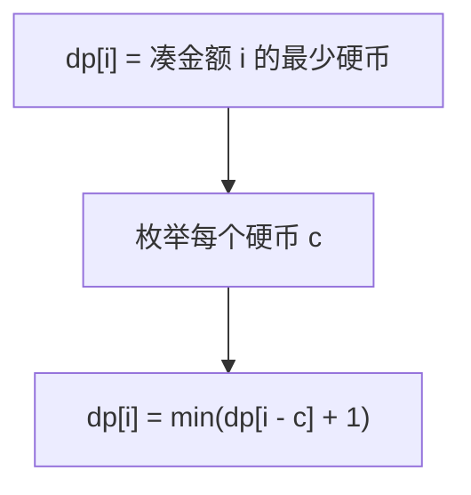

# 322. 零钱兑换

## 📌 题目

给你一个整数数组 `coins` ，表示不同面额的硬币；以及一个整数 `amount` ，表示总金额。

计算并返回可以凑成总金额所需的 **最少的硬币个数** 。如果没有任何一种硬币组合能组成总金额，返回 `-1` 。

你可以认为每种硬币的数量是无限的。

示例：

```
输入：coins = [1, 2, 5], amount = 11
输出：3 
解释：11 = 5 + 5 + 1
```

🔗 [LeetCode 322](https://leetcode.cn/problems/coin-change/description/?envType=study-plan-v2&envId=top-100-liked)

## 🛒 人话理解 & 🧠 思路演进



还记得小时候去超市找零钱的场景吗？收银员总能巧妙地用最少的硬币给我们找零。今天，让我们通过 LeetCode 322 题「零钱兑换」，一起探索这个生活中的动态规划问题。

### 🎯 问题的本质：生活中的场景

想象你是一个收银员，手里有不同面值的硬币，需要找给顾客一定金额的零钱。你想用最少的硬币数完成找零。比如：

```
输入：coins = [1, 2, 5], amount = 11
输出：3
解释：11 = 5 + 5 + 1，用了3枚硬币
```

这不就是我们日常生活中经常遇到的问题吗？看似简单，但要用程序解决，还真需要一番思考。

### 💡 从贪心到动态规划：思维的升华

让我们像解开一个谜题一样，逐步深入这个问题：

### 第一步：贪心的陷阱

初学者可能会想：每次都选最大的硬币不就好了吗？
比如要找 11 元，先用 5 元，然后再用 5 元，最后用 1 元。

但如果硬币面值是 [1, 3, 4]，要找 6 元呢？
- 贪心：6 = 4 + 1 + 1（3枚）
- 最优：6 = 3 + 3（2枚）

这告诉我们：贪心策略在这个问题上并不可靠。

### 第二步：递归的思路

站在终点思考：要凑出金额 n，我们可以：
- 使用第一种硬币，然后解决剩余金额
- 使用第二种硬币，然后解决剩余金额
- ...以此类推

这就形成了递归的思路！

> 👉 代码实现见下方「🐍 Python 代码」

### 第三步：认识状态转移

动态规划的精髓在于找到状态转移方程：
dp[i] = min(dp[i-coin] + 1) for coin in coins

这个方程告诉我们：凑出金额i的最少硬币数，等于凑出金额(i-coin)的最少硬币数加1，其中coin遍历所有可用的硬币。

### 🔍 动态规划的关键要素

通过零钱兑换这个问题，我们可以总结出动态规划的要点：

1. 状态定义：dp[i]表示凑出金额i所需的最少硬币数
2. 状态转移：dp[i] = min(dp[i-coin] + 1) for coin in coins
3. 初始状态：dp[0] = 0
4. 遍历顺序：从小到大，因为大的金额依赖小的金额

### 💡 举一反三

理解了零钱兑换，你会发现很多问题都是类似的：
- 完全背包问题
- 最小路径和
- 单词拆分

### 🎯 思考题

如果硬币的数量有限制（每种硬币最多只能用k次），该如何修改代码？

### 🎓 面试建议

遇到类似的动态规划问题，建议这样思考：
1. 先想暴力解法，找到问题的递归本质
2. 分析重叠子问题，考虑是否需要记忆化
3. 寻找状态转移方程，优化为动态规划
4. 考虑空间优化的可能性

记住，动态规划的威力不在于它的复杂，而在于它帮我们把复杂的问题分解成简单的子问题。就像零钱兑换，看似复杂，其实就是不断选择硬币，累积最优解的过程。

## 🐍 Python 代码

```python
class Solution:
    def coinChange(self, coins: List[int], amount: int) -> int:
        # 初始化dp数组，dp[i]表示凑成i元最少需要的硬币数量
        dp = [float('inf')] * (amount + 1)
        dp[0] = 0  # 凑成0元需要0个硬币

        # 从1元开始，逐步计算每个金额的最优解
        for i in range(1, amount + 1):
            # 遍历所有硬币面额
            for coin in coins:
                if i - coin >= 0:  # 如果当前硬币可以用来凑成i
                    dp[i] = min(dp[i], dp[i - coin] + 1)
        
        # 如果dp[amount]仍然是无穷大，说明无法凑成该金额
        return dp[amount] if dp[amount] != float('inf') else -1
```
