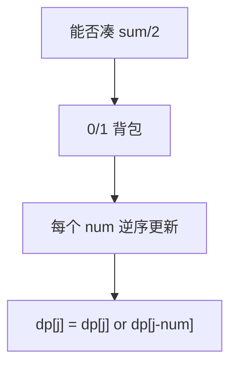

# 416. 分割等和子集

## 📌 题目

给你一个 **只包含正整数** 的 **非空** 数组 `nums` 。请你判断是否可以将这个数组分割成两个子集，使得两个子集的元素和相等。

示例：

```
输入：nums = [1,5,11,5]
输出：true
解释：数组可以分割成 [1, 5, 5] 和 [11] 。
```

🔗 [LeetCode 416](https://leetcode.cn/problems/partition-equal-subset-sum/description/?envType=study-plan-v2&envId=top-100-liked)

## 🛒 人话理解



**转化**：能不能把数组分成和相等的两半 ⟺ 能不能挑一些数**凑出总和的一半**。这就是经典 **0/1 背包**。

**做法**：若总和为奇数直接 False。否则目标 `target = sum/2`。`dp[j]` 表示「能否凑出和 j」，对每个数从大到小更新 `dp[j] = dp[j] or dp[j-num]`。逆序是为了每个数只用一次。最后看 `dp[target]`。

### 思路步骤

这道题是一个经典的 0/1 背包问题，给定一个数组 nums，我们需要判断是否能够将它分割成两个子集，使得两个子集的元素和相等。
我们可以将问题转换为：是否能从数组中挑选出若干个元素，使得它们的和等于整个数组总和的一半。

假设数组的总和为 S，如果 S 是奇数，那么无法平分为两个相等的子集，直接返回 False。
如果 S 是偶数，那么我们的问题就变成了：是否能从数组中找到一个子集，使得该子集的和等于 S / 2。

我们可以把问题看作是一个 0/1 背包问题：
	- 背包容量是 S / 2，即我们需要找的子集的目标和。
	- 每个数组元素代表可以选择或不选择的一件物品，物品的重量就是数组中的元素值。
目标是判断是否存在一种选择方案，能够让这些元素的和恰好等于 S / 2。

用一个动态规划的数组 dp 来解决这个问题，其中 dp[i] 表示是否能找到一个子集，使得这个子集的和等于 i。

1. 状态定义：
	- 定义一个布尔数组 dp ，其中 dp[j] 表示能否从数组中找到和为 j 的子集。

2. 状态转移：
	- 对于每个数组中的数字 num，我们从右向左遍历 dp 数组，检查能否通过选择这个 num 来更新 dp[j]。
	- 具体来说，dp[j] 可以由 dp[j - num] 推导出来，表示如果之前存在和为 j - num 的子集，那么加上 num 后就可以得到和为 j 的子集。
	- 因此，状态转移方程为： dp[j] = dp[j] or dp[j − num]
3. 初始化：
	- dp[0] = True，表示和为 0 的子集肯定是存在的（即不选任何元素）。
4. 结果：
	- 在遍历完数组 nums 后，检查 dp[S/2] 是否为 True，如果是，则表示存在子集和为 S/2，即可以分割为两个和相等的子集。

## 🐍 Python 代码

```python
class Solution:
    def canPartition(self, nums: List[int]) -> bool:
        total_sum = sum(nums)
        
        # 如果总和是奇数，无法平分成两个子集
        if total_sum % 2 != 0:
            return False
        
        target = total_sum // 2
        
        # 初始化 dp 数组，dp[j] 表示是否能找到和为 j 的子集
        dp = [False] * (target + 1)
        dp[0] = True  # 和为0的子集肯定存在
        
        # 遍历数组中的每个数字
        for num in nums:
            # 从 target 到 num 进行逆序遍历，防止重复使用同一个数字
            for j in range(target, num - 1, -1):
                dp[j] = dp[j] or dp[j - num]
        
        # 返回是否能找到和为 target 的子集
        return dp[target]
```
