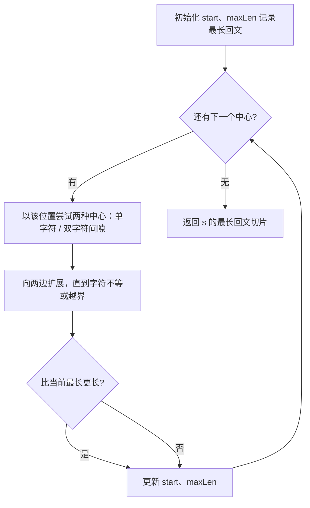
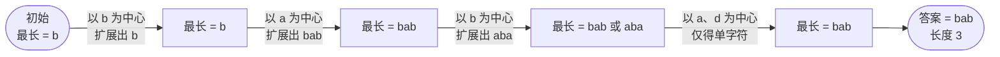

# 5. 最长回文子串

## 📌 题目

给你一个字符串 `s`，找到 `s` 中最长的回文子串。

示例：
```
输入：s = "babad"
输出："bab"
解释："aba" 同样是符合题意的答案。
```

🔗 [LeetCode 5](https://leetcode.cn/problems/longest-palindromic-substring/description/?envType=study-plan-v2&envId=top-100-liked)

## 🛒 人话理解



**总体一句话**：回文关于中心对称——枚举每个中心（单字符或双字符间隙），向两边尽量扩展，记录最长的那段。

### 🔬 逐步推演（动画式）

以 `s = "babad"` 为例——从左到右就是算法的时间线：**每个节点是一次状态快照（当前发现的最长回文），箭头上写这一步以谁为中心、扩展结果如何**：



**关键性质**：回文是**关于中心对称**的。所以枚举每个可能的中心，向两边扩展，就能找到以它为中心的最长回文。

**注意**：中心有两种——**单个字符**（奇数长度回文）和**两个字符之间的间隙**（偶数长度）。每个位置两种都试，取最长。O(n²)。

### 思路步骤

回文字符串是对称的，我们可以从每个字符或者字符之间的缝隙作为中心，向两边扩展，检查最长的回文子串。
具体地，对于每个可能的中心，向两边扩展，直到不再是回文子串为止。维护当前发现的最长回文子串。

## 🐍 Python 代码

### 🥊 暴力解（朴素对照）

枚举所有子串、逐个判断是否回文，记录最长——思路最直白，三重循环。

```python
class Solution:
    def longestPalindrome(self, s: str) -> str:
        n = len(s)
        if n < 2:
            return s

        def is_palindrome(left: int, right: int) -> bool:
            # 闭区间 [left, right] 是否回文
            while left < right:
                if s[left] != s[right]:
                    return False
                left += 1
                right -= 1
            return True

        start, max_len = 0, 1  # 至少能取到单个字符
        for i in range(n):            # 子串起点
            for j in range(i, n):     # 子串终点
                if is_palindrome(i, j) and (j - i + 1) > max_len:
                    start = i
                    max_len = j - i + 1
        return s[start:start + max_len]
```

- 时间复杂度：`O(n³)`，枚举子串 O(n²) × 判回文 O(n)
- 空间复杂度：`O(1)`
- ⚠️ 大量重复判断（同一位置的对称扩展被反复检查）。观察到「回文关于中心对称」→ 直接以每个中心向两边扩展，省掉判回文这一层，演进到下方 `O(n²)` 的中心扩展法。

### ⚡ 最优解

```python
class Solution:
    def longestPalindrome(self, s: str) -> str:
        if len(s) < 2:
            return s

        # 定义一个函数，从中心向两边扩展，找到最长的回文子串
        # 参数 left 和 right 分别是左右边界
        def expandAroundCenter(s, left, right):
            # 当左右边界在有效范围内，且 s[left] == s[right] 时，继续向外扩展
            while left >= 0 and right < len(s) and s[left] == s[right]:
                left -= 1  # 向左扩展
                right += 1  # 向右扩展
            # 返回扩展后的回文子串的实际左右边界（因为最后一次循环会多减/加一，所以要 +1 和 -1）
            return left + 1, right - 1

        # 初始化回文子串的起始和结束索引
        start, end = 0, 0

        # 遍历字符串的每一个字符，以其作为中心进行扩展
        for i in range(len(s)):
            # 第一种情况：以 s[i] 作为中心，检查长度为奇数的回文子串
            l1, r1 = expandAroundCenter(s, i, i)
            # 第二种情况：以 s[i] 和 s[i+1] 之间的空隙作为中心，检查长度为偶数的回文子串
            l2, r2 = expandAroundCenter(s, i, i + 1)

            # 如果奇数长度的回文子串比当前记录的最长回文子串更长，更新 start 和 end
            if r1 - l1 > end - start:
                start, end = l1, r1
            # 如果偶数长度的回文子串比当前记录的最长回文子串更长，更新 start 和 end
            if r2 - l2 > end - start:
                start, end = l2, r2

        # 返回最长回文子串，使用最终的 start 和 end 索引
        return s[start:end + 1]
```
