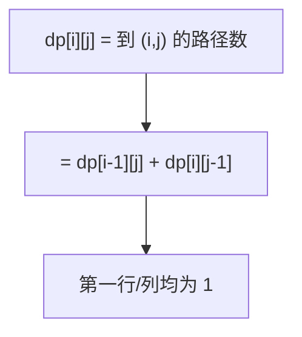

# 62. 不同路径

## 📌 题目

一个机器人位于一个 `m x n` 网格的左上角 （起始点在下图中标记为 “Start” ）。

机器人每次只能向下或者向右移动一步。机器人试图达到网格的右下角（在下图中标记为 “Finish” ）。

问总共有多少条不同的路径？

示例：

```
输入：m = 3, n = 7
输出：28
```

🔗 [LeetCode 62](https://leetcode.cn/problems/unique-paths/description/?envType=study-plan-v2&envId=top-100-liked)

## 🛒 人话理解



**类比**：机器人在网格里只能往下或往右走，从左上到右下。每条路径就是「m-1 次下 + n-1 次右」的一个排列。

**做法一**：组合数 `C(m+n-2, m-1)`，Python 直接 `math.comb`。
**做法二**：DP，`dp[i][j] = dp[i-1][j] + dp[i][j-1]`（从上或从左走来），第一行第一列全为 1。

### 思路步骤

机器人要完成整个移动，必须走 m-1 次向下和 n−1 次向右。因此，总共需要走的步数是 m+n−2 步。
因此，问题可以看作从 m+n−2 个位置中选择 m−1 个位置向下，剩下的向右。

这就是组合数问题，公式为：C(m+n−2,m−1) = (m+n−2)! / (m−1)!(n−1)!

## 🐍 Python 代码

```python
class Solution:
	def uniquePaths(self, m: int, n: int) -> int:
		return math.comb(m + n - 2, m - 1)
```
