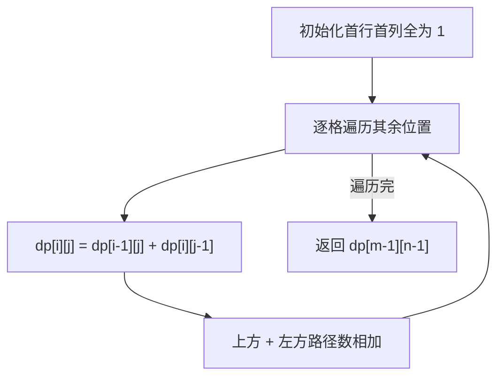
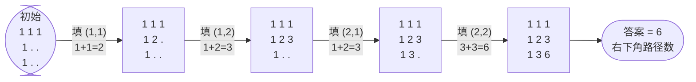

# 62. 不同路径

## 📌 题目

一个机器人位于一个 `m x n` 网格的左上角 （起始点在下图中标记为 “Start” ）。

机器人每次只能向下或者向右移动一步。机器人试图达到网格的右下角（在下图中标记为 “Finish” ）。

问总共有多少条不同的路径？

示例：

```
输入：m = 3, n = 7
输出：28
```

🔗 [LeetCode 62](https://leetcode.cn/problems/unique-paths/description/?envType=study-plan-v2&envId=top-100-liked)

## 🛒 人话理解



**总体一句话**：每个格子的路径数等于「从上走入」加「从左走入」——边界（首行首列）只有一条路，全填 1，内部格子左上相加即可。

### 🔬 逐步推演（动画式）

以 `m = 3, n = 3` 的 3×3 网格为例——从左到右就是算法填表的时间线：**每个节点是一次状态快照（已填好的 dp 表，未填处用 . 表示），箭头上写这一步填哪个格子、怎么算**：



**类比**：机器人在网格里只能往下或往右走，从左上到右下。每条路径就是「m-1 次下 + n-1 次右」的一个排列。

**做法一**：组合数 `C(m+n-2, m-1)`，Python 直接 `math.comb`。
**做法二**：DP，`dp[i][j] = dp[i-1][j] + dp[i][j-1]`（从上或从左走来），第一行第一列全为 1。

### 思路步骤

机器人要完成整个移动，必须走 m-1 次向下和 n−1 次向右。因此，总共需要走的步数是 m+n−2 步。
因此，问题可以看作从 m+n−2 个位置中选择 m−1 个位置向下，剩下的向右。

这就是组合数问题，公式为：C(m+n−2,m−1) = (m+n−2)! / (m−1)!(n−1)!

## 🐍 Python 代码

### 🥊 暴力解（朴素对照）

从起点出发，每步只能向下或向右，递归枚举所有走法——走到右下角就计一条路径，思路最直白。

```python
class Solution:
    def uniquePaths(self, m: int, n: int) -> int:
        def dfs(i: int, j: int) -> int:
            # 越界走不通
            if i >= m or j >= n:
                return 0
            # 到达终点，记一条路径
            if i == m - 1 and j == n - 1:
                return 1
            # 向下走 + 向右走
            return dfs(i + 1, j) + dfs(i, j + 1)

        return dfs(0, 0)
```

- 时间复杂度：`O(C(m+n, m))`，指数级，递归展开整棵移动树
- 空间复杂度：`O(m+n)`，递归栈深度
- ⚠️ 同一个格子被反复求解（大量重叠子问题）。加一张记忆表/DP 表就能去掉重复计算；进一步看出本质就是组合数，演进到下方 `O(1)` 的 `math.comb`。

### ⚡ 最优解

```python
import math

class Solution:
	def uniquePaths(self, m: int, n: int) -> int:
		return math.comb(m + n - 2, m - 1)
```
