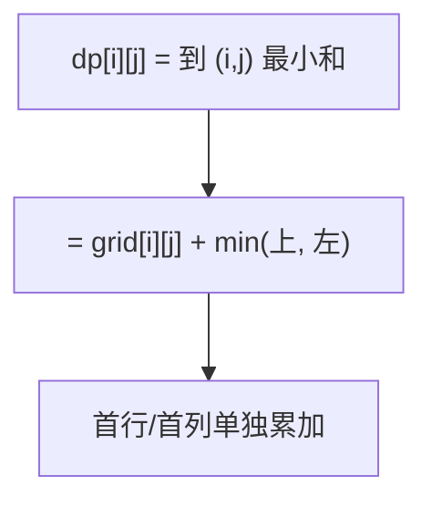

# 64. 最小路径和

## 📌 题目

给定一个包含非负整数的 `_m_ x _n_` 网格 `grid` ，请找出一条从左上角到右下角的路径，使得路径上的数字总和为最小。

说明：每次只能向下或者向右移动一步。

示例：

```
输入：grid = [[1,3,1],[1,5,1],[4,2,1]]
输出：7
解释：因为路径 1→3→1→1→1 的总和最小。
```

🔗 [LeetCode 64](https://leetcode.cn/problems/minimum-path-sum/description/?envType=study-plan-v2&envId=top-100-liked)

## 🛒 人话理解



**类比**：和「不同路径」一样的网格，但每个格子有花费，求**到右下角的最小花费和**。

**做法**：`dp[i][j] = grid[i][j] + min(dp[i-1][j], dp[i][j-1])`——当前格的花费加上「从上或从左过来的较小累计」。第一行只能从左来、第一列只能从上来，单独初始化。

### 思路步骤

1. 定义状态：
   - 设 dp[i][j] 为到达位置 (i, j) 的最小路径和。

2. 状态转移方程：
   - 从左上角 (0, 0) 开始，移动到 (i, j) 只能从上方 (i-1, j) 或左方 (i, j-1) 移动过来。
   - 因此，状态转移方程为：dp[i][j] = grid[i][j] + min(dp[i-1][j], dp[i][j-1])
   - 需要注意边界条件：
     - 当 i = 0 时，只能从左边移动：dp[0][j] = dp[0][j-1] + grid[0][j]
     - 当 j = 0 时，只能从上边移动：dp[i][0] = dp[i-1][0] + grid[i][0]

3. 初始化：
   - dp[0][0] = grid[0][0]，即起点的值。

4. 计算：
   - 通过双重循环遍历整个 grid，根据状态转移方程填充 dp 数组。

5. 结果：
   - 最终结果为 dp[m-1][n-1]，即到达右下角的最小路径和。

## 🐍 Python 代码

### 🥊 暴力解（朴素对照）

从起点出发，每步向下或向右，递归枚举每一条到右下角的路径并累加和，取所有路径中的最小——思路最直白。

```python
from typing import List

class Solution:
    def minPathSum(self, grid: List[List[int]]) -> int:
        m, n = len(grid), len(grid[0])

        def dfs(i: int, j: int) -> int:
            # 越界走不通，用大数排除
            if i >= m or j >= n:
                return float('inf')
            # 到达终点
            if i == m - 1 and j == n - 1:
                return grid[i][j]
            # 当前格 + min(向下走, 向右走)
            return grid[i][j] + min(dfs(i + 1, j), dfs(i, j + 1))

        return dfs(0, 0)
```

- 时间复杂度：`O(2^(m+n))`，指数级，递归展开整棵移动树
- 空间复杂度：`O(m+n)`，递归栈深度
- ⚠️ 同一个格子被反复求解（大量重叠子问题）。用一张 DP 表把每个格子的最小和记下来，演进到下方 `O(mn)` 的动态规划。

### ⚡ 最优解

```python
from typing import List

class Solution:
    def minPathSum(self, grid: List[List[int]]) -> int:
        m = len(grid)
        n = len(grid[0])
        
        # 创建一个二维数组 dp，用于存储到达每个点的最小路径和
        dp = [[0] * n for _ in range(m)]
        
        dp[0][0] = grid[0][0]
        
        # 填充第一行（只能从左边移动）
        for j in range(1, n):
            dp[0][j] = dp[0][j - 1] + grid[0][j]
        
        # 填充第一列（只能从上面移动）
        for i in range(1, m):
            dp[i][0] = dp[i - 1][0] + grid[i][0]
        
        # 填充剩余的 dp 数组
        for i in range(1, m):
            for j in range(1, n):
                # 当前点的最小路径和 = 当前点的值 + 上方和左方的最小路径和
                dp[i][j] = grid[i][j] + min(dp[i - 1][j], dp[i][j - 1])
        
        return dp[m - 1][n - 1]
```
