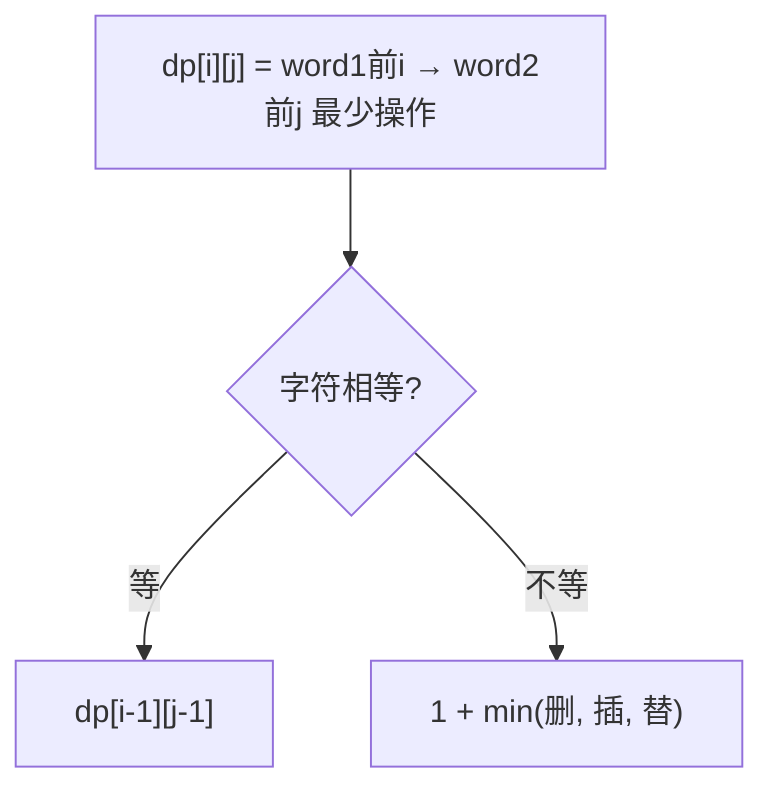

# 72. 编辑距离

## 📌 题目

给你两个单词 `word1` 和 `word2`， 请返回将 `word1` 转换成 `word2` 所使用的最少操作数。
你可以对一个单词进行如下三种操作：
- 插入一个字符
- 删除一个字符
- 替换一个字符

示例：
```
输入：word1 = "horse", word2 = "ros"
输出：3
解释：
horse -> rorse (将 'h' 替换为 'r')
rorse -> rose (删除 'r')
rose -> ros (删除 'e')
```

🔗 [LeetCode 72](https://leetcode.cn/problems/edit-distance/description/?envType=study-plan-v2&envId=top-100-liked)

## 🛒 人话理解



**类比**：把 word1 改成 word2，每次能 删除/插入/替换 一个字符，求最少几步。

**DP**：`dp[i][j]` = word1 前 i 个变成 word2 前 j 个的最少操作。
- 相同：`dp[i][j] = dp[i-1][j-1]`（白嫖，不操作）
- 不同：`dp[i][j] = 1 + min(删=dp[i-1][j], 插=dp[i][j-1], 替=dp[i-1][j-1])`

### 思路步骤

1. 定义 DP 表：我们定义一个二维数组 dp，其中 dp[i][j] 表示将 word1 的前 i 个字符转换为 word2 的前 j 个字符所需的最少操作数。
    
2. 边界条件： 
    - 如果 i == 0，即 word1 是空字符串，那么我们需要 j 次插入操作来将 word2 拼出来，故 dp[0][j] = j。
    - 如果 j == 0，即 word2 是空字符串，那么我们需要 i 次删除操作来将 word1 清空，故 dp[i][0] = i。

3. 状态转移方程：    
    - 如果 word1[i-1] == word2[j-1]，表示两个字符相同，不需要任何操作：dp[i][j] = dp[i-1][j-1]。
    - 如果 word1[i-1] != word2[j-1]，表示两个字符不同，需要执行一次操作（插入、删除、替换），我们取三种操作中最小的那个： dp[i][j] = min⁡(dp[i−1][j]+1, dp[i][j−1]+1, dp[i−1][j−1]+1)
        - 删除操作：dp[i-1][j] + 1（从 word1 删除一个字符）
        - 插入操作：dp[i][j-1] + 1（在 word1 插入一个字符）
        - 替换操作：dp[i-1][j-1] + 1（将 word1 的当前字符替换成 word2 的字符）

4. 最终结果：dp[m][n]，其中 m 是 word1 的长度，n 是 word2 的长度。

## 🐍 Python 代码

### 🥊 暴力解（朴素对照）

对每对位置 i、j，按「字符是否相等」分情况递归：相等就跳过，不等就分别尝试删除/插入/替换并取最小——思路最直白，但没有任何记忆化。

```python
class Solution:
    def minDistance(self, word1: str, word2: str) -> int:
        def dfs(i: int, j: int) -> int:
            # word1 已用完：剩下的 word2 全靠插入
            if i == len(word1):
                return len(word2) - j
            # word2 已用完：剩下的 word1 全靠删除
            if j == len(word2):
                return len(word1) - i
            # 字符相等，无需操作，直接往后看
            if word1[i] == word2[j]:
                return dfs(i + 1, j + 1)
            # 字符不等，三种操作各试一次取最小
            delete_  = dfs(i + 1, j)      # 删除 word1[i]
            insert_  = dfs(i, j + 1)      # 插入一个 word2[j]
            replace_ = dfs(i + 1, j + 1)  # 把 word1[i] 替换成 word2[j]
            return 1 + min(delete_, insert_, replace_)

        return dfs(0, 0)
```

- 时间复杂度：`O(3^(m+n))`，指数级，每个不等位都三路递归
- 空间复杂度：`O(m+n)`，递归栈深度
- ⚠️ 同一个 (i, j) 子问题被反复求解（大量重叠）。加一张二维记忆表/DP 表，演进到下方 `O(mn)` 的动态规划。

### ⚡ 最优解

```python
class Solution:
    def minDistance(self, word1: str, word2: str) -> int:
        m, n = len(word1), len(word2)
        dp = [[0] * (n + 1) for _ in range(m + 1)]

        for i in range(1, m + 1):
            dp[i][0] = i  # 从 word1[0:i] 变成空字符串，执行 i 次删除操作
        for j in range(1, n + 1):
            dp[0][j] = j  # 从空字符串变成 word2[0:j]，执行 j 次插入操作

        for i in range(1, m + 1):
            for j in range(1, n + 1):
                if word1[i - 1] == word2[j - 1]:
                    dp[i][j] = dp[i - 1][j - 1]
                else:
                    # 如果不同，取插入、删除、替换操作的最小值，并加1表示一次操作
                    dp[i][j] = min(dp[i - 1][j] + 1,    # 删除
                                   dp[i][j - 1] + 1,    # 插入
                                   dp[i - 1][j - 1] + 1)  # 替换

        # 返回最终的最少操作次数
        return dp[m][n]
```
