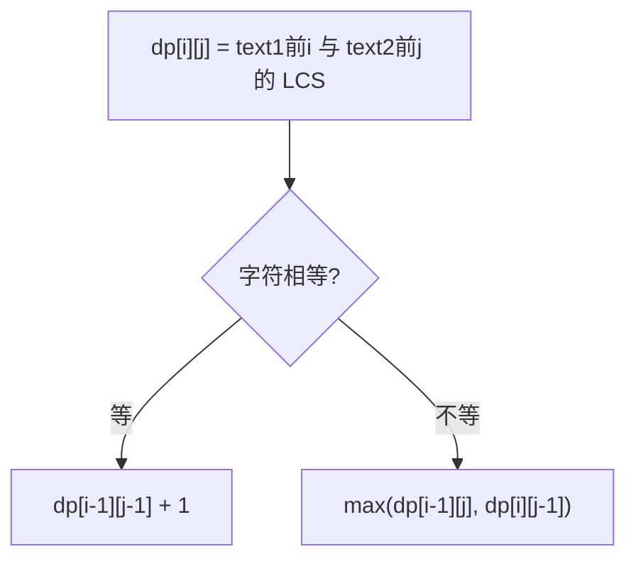

# 1143. 最长公共子序列

## 📌 题目

给定两个字符串 `text1` 和 `text2`，返回这两个字符串的最长 **公共子序列** 的长度。如果不存在 **公共子序列** ，返回 `0` 。

一个字符串的 **子序列** 是指这样一个新的字符串：它是由原字符串在不改变字符的相对顺序的情况下删除某些字符（也可以不删除任何字符）后组成的新字符串。

- 例如，`"ace"` 是 `"abcde"` 的子序列，但 `"aec"` 不是 `"abcde"` 的子序列。

两个字符串的 **公共子序列** 是这两个字符串所共同拥有的子序列。

示例：
```
输入：text1 = "abcde", text2 = "ace" 
输出：3  
解释：最长公共子序列是 "ace" ，它的长度为 3 。
```

🔗 [LeetCode 1143](https://leetcode.cn/problems/longest-common-subsequence/description/?envType=study-plan-v2&envId=top-100-liked)

## 🛒 人话理解



**类比**：找两个字符串的「公共部分」（不要求连续）。

**DP**：`dp[i][j]` = text1 前 i 个 与 text2 前 j 个的最长公共子序列长度。
- 字符相同：`dp[i][j] = dp[i-1][j-1] + 1`（接上）
- 不同：`dp[i][j] = max(dp[i-1][j], dp[i][j-1])`（舍掉某一个）

### 思路步骤

1. 定义动态规划表（DP表）：
    - 我们定义一个二维数组 dp，其中 dp[i][j] 表示字符串 text1 的前 i 个字符和字符串 text2 的前 j 个字符的最长公共子序列长度。
    - dp[i][j] 记录了到目前为止，text1[0:i-1] 和 text2[0:j-1] 的最长公共子序列长度。

2. 状态转移方程：    
    - 如果 text1[i-1] == text2[j-1]，这说明 text1 和 text2 的当前字符相同，我们可以把这个公共字符加入最长公共子序列，因此：dp[i][j] = dp[i−1][j−1] + 1
    - 如果 text1[i-1] != text2[j-1]，则 dp[i][j] = max⁡(dp[i−1][j],dp[i][j−1]) 这表示我们要么忽略 text1 的当前字符，要么忽略 text2 的当前字符，取两种情况中较大的子序列长度。

3. 边界条件：    
    - 当 i == 0 或 j == 0 时，dp[i][j] 都初始化为 0，因为一个空字符串与任何字符串的公共子序列长度为 0。

4. 最终结果：
    - 填充完 DP 表后，dp[m][n]（其中 m 是 text1 的长度，n 是 `text2` 的长度）就是最长公共子序列的长度。

## 🐍 Python 代码

```python
class Solution:
    def longestCommonSubsequence(self, text1: str, text2: str) -> int:
        # 获取两个字符串的长度
        m, n = len(text1), len(text2)

        # 初始化 DP 表，dp[i][j] 表示 text1[0:i] 和 text2[0:j] 的最长公共子序列长度
        dp = [[0] * (n + 1) for _ in range(m + 1)]

        # 填充 DP 表
        for i in range(1, m + 1):
            for j in range(1, n + 1):
                if text1[i - 1] == text2[j - 1]:
                    # 当前字符相同，公共子序列长度加1
                    dp[i][j] = dp[i - 1][j - 1] + 1
                else:
                    # 当前字符不相同，取两个可能情况的最大值
                    dp[i][j] = max(dp[i - 1][j], dp[i][j - 1])

        # 返回最终的最长公共子序列长度
        return dp[m][n]
```
