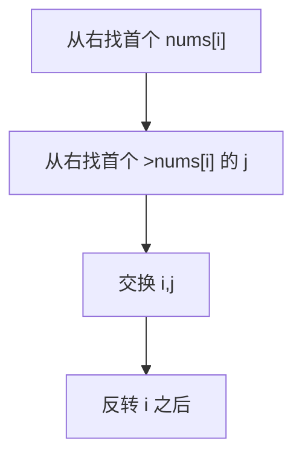

# 31. 下一个排列

## 📌 题目

整数数组的一个 **排列**  就是将其所有成员以序列或线性顺序排列。

- 例如，`arr = [1,2,3]` ，以下这些都可以视作 `arr` 的排列：`[1,2,3]`、`[1,3,2]`、`[3,1,2]`、`[2,3,1]` 。

整数数组的 **下一个排列** 是指其整数的下一个字典序更大的排列。更正式地，如果数组的所有排列根据其字典顺序从小到大排列在一个容器中，那么数组的 **下一个排列** 就是在这个有序容器中排在它后面的那个排列。如果不存在下一个更大的排列，那么这个数组必须重排为字典序最小的排列（即，其元素按升序排列）。

- 例如，`arr = [1,2,3]` 的下一个排列是 `[1,3,2]` 。
- 类似地，`arr = [2,3,1]` 的下一个排列是 `[3,1,2]` 。
- 而 `arr = [3,2,1]` 的下一个排列是 `[1,2,3]` ，因为 `[3,2,1]` 不存在一个字典序更大的排列。

给你一个整数数组 `nums` ，找出 `nums` 的下一个排列。

必须 **[原地](https://baike.baidu.com/item/%E5%8E%9F%E5%9C%B0%E7%AE%97%E6%B3%95)** 修改，只允许使用额外常数空间。

示例：
```
输入：nums = [1,2,3]
输出：[1,3,2]
```

🔗 [LeetCode 31](https://leetcode.cn/problems/next-permutation/description/?envType=study-plan-v2&envId=top-100-liked)

## 🛒 人话理解



**目标**：找比当前排列**大一点点的**下一个排列。

**三步**：
1. 从右往左找第一个「升序对」，即 `nums[i] < nums[i+1]` 的 i（右边是降序，找到就说明有变大空间）。
2. 再从右往左找第一个 `> nums[i]` 的 j，交换 i、j。
3. 把 i 之后的部分反转（从降序变升序，变成「大一点点」里最小的）。
若找不到 i（整体降序），说明已是最大，反转整体回到最小。

### 思路步骤

1. 找到第一个升序对：
    - 从数组的末尾开始，找到第一个 nums[i] < nums[i + 1] 的位置 i。
    - 如果找不到这样的 i，说明整个数组是降序的，直接反转整个数组即可得到最小排列。
2. 找到比 nums[i] 大的最小数：
    - 从数组的末尾开始，找到第一个 nums[j] > nums[i] 的位置 j。
    - 交换 nums[i] 和 nums[j]。
3. 反转剩余部分： 
    - 反转从 i + 1 到数组末尾的部分，使其变为升序。

## 🐍 Python 代码

```python
class Solution:
    def nextPermutation(self, nums: List[int]) -> None:
        # Step 1: Find the first decreasing element from the right
        i = len(nums) - 2
        while i >= 0 and nums[i] >= nums[i + 1]:
            i -= 1

        if i >= 0:  # If such an element is found
            # Step 2: Find the element just larger than nums[i] from the right
            j = len(nums) - 1
            while nums[j] <= nums[i]:
                j -= 1
            # Step 3: Swap elements at i and j
            nums[i], nums[j] = nums[j], nums[i]

        # Step 4: Reverse the elements from i+1 to end
        nums[i + 1:] = reversed(nums[i + 1:])
```
