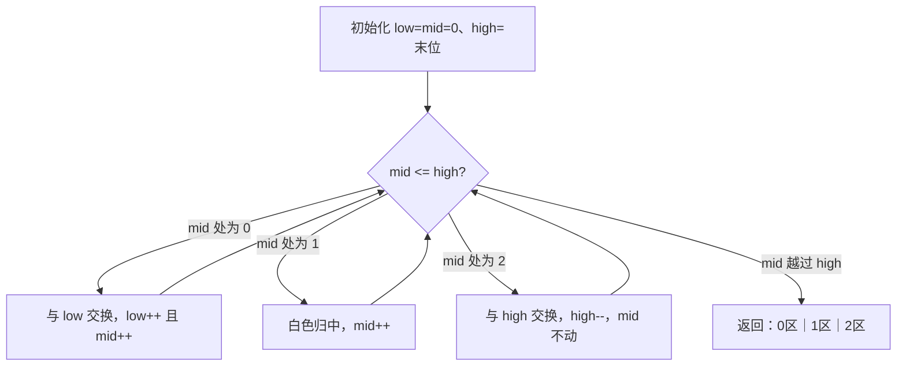
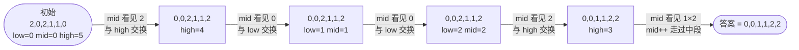

# 75. 颜色分类

## 📌 题目

给定一个包含红色、白色和蓝色、共 `n` 个元素的数组 `nums` ，**[原地](https://baike.baidu.com/item/%E5%8E%9F%E5%9C%B0%E7%AE%97%E6%B3%95)** 对它们进行排序，使得相同颜色的元素相邻，并按照红色、白色、蓝色顺序排列。

我们使用整数 `0`、 `1` 和 `2` 分别表示红色、白色和蓝色。

必须在不使用库内置的 sort 函数的情况下解决这个问题。

示例：
```
输入：nums = [2,0,2,1,1,0]
输出：[0,0,1,1,2,2]
```

🔗 [LeetCode 75](https://leetcode.cn/problems/sort-colors/description/?envType=study-plan-v2&envId=top-100-liked)

## 🛒 人话理解



**总体一句话**：`low`/`mid`/`high` 三指针划出三区——`low` 圈住 0 的右界、`high` 圈住 2 的左界、`mid` 一趟扫描：遇 0 丢给 low、遇 2 丢给 high、遇 1 留在中间，一趟走完三色各归其位。

### 🔬 逐步推演（动画式）

以 `nums = 2,0,2,1,1,0` 为例（low=0、mid=0、high=5）——从左到右就是 `mid` 扫描的时间线：**每个节点是一次数组快照（标注 low/mid/high），箭头上写遇到几、做了哪种交换**：



**类比**：荷兰国旗——红(0)、白(1)、蓝(2) 三色，要求一趟排好。

**三指针（一次扫描、O(1) 空间）**：`low` 指 0 的右边界、`high` 指 2 的左边界、`mid` 扫描。
- 遇 0：和 `low` 交换，`low++`、`mid++`
- 遇 1：`mid++`（白色留中间）
- 遇 2：和 `high` 交换，`high--`（`mid` 不动，换回来的要再看一眼）

### 思路步骤

1. 初始化指针：
    - low 指针用于标记红色（0）的边界，初始为 0。
    - mid 指针用于遍历数组，初始为 0。
    - high 指针用于标记蓝色（2）的边界，初始为数组的最后一个索引。

2. 遍历数组：
    - 当 mid 指针小于等于 high 指针时，检查 nums[mid] 的值：
        - 如果 nums[mid] == 0：交换 nums[low] 和 nums[mid]，然后将 low 和 mid 都加 1。
        - 如果 nums[mid] == 1：mid 加 1。
        - 如果 nums[mid] == 2：交换 nums[mid] 和 nums[high]，然后将 high 减 1。注意这里 mid 不变，因为交换后需要再次检查 mid 位置的值。

## 🐍 Python 代码

### 🥊 暴力解（朴素对照）

数出 0、1、2 各有几个，再按个数原地覆写——两趟扫描的计数排序，思路最直白。

```python
from typing import List

class Solution:
    def sortColors(self, nums: List[int]) -> None:
        cnt = [0, 0, 0]
        for num in nums:        # 第一趟：计数
            cnt[num] += 1
        i = 0
        for color in range(3):  # 第二趟：按个数覆写
            for _ in range(cnt[color]):
                nums[i] = color
                i += 1
```

- 时间复杂度：`O(n)`，两趟扫描
- 空间复杂度：`O(1)`，只用 3 个计数器
- ⚠️ 虽也是 O(n)，但要扫两趟。能否一趟走完、边走边把 0 和 2 各自归位？→ 演进到下方一趟扫描的荷兰国旗三指针。

### ⚡ 最优解

```python
class Solution:
    def sortColors(self, nums: List[int]) -> None:
        low, mid, high = 0, 0, len(nums) - 1

        while mid <= high:
            if nums[mid] == 0:
                nums[low], nums[mid] = nums[mid], nums[low]
                low += 1
                mid += 1          # 换过来的是 low 处(≤mid，必是 0/1)，可放心前进
            elif nums[mid] == 1:
                mid += 1           # 白色(1)就该待在中间，直接前进
            else:  # nums[mid] == 2
                nums[mid], nums[high] = nums[high], nums[mid]
                high -= 1          # 关键：mid 不动！换回来的数还没看过，下一轮要再判一次
```
