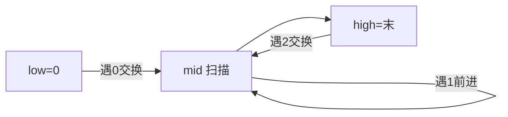

# 75. 颜色分类

## 📌 题目

给定一个包含红色、白色和蓝色、共 `n` 个元素的数组 `nums` ，**[原地](https://baike.baidu.com/item/%E5%8E%9F%E5%9C%B0%E7%AE%97%E6%B3%95)** 对它们进行排序，使得相同颜色的元素相邻，并按照红色、白色、蓝色顺序排列。

我们使用整数 `0`、 `1` 和 `2` 分别表示红色、白色和蓝色。

必须在不使用库内置的 sort 函数的情况下解决这个问题。

示例：
```
输入：nums = [2,0,2,1,1,0]
输出：[0,0,1,1,2,2]
```

🔗 [LeetCode 75](https://leetcode.cn/problems/sort-colors/description/?envType=study-plan-v2&envId=top-100-liked)

## 🛒 人话理解



**类比**：荷兰国旗——红(0)、白(1)、蓝(2) 三色，要求一趟排好。

**三指针（一次扫描、O(1) 空间）**：`low` 指 0 的右边界、`high` 指 2 的左边界、`mid` 扫描。
- 遇 0：和 `low` 交换，`low++`、`mid++`
- 遇 1：`mid++`（白色留中间）
- 遇 2：和 `high` 交换，`high--`（`mid` 不动，换回来的要再看一眼）

### 思路步骤

1. 初始化指针：
    - low 指针用于标记红色（0）的边界，初始为 0。
    - mid 指针用于遍历数组，初始为 0。
    - high 指针用于标记蓝色（2）的边界，初始为数组的最后一个索引。

2. 遍历数组：
    - 当 mid 指针小于等于 high 指针时，检查 nums[mid] 的值：
        - 如果 nums[mid] == 0：交换 nums[low] 和 nums[mid]，然后将 low 和 mid 都加 1。
        - 如果 nums[mid] == 1：mid 加 1。
        - 如果 nums[mid] == 2：交换 nums[mid] 和 nums[high]，然后将 high 减 1。注意这里 mid 不变，因为交换后需要再次检查 mid 位置的值。

## 🐍 Python 代码

```python
class Solution:
    def sortColors(self, nums: List[int]) -> None:
        low, mid, high = 0, 0, len(nums) - 1

        while mid <= high:
            if nums[mid] == 0:
                nums[low], nums[mid] = nums[mid], nums[low]
                low += 1
                mid += 1
            elif nums[mid] == 1:
                mid += 1
            else:  # nums[mid] == 2
                nums[mid], nums[high] = nums[high], nums[mid]
                high -= 1
```
