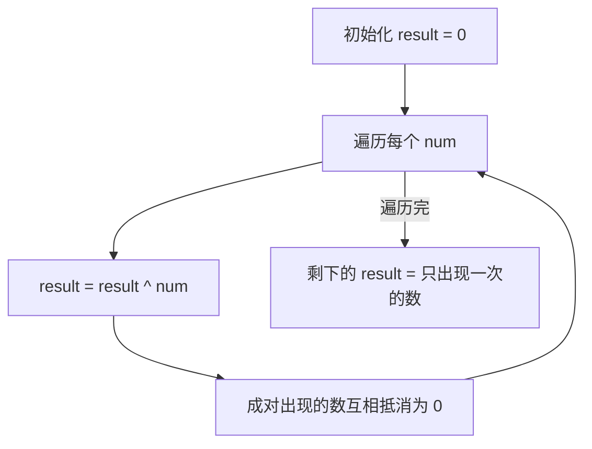
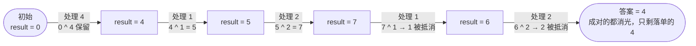

# 136. 只出现一次的数字

## 📌 题目

给你一个 **非空** 整数数组 `nums` ，除了某个元素只出现一次以外，其余每个元素均出现两次。找出那个只出现了一次的元素。

你必须设计并实现线性时间复杂度的算法来解决此问题，且该算法只使用常量额外空间。

示例：

```
输入：nums = [2,2,1]
输出：1
```

🔗 [LeetCode 136](https://leetcode.cn/problems/single-number/description/?envType=study-plan-v2&envId=top-100-liked)

## 🛒 人话理解



**总体一句话**：把所有数异或一遍——`a ^ a = 0` 让成对出现的数互相抵消，`a ^ 0 = a` 让落单的数原样留下，最后 result 就是答案，O(n)、O(1)。

### 🔬 逐步推演（动画式）

以 `nums = 4,1,2,1,2` 为例（落单的是 4）——从左到右就是异或累加的时间线：**每个节点是 result 的当前值，箭头上写处理了谁、是抵消还是保留**：



**武器**：异或（XOR）的两条性质——`a ^ a = 0`（相同抵消）、`a ^ 0 = a`。

**做法**：把所有数异或一遍，成对出现的数互相抵消成 0，最后剩下的就是那个只出现一次的数。O(n) 时间、O(1) 空间，连哈希表都不用。

### 思路步骤

异或运算的性质
1. 任何数与0异或为其本身： (a \oplus 0 = a)
2. 任何数与其自身异或为0： (a \oplus a = 0)

利用异或运算性质，我们可以在O(n)时间复杂度和O(1)空间复杂度内找到只出现一次的数字。
因为对于任意两个相同的数，异或后结果为0。而0与任何数异或结果为该数本身。所以，所有成对出现的数在异或后都抵消为0，最终剩下的就是那个只出现一次的数。

具体步骤如下：
1. 初始化变量result为0。
2. 遍历数组，对每个元素执行异或运算并更新result。
3. 最终，result的值即为只出现一次的那个数字。

## 🐍 Python 代码

### 🥊 暴力解（朴素对照）

用哈希表统计每个数出现次数，再找出次数为 1 的那个——思路最直白。

```python
from typing import List
from collections import Counter

class Solution:
    def singleNumber(self, nums: List[int]) -> int:
        cnt = Counter(nums)
        for num, c in cnt.items():
            if c == 1:
                return num
        return -1  # 题目保证存在，不会走到这里
```

- 时间复杂度：`O(n)`
- 空间复杂度：`O(n)`，哈希表要存所有不同元素
- ⚠️ 不满足题目「只用常量额外空间」的要求，仅作思路对照。利用异或「相同抵消」的性质可把空间压到 `O(1)` → 演进到下方异或解。

### ⚡ 最优解

```python
class Solution:
    def singleNumber(self, nums: List[int]) -> int:
        result = 0
        for num in nums:
            result ^= num   # a^a=0、a^0=a：成对的抵消为 0，最后只剩出现一次的那个
        return result
```
