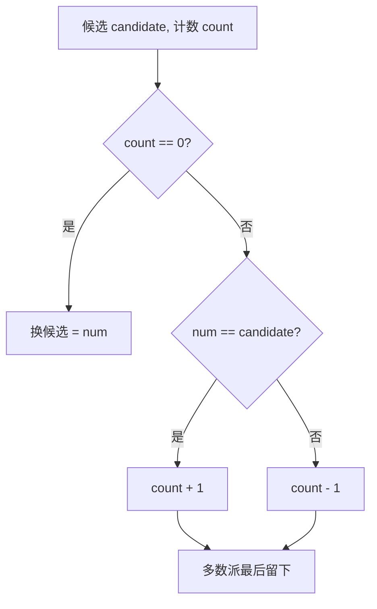

# 169. 多数元素

## 📌 题目

给定一个大小为 `n` 的数组 `nums` ，返回其中的多数元素。多数元素是指在数组中出现次数 **大于** `⌊ n/2 ⌋` 的元素。

你可以假设数组是非空的，并且给定的数组总是存在多数元素。

示例：

```
输入：nums = [3,2,3]
输出：3
```

🔗 [LeetCode 169](https://leetcode.cn/problems/majority-element/description/?envType=study-plan-v2&envId=top-100-liked)

## 🛒 人话理解



**类比**：战场上多方厮杀，**多数派**（超过一半）的人头比其他所有派系加起来还多，对拼消耗后最后站着的一定是多数派。

**摩尔投票**：维护候选者 `candidate` 和计数 `count`。遇到同党 `count+1`，遇到异党 `count-1`，`count` 归零就换候选。一趟下来候选者就是多数元素。O(n)、O(1)。

### 思路步骤

【方法一：哈希表】

1. 记录次数：
    - 使用一个哈希表 counts 来记录每个元素出现的次数。
    - 遍历数组 nums，对每个元素进行统计。
	    - 如果元素已经在哈希表中，则其对应的计数器加1；
	    - 如果不在，则初始化该元素的计数器为1。
2. 查找多数元素：
    - 遍历哈希表中的所有键值对，找到出现次数大于 [n/2] 的元素，并返回该元素。

时间复杂度：O(n)，因为我们需要遍历数组一次来填充哈希表，然后再遍历哈希表一次来找到多数元素。
空间复杂度：O(n)，因为最坏情况下，需要存储数组中所有不同的元素的计数。

【方法二：摩尔投票】

1. 候选者和计数器： 
    - 维护一个变量 candidate 用于跟踪当前的候选多数元素，以及一个 count 计数器来表示 candidate 在目前遇到的元素中的净出现次数。
2. 遍历数组： 
    - 如果 count 为 0，说明我们需要更换候选者，将当前元素设为新的候选者，并将 count 设为 1。
    - 如果当前元素等于 candidate，则 count 加 1。
    - 如果当前元素不等于 candidate，则 count 减 1。
3. 最终候选者：
    - 遍历完成后，candidate 所指的元素就是数组的多数元素。

时间复杂度：O(n)，因为我们只需要一次遍历数组。
空间复杂度：O(1)，只使用了常数级别的额外空间。

## 🐍 Python 代码

```python
class Solution:
	def majorityElement(self, nums: List[int]) -> int:
	    counts = {}
	    for num in nums:
	        if num in counts:
	            counts[num] += 1
	        else:
	            counts[num] = 1

	    for key, value in counts.items():
	        if value > len(nums) // 2:
	            return key
```
```python
class Solution:
	def majorityElement(self, nums: List[int]) -> int:
	    candidate = None
	    count = 0
	
	    for num in nums:
	        if count == 0:
	            candidate = num
	        count += (1 if num == candidate else -1)
	
	    return candidate
```
