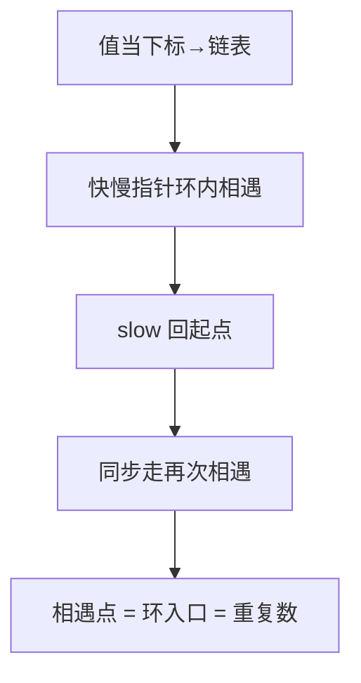

# 287. 寻找重复数

## 📌 题目

给定一个包含 `n + 1` 个整数的数组 `nums` ，其数字都在 `[1, n]` 范围内（包括 `1` 和 `n`），可知至少存在一个重复的整数。

假设 `nums` 只有 **一个重复的整数** ，返回 **这个重复的数** 。

你设计的解决方案必须 **不修改** 数组 `nums` 且只用常量级 `O(1)` 的额外空间。

示例：
```
输入：nums = [1,3,4,2,2]
输出：2
```

🔗 [LeetCode 287](https://leetcode.cn/problems/find-the-duplicate-number/description/?envType=study-plan-v2&envId=top-100-liked)

## 🛒 人话理解



**神仙转化**：把数组当成**链表**——下标 i 的「下一个节点」是 `nums[i]`。因为值域在 [1,n] 且有重复，必然形成**环**，而**环的入口就是重复的数**（两个下标指向同一个值）。

**做法**：快慢指针（slow 走一步、fast 走两步）先在环内相遇；再把 slow 拉回起点，两个都走一步，再次相遇点就是环入口。O(n)、O(1)，且不修改原数组。

### 思路步骤

将数组视为一个链表，其中每个元素的值指向下一个节点的索引。由于存在重复的数字，因此链表中必然存在环。

1. 初始化快慢指针：
    - 使用两个指针，slow 和 fast。初始时，它们都指向数组的第一个元素。

2. 寻找相遇点：
    - 让 slow 每次移动一步，而 fast 每次移动两步。
    - 由于存在重复的数字，fast 和 slow 最终会在环中相遇。

3. 找到环的入口：
    - 将 slow 重置到数组的起始位置，而 fast 保持在相遇点。
    - 这时，让 slow 和 fast 每次都移动一步。
    - 当它们再次相遇时，相遇点即为环的入口，也就是重复数字所在的位置。

## 🐍 Python 代码

```python
class Solution:
    def findDuplicate(self, nums: List[int]) -> int:
        # Step 1: Initialize the slow and fast pointers
        slow = nums[0]
        fast = nums[0]

        # Step 2: Move slow pointer by 1 step and fast pointer by 2 steps
        # until they meet inside the cycle
        while True:
            slow = nums[slow]
            fast = nums[nums[fast]]
            if slow == fast:
                break

        # Step 3: Find the entrance to the cycle
        slow = nums[0]
        while slow != fast:
            slow = nums[slow]
            fast = nums[fast]

        return slow
```
