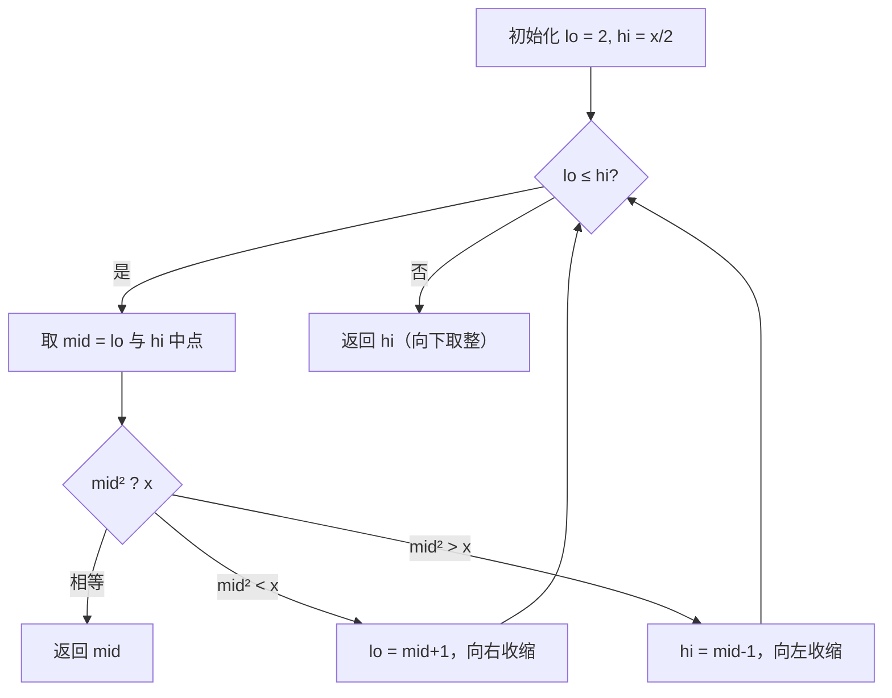
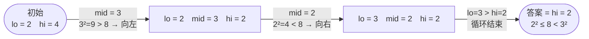

# 69. x 的平方根

## 📌 题目

给你一个非负整数 `x`，计算并返回 `x` 的**算术平方根**的整数部分（即向下取整）。

**注意**：不得使用内置的指数函数（如 `pow`）或 `** 0.5`。

```
输入：x = 4      输出：2
输入：x = 8      输出：2   （√8 ≈ 2.828，整数部分为 2）
```

🔗 [LeetCode 69](https://leetcode.cn/problems/sqrtx/)

## 🎯 字节考察

> **CodeTop 字节后端榜 20 次**——二分查找的经典载体。字节常借此考察「二分边界」与「能否给出进阶解法（牛顿迭代）」。

- 来源：[CodeTop 字节后端榜](https://github.com/afatcoder/LeetcodeTop/blob/master/bytedance/backend.md)
- 考点：**二分查找**、向下取整边界

## 🛒 人话理解 & 🧠 思路演进



**总体一句话**：在 `[2, x/2]` 上二分找最大的满足 `mid² ≤ x` 的整数——`mid²` 单调递增，比目标小就往右、大就往左，循环结束的 `hi` 就是向下取整的平方根。

### 🔬 逐步推演（动画式）

以 `x = 8` 为例——从左到右就是二分的时间线：**每个节点是一次三指针快照（lo / mid / hi），箭头写这一轮比了谁、往哪收缩**：



### 生活中的算法

猜数字：我想一个 `0~x` 之间的数 `t`，使得 `t² ≤ x < (t+1)²`。每次猜中间值，大了往左、小了往右，最后落到的位置就是整数平方根。

### 思路演进

1. **暴力**：从 `0` 往上试 `i*i`，第一个超过 `x` 的就停，返回 `i-1`。`O(√x)`，慢。
2. **二分（推荐）**：答案落在 `[0, x]`，且 `mid²` 单调，可二分。**优化上界**：当 `x ≥ 4`，`√x ≤ x/2`，上界可直接设 `x // 2`，少算一半。
3. **牛顿迭代（进阶加分）**：用 `t = (t + x/t) / 2` 迭代逼近，收敛极快（`O(log log x)`）。面试口述即可加分。

> 💡 返回 `hi` 而非 `lo`：循环结束时 `lo > hi`，`lo` 是「第一个平方 > x 的数」，`hi` 才是「最大的平方 ≤ x 的数」——即向下取整结果。

### 复杂度

- 时间：`O(log x)`
- 空间：`O(1)`

## 🐍 Python 代码

### 🥊 暴力解（朴素对照）

从 `0` 开始逐个试 `i*i`，第一个超过 `x` 就停——线性扫描，思路最直白。

```python
class Solution:
    def mySqrt(self, x: int) -> int:
        i = 0
        while (i + 1) * (i + 1) <= x:   # 一直试到下一个会超过 x 为止
            i += 1
        return i                        # i 是最大的满足 i² ≤ x 的整数
```

- 时间复杂度：`O(√x)`，i 最多走到 √x
- 空间复杂度：`O(1)`
- ⚠️ x 一大（如 `2³¹-1`）就要循环约 46000+ 次。观察到答案在 `[0, x]` 区间内且 `mid²` 单调 → 演进到下方 `O(log x)` 的二分查找。

### ⚡ 最优解

```python
class Solution:
    def mySqrt(self, x: int) -> int:
        if x < 2:
            return x              # 0、1 的平方根是自身

        lo, hi = 2, x // 2        # 优化：√x ≤ x/2（x≥4 时）
        while lo <= hi:
            mid = (lo + hi) // 2
            sq = mid * mid
            if sq == x:
                return mid
            elif sq < x:
                lo = mid + 1
            else:
                hi = mid - 1
        return hi                 # hi 是向下取整的整数平方根
```

## 🔁 举一反三

- [367. 有效的完全平方数](https://leetcode.cn/problems/valid-perfect-square/) —— 同款二分
- [50. Pow(x, n)](https://leetcode.cn/problems/powx-n/) —— 快速幂，二分思想
- 牛顿迭代法 —— 本题进阶解法，面试可主动提出
