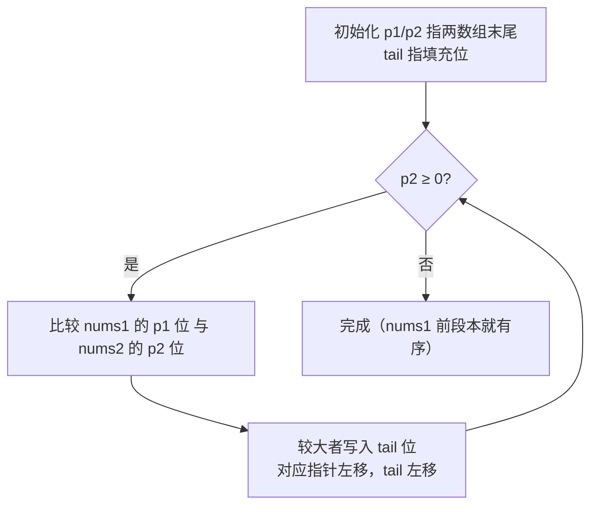
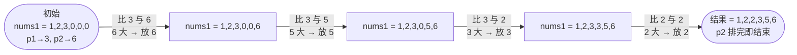

# 88. 合并两个有序数组

## 📌 题目

给你两个按**非递减顺序**排列的整数数组 `nums1` 和 `nums2`，另有两个整数 `m` 和 `n`，分别表示 `nums1` 和 `nums2` 中的元素数目。

请你合并 `nums2` 到 `nums1` 中，使合并后的数组同样按**非递减顺序**排列。

**注意**：`nums1` 的末尾预留了 `n` 个位置（即长度为 `m + n`），要求**原地修改** `nums1`。

```
输入：nums1 = [1,2,3,0,0,0], m = 3, nums2 = [2,5,6], n = 3
输出：[1,2,2,3,5,6]
```

🔗 [LeetCode 88](https://leetcode.cn/problems/merge-sorted-array/)

## 🎯 字节考察

> 经典双指针热身题，字节 / 各大厂高频。牛客面经评论里有人直接点名「**23、88 考了**」。

- 来源：[牛客字节面经评论](https://www.nowcoder.com/discuss/577995)、[力扣 88 题解](https://leetcode.cn/problems/merge-sorted-array/)
- 考点：**双指针**、**逆向填充（避免覆盖）**、原地操作

## 🛒 人话理解 & 🧠 思路演进



**总体一句话**：从两个数组的**末尾**往回比，每次把较大的放到 `nums1` 的 `tail` 位——因为 `nums1` 尾部本来就是空的，从后往前填绝不会覆盖还没用到的元素，原地完成归并。

### 🔬 逐步推演（动画式）

以 `nums1 = 1,2,3,0,0,0`、`nums2 = 2,5,6` 为例——从左到右就是逆向填充的时间线：**每个节点是一次 nums1 快照，箭头写这步比了谁、谁落到了 tail 位**：



### 生活中的算法

两个已经排好队（从小到大）的队伍要合成一队。关键是 `nums1` 尾部有 `n` 个空位——**从后往前填**，就不会覆盖 `nums1` 还没用到的元素。

### 思路演进

1. **合并后排序**：把 `nums2` 塞进 `nums1` 尾部再 `sort()`。能用，但**没利用「有序」这个条件**，复杂度 `O((m+n) log(m+n))`，面试官不满意。
2. **正向双指针 + 辅助数组**：从头比较，小的先放进临时数组，再拷回 `nums1`。`O(m+n)` 但需要 `O(m+n)` 额外空间。
3. **逆向双指针（最优）**：从**末尾**比较，**大的先放到 `nums1` 最末尾**。因为尾部本来就是空的，正好从后往前填，既 `O(m+n)` 又 `O(1)` 原地。

> 💡 为什么逆向就不会覆盖？放到末尾的元素来自「当前最大」，而 `nums1` 还没处理的元素都在更前面，互不干扰。

### 复杂度

- 时间：`O(m + n)`，每个元素处理一次
- 空间：`O(1)`，原地修改

## 🐍 Python 代码

### 🥊 暴力解（朴素对照）

把 `nums2` 塞进 `nums1` 尾部再整体排序——能用，但完全没利用「两个数组本就有序」这个条件。

```python
from typing import List

class Solution:
    def merge(self, nums1: List[int], m: int, nums2: List[int], n: int) -> None:
        # 把 nums2 拷到 nums1 末尾的预留位置，再整体排序
        for i in range(n):
            nums1[m + i] = nums2[i]
        nums1.sort()
```

- 时间复杂度：`O((m+n) log(m+n))`，排序是主导项
- 空间复杂度：`O((m+n))`，Python `list.sort()` 的 Timsort 临时空间
- ⚠️ 既没用「有序」也没做到线性。利用两数组有序做双指针 → 演进到下方 `O(m+n)` 的逆向双指针原地解。

### ⚡ 最优解

```python
from typing import List

class Solution:
    def merge(self, nums1: List[int], m: int, nums2: List[int], n: int) -> None:
        p1, p2 = m - 1, n - 1      # 分别指向两数组有效元素末尾
        tail = m + n - 1            # 指向 nums1 最末尾（待填位置）

        # 只要把 nums2 全部归位即可；nums1 剩余的本来就在正确位置
        while p2 >= 0:
            if p1 >= 0 and nums1[p1] > nums2[p2]:
                nums1[tail] = nums1[p1]
                p1 -= 1
            else:
                nums1[tail] = nums2[p2]
                p2 -= 1
            tail -= 1
```

> 💡 循环条件只看 `p2 >= 0`：当 `nums2` 排完，`nums1` 前面剩余的本就有序，无需再动。

## 🔁 举一反三

- [21. 合并两个有序链表](../../08-链表/0021-合并两个有序链表.md)（Hot100）—— 链表版，思路同源
- [23. 合并 K 个升序链表](../../08-链表/0023-合并_K_个升序链表.md)（Hot100）—— 多路归并，堆优化
- 归并排序的 merge 环节 —— 同样的双指针套路
