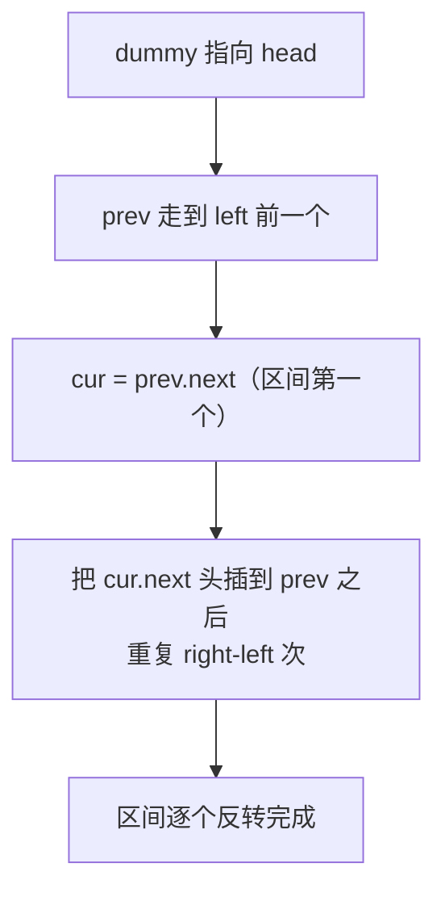

# 92. 反转链表 II

## 📌 题目

给你单链表的头指针 `head` 和两个整数 `left` 和 `right`，其中 `left <= right`。请反转从位置 `left` 到位置 `right` 的链表节点，返回反转后的链表。

```
输入：head = [1,2,3,4,5], left = 2, right = 4
输出：[1,4,3,2,5]
解释：反转下标 2~4 的节点 [2,3,4] → [4,3,2]
```

🔗 [LeetCode 92](https://leetcode.cn/problems/reverse-linked-list-ii/)

## 🎯 字节考察

> **CodeTop 字节后端榜 20 次**——[25. K 个一组翻转链表](../../08-链表/0025-K_个一组翻转链表.md)（字节第 1）的「区间版」前菜，常和 25 一起被追问。

- 来源：[CodeTop 字节后端榜](https://github.com/afatcoder/LeetcodeTop/blob/master/bytedance/backend.md)
- 考点：**头插法（穿针引线）**、虚拟头节点、边界处理

## 🛒 人话理解 & 🧠 思路演进



### 生活中的算法

一队人（1,2,3,4,5），要让你把第 2~4 个人（2,3,4）的顺序倒过来。一个省事办法：**固定住第 1 个人**，然后反复把后面的人「**插队到第 1 个人正后方**」——先把 3 插到 1 后面（1,3,2,4,5），再把 4 插到 1 后面（1,4,3,2,5）。每次「插队」就完成了一次局部反转。

### 思路演进

1. **切断重连法**：把区间拎出来反转再接回去——逻辑清楚，但要处理多个断点，容易写错。
2. **头插法（穿针引线，推荐）**：一遍遍历搞定。
   - 用 `dummy` 虚拟头统一处理 `left = 1` 的边界。
   - `prev` 走到 `left` 前一个节点；`cur = prev.next` 是待反转区间第一个。
   - 重复 `right - left` 次：把 `cur.next`「摘下来」头插到 `prev` 后面。
   - 每次「头插」相当于把后一个节点搬到区间最前，循环完区间就整体反转了。

> 💡 关键不变量：整个过程中 `cur` 始终指向「原区间第一个节点」（它会被不断后挤），`prev` 始终是区间前一个节点。记住这点，指针不会乱。

### 复杂度

- 时间：`O(n)`，一遍遍历
- 空间：`O(1)`

## 🐍 Python 代码

### 🥊 暴力解（朴素对照）

把链表节点值读进列表，反转 `[left-1:right]` 这一段，再重新串成链表——借助额外空间，逻辑最直白。

```python
from typing import Optional

class Solution:
    def reverseBetween(self, head: Optional[ListNode], left: int, right: int) -> Optional[ListNode]:
        # 1. 把所有节点值读进列表
        vals = []
        cur = head
        while cur:
            vals.append(cur.val)
            cur = cur.next

        # 2. 反转 [left-1, right-1] 这一段
        i, j = left - 1, right - 1
        while i < j:
            vals[i], vals[j] = vals[j], vals[i]
            i += 1
            j -= 1

        # 3. 按新顺序重建链表
        dummy = ListNode(0)
        tail = dummy
        for v in vals:
            tail.next = ListNode(v)
            tail = tail.next
        return dummy.next
```

- 时间复杂度：`O(n)`，遍历一遍 + 重建一遍
- 空间复杂度：`O(n)`，额外开了长度为 n 的 vals 列表
- ⚠️ 空间不是 `O(1)`，而且重建了新节点。用「头插法」原地穿针引线 → 演进到下方 `O(1)` 空间的指针操作解。

### ⚡ 最优解

```python
class Solution:
    def reverseBetween(self, head: Optional[ListNode], left: int, right: int) -> Optional[ListNode]:
        dummy = ListNode(0, head)      # 虚拟头，统一处理 left=1
        prev = dummy

        # 1. prev 走到 left 的前一个节点
        for _ in range(left - 1):
            prev = prev.next
        cur = prev.next                # 区间第一个节点（反转后变最后）

        # 2. 头插法：把 cur.next 插到 prev 之后，共 right-left 次
        for _ in range(right - left):
            nxt = cur.next             # 要摘下来前插的节点
            cur.next = nxt.next        # cur 跳过 nxt
            nxt.next = prev.next       # nxt 指向当前区间头
            prev.next = nxt            # prev 指向新的区间头 nxt

        return dummy.next
```

## 🔁 举一反三

- [206. 反转链表](../../08-链表/0206-反转链表.md)（Hot100）—— 全链反转，本题基础
- [25. K 个一组翻转链表](../../08-链表/0025-K_个一组翻转链表.md)（Hot100，字节 #1）—— 分组反转，本题进阶
- [24. 两两交换链表中的节点](../../08-链表/0024-两两交换链表中的节点.md)（Hot100）—— k=2 特例
