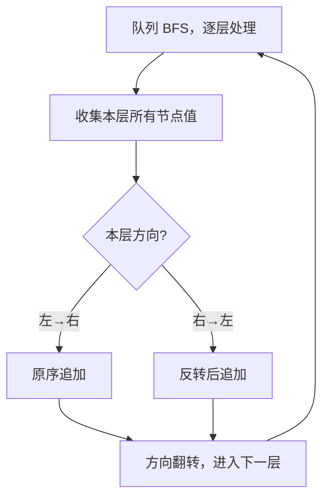

# 103. 二叉树的锯齿形层序遍历

## 📌 题目

给定二叉树的根节点 `root`，返回其节点值的**锯齿形层序遍历**。（即先从左往右，下一层再从右往左，交替进行）

```
输入：root = [3,9,20,null,null,15,7]
输出：[[3],[20,9],[15,7]]
解释：第 0 层 [3] 从左到右；第 1 层 [20,9] 从右到左；第 2 层 [15,7] 从左到右。
```

🔗 [LeetCode 103](https://leetcode.cn/problems/binary-tree-zigzag-level-order-traversal/)

## 🎯 字节考察

> **CodeTop 字节后端榜第 6 名，47 次**——频度仅次于 25/3/146/215/206，是字节二叉树类最高频题。牛客面经评论直言「蛇形打印二叉树考的也比较多」。

- 来源：[CodeTop 字节后端榜](https://github.com/afatcoder/LeetcodeTop/blob/master/bytedance/backend.md)、[牛客 389 面经](https://www.nowcoder.com/discuss/577995)
- 考点：**BFS 层序遍历** + 方向翻转

## 🛒 人话理解 & 🧠 思路演进



### 生活中的算法

想象你在图书馆一排排书架前走：第一排从左看到右，到头了折返，第二排就从右看到左……如此「之字形」走完每一排。锯齿形层序就是一层层「折返」地读取二叉树。

### 思路演进

1. **基础**：先会 [102. 二叉树层序遍历](../../09-二叉树/0102-二叉树的层序遍历.md)（BFS + 队列，每层一个列表）。
2. **加翻转**：只要在 102 的基础上，给每一层挂一个**方向标志**——奇数层正常收集、偶数层把本层结果**反转**一下即可。

> 💡 两种实现：
> - 简单版：收集完一层后，按方向 `reverse()`（O(每层长度)）。
> - 进阶版：用双端队列 `deque`，左→右层 `append`、右→左层 `appendleft`，避免反转。面试说得出进阶版加分。

### 复杂度

- 时间：`O(n)`，每个节点入队出队一次
- 空间：`O(n)`，队列最多存一层的节点

## 🐍 Python 代码

### 🥊 暴力解（朴素对照）

朴素 DFS：递归遍历、按深度把值塞进对应的层列表，最后把偶数层整体反转——递归栈 + 事后反转，思路最直白，没用到队列。

```python
from typing import List, Optional

class Solution:
    def zigzagLevelOrder(self, root: Optional[TreeNode]) -> List[List[int]]:
        levels = []

        def dfs(node: Optional[TreeNode], depth: int) -> None:
            if not node:
                return
            if depth == len(levels):          # 第一次到达该层，新建子列表
                levels.append([])
            levels[depth].append(node.val)    # 按左→右的原序收集
            dfs(node.left, depth + 1)
            dfs(node.right, depth + 1)

        dfs(root, 0)
        for d in range(1, len(levels), 2):    # 偶数下标层（第 1、3、5… 层）从右→左
            levels[d].reverse()
        return levels
```

- 时间复杂度：`O(n)`，每个节点访问一次
- 空间复杂度：`O(n)`，递归栈最坏链状 O(n) + 层结果 O(n)
- ⚠️ 依赖递归栈、事后整层反转。用迭代 BFS + 方向标志边遍历边处理 → 演进到下方更省栈、更紧凑的队列解。

### ⚡ 最优解

```python
from typing import List, Optional
from collections import deque

class Solution:
    def zigzagLevelOrder(self, root: Optional[TreeNode]) -> List[List[int]]:
        if not root:
            return []

        res = []
        q = deque([root])
        left_to_right = True   # 本层方向标志

        while q:
            level = []
            for _ in range(len(q)):          # 只处理当前层节点数
                node = q.popleft()
                level.append(node.val)
                if node.left:
                    q.append(node.left)
                if node.right:
                    q.append(node.right)
            if not left_to_right:            # 右→左层，反转
                level.reverse()
            res.append(level)
            left_to_right = not left_to_right  # 方向翻转

        return res
```

## 🔁 举一反三

- [102. 二叉树的层序遍历](../../09-二叉树/0102-二叉树的层序遍历.md)（Hot100）—— 本题的基础
- [107. 二叉树的层序遍历 II](https://leetcode.cn/problems/binary-tree-level-order-traversal-ii/) —— 自底向上
- [199. 二叉树的右视图](../../09-二叉树/0199-二叉树的右视图.md)（Hot100）—— 每层只取最右
