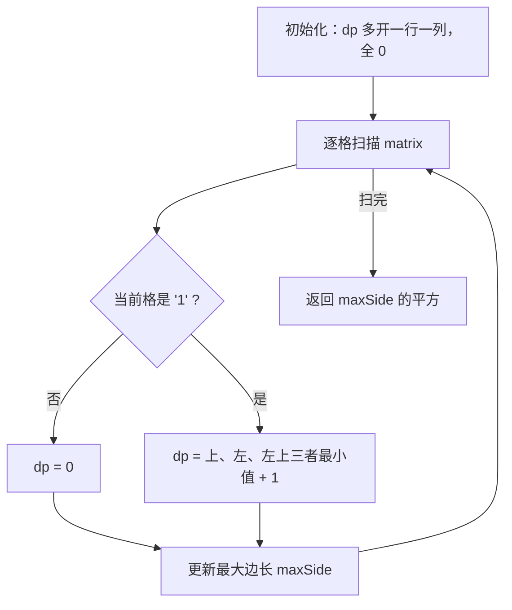
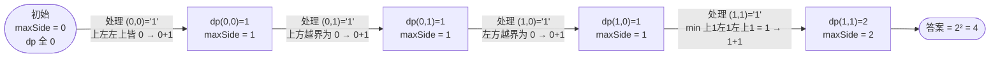

# 221. 最大正方形

## 📌 题目

在一个由 `'0'` 和 `'1'` 组成的二维二进制矩阵内，找到**只包含 `'1'` 的最大正方形**，并返回其面积。

```
输入：matrix = [["1","0","1","0","0"],
               ["1","0","1","1","1"],
               ["1","1","1","1","1"],
               ["1","0","0","1","0"]]
输出：4   （边长为 2 的正方形，面积 4）
```

🔗 [LeetCode 221](https://leetcode.cn/problems/maximal-square/)

## 🎯 字节考察

> **CodeTop 字节后端榜 14 次**——二维 DP 的代表题，Hot100 未收录，字节常考。

- 来源：[CodeTop 字节后端榜](https://github.com/afatcoder/LeetcodeTop/blob/master/bytedance/backend.md)
- 考点：**动态规划**、状态转移 `min(上, 左, 左上) + 1`

## 🛒 人话理解 & 🧠 思路演进



**总体一句话**：`dp[i][j]` 表示以 `(i,j)` 为右下角的最大全 1 正方形边长；当前格是 `'1'` 时，它只能在上、左、左上三者的最小值基础上 +1，扫完取最大边长的平方即为面积。

### 🔬 逐步推演（动画式）

以 `matrix = 1,1 / 1,1`（2×2 全 1）为例——从左到右就是算法的时间线：**每个节点是一次状态快照（dp 值 / 当前最大边长），箭头上写处理了哪个格子、怎么转移**：



### 生活中的算法

把 `'1'` 看作可搭积木的格子、`'0'` 是空地。以每个格子为**正方形的右下角**，能搭多大的正方形？取决于它**上方、左方、左上方**三个邻居——三者里最弱的那个，决定了能向左上扩展多少层。

### 思路演进

1. **暴力**：枚举每个格子作为左上角，尝试不断扩大正方形边长并验证全 1。`O(mn · min(m,n)²)`，太慢。
2. **DP（推荐）**：`dp[i][j]` = 以 `(i,j)` 为**右下角**的最大全 1 正方形**边长**。
   - 若 `matrix[i][j] == '1'`：`dp[i][j] = min(dp[i-1][j], dp[i][j-1], dp[i-1][j-1]) + 1`
   - 否则 `dp[i][j] = 0`。
   - 多开一行一列（`dp` 尺寸 `(m+1)×(n+1)`），省去第一行/第一列的边界判断。

> 💡 转移式的直觉：要形成边长 `k` 的正方形，`(i,j)` 的上、左、左上三个方向都必须至少能形成边长 `k-1` 的正方形，所以取三者最小值再 +1。

### 复杂度

- 时间：`O(m·n)`
- 空间：`O(m·n)`，可滚动数组优化到 `O(n)`

## 🐍 Python 代码

### 🥊 暴力解（朴素对照）

以每个 `'1'` 格子为左上角，逐步扩大正方形边长，逐格验证是否全 `'1'`——思路最直白，但重复检查同一片区域。

```python
from typing import List

class Solution:
    def maximalSquare(self, matrix: List[List[str]]) -> int:
        if not matrix:
            return 0
        m, n = len(matrix), len(matrix[0])
        max_side = 0

        for i in range(m):
            for j in range(n):
                if matrix[i][j] != '1':
                    continue
                # 以 (i,j) 为左上角，尝试扩大边长 k
                k = 1
                while i + k < m and j + k < n:
                    # 检查新增的第 k 行、第 k 列是否全为 '1'
                    ok = True
                    for d in range(k + 1):
                        if matrix[i + k][j + d] != '1' or matrix[i + d][j + k] != '1':
                            ok = False
                            break
                    if not ok:
                        break
                    k += 1
                max_side = max(max_side, k)

        return max_side * max_side   # 面积 = 边长²
```

- 时间复杂度：`O(m·n·min(m,n)²)`，每个格子都要反复扫描子区域
- 空间复杂度：`O(1)`
- ⚠️ 大量重复验证，会超时。发现「以 `(i,j)` 为右下角的边长」可由上、左、左上三格转移而来 → 演进到下方 `O(m·n)` 的二维 DP。

### ⚡ 最优解

```python
from typing import List

class Solution:
    def maximalSquare(self, matrix: List[List[str]]) -> int:
        if not matrix:
            return 0
        m, n = len(matrix), len(matrix[0])
        dp = [[0] * (n + 1) for _ in range(m + 1)]   # 多开一行一列，简化边界
        max_side = 0

        for i in range(m):
            for j in range(n):
                if matrix[i][j] == '1':
                    dp[i + 1][j + 1] = min(dp[i][j],        # 左上
                                           dp[i + 1][j],    # 左
                                           dp[i][j + 1]) + 1  # 上
                    max_side = max(max_side, dp[i + 1][j + 1])

        return max_side * max_side   # 面积 = 边长²
```

## 🔁 举一反三

- [1277. 统计全为 1 的正方形子矩阵](https://leetcode.cn/problems/count-square-submatrices-with-all-ones/) —— 同一 DP，改为计数
- [85. 最大矩形](https://leetcode.cn/problems/maximal-rectangle/) —— 升级版，需单调栈
- [200. 岛屿数量](../../10-图论/0200-岛屿数量.md)（Hot100）—— 矩阵遍历的另一经典
