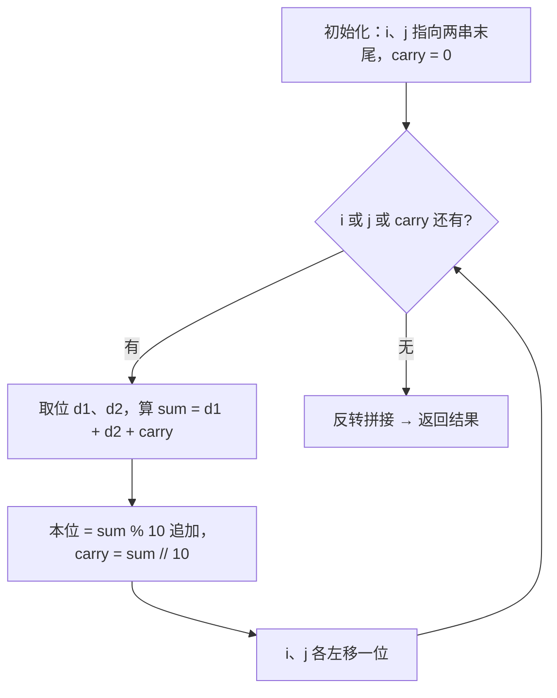
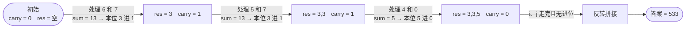

# 415. 字符串相加

## 📌 题目

给定两个字符串形式的非负整数 `num1` 和 `num2`，计算它们的和并同样以字符串形式返回。

**你不能使用任何内建的 BigInteger 库，也不能直接把输入字符串转换为整数。**

```
输入：num1 = "11", num2 = "123"
输出："134"

输入：num1 = "456", num2 = "77"
输出："533"
```

🔗 [LeetCode 415](https://leetcode.cn/problems/add-strings/)

## 🎯 字节考察

> 字节招牌题，大数运算系列入门。常与 [43. 字符串相乘](0043-字符串相乘.md) **联动考察**——面试官先让你手写加法，再追乘法。

- 来源：[牛客 389 篇字节面经统计](https://www.nowcoder.com/discuss/577995)、[力扣官方题解（高频面试系列）](https://leetcode.cn/problems/add-strings/)
- 考点：**字符串模拟**、**进位处理**、边界（空串、前导零）

## 🛒 人话理解 & 🧠 思路演进



**总体一句话**：模拟小学竖式加法——两指针从字符串末尾向前，每次取一位相加再加进位，个位追加到结果、十位留给下一轮，最后反转拼接。

### 🔬 逐步推演（动画式）

以 `num1 = "456"、num2 = "77"` 为例——从左到右就是算法的时间线：**每个节点是一次状态快照（本位结果 / 进位），箭头上写处理了哪两位、怎么决策**：



### 生活中的算法

就是小学竖式加法。两个数右对齐，从个位开始逐位相加，满十进一：

```
   4 5 6
+    7 7
-------
   5 3 3
```

字符串不能直接转 int（会溢出/违规），所以**一位一位取字符、手动算进位**。

### 思路演进

1. **禁止的偷懒法**：`str(int(num1) + int(num2))`——题目明确不允许，且数字极大时会溢出。
2. **正确做法**：两个指针 `i`、`j` 分别从 `num1`、`num2` 末尾往前走，维护进位 `carry`，每次把 `d1 + d2 + carry` 的个位追加到结果、十位留给下一轮。

### 复杂度

- 时间：`O(max(m, n))`，遍历较长串
- 空间：`O(max(m, n))`，存结果

## 🐍 Python 代码

### 🥊 暴力解（朴素对照·违规）

最直觉的偷懒法——直接转 int 相加再转回字符串。**但题目明确禁止**（不能用 BigInteger、不能整串转 int），也违背了「手算模拟」的考察意图。

```python
class Solution:
    def addStrings(self, num1: str, num2: str) -> str:
        # ⚠️ 违规：题目禁止整串转 int / 使用 BigInteger
        return str(int(num1) + int(num2))
```

- 时间复杂度：`O(max(m, n))`（大整数加法本身）
- 空间复杂度：`O(max(m, n))`
- ⚠️ **不满足题目要求**（禁用整串转 int / BigInteger），仅作思路对照。面试官要的是「逐位模拟手算」→ 见下方最优解。

### ⚡ 最优解（竖式模拟·双指针）

```python
class Solution:
    def addStrings(self, num1: str, num2: str) -> str:
        i, j = len(num1) - 1, len(num2) - 1
        carry = 0
        res = []

        # 任一指针没走完、或还有进位，就继续
        while i >= 0 or j >= 0 or carry:
            d1 = ord(num1[i]) - ord('0') if i >= 0 else 0
            d2 = ord(num2[j]) - ord('0') if j >= 0 else 0
            s = d1 + d2 + carry
            carry = s // 10          # 进位
            res.append(str(s % 10))  # 本位
            i -= 1
            j -= 1

        # 结果是逆序追加的，反转回来
        return ''.join(reversed(res))
```

> 💡 `ord(c) - ord('0')` 把字符转数字，绕开「整串转 int」的限制。

## 🔁 举一反三

- [43. 字符串相乘](0043-字符串相乘.md)（本目录）—— 乘法内部会调用加法逻辑
- [66. 加一](https://leetcode.cn/problems/plus-one/)（🔜 待补充）—— 数组版「+1」
- [67. 二进制求和](https://leetcode.cn/problems/add-binary/) —— 同套路，进制改成 2
- 大数减法 / 大数除法 —— 进位换成借位 / 逐位试商
