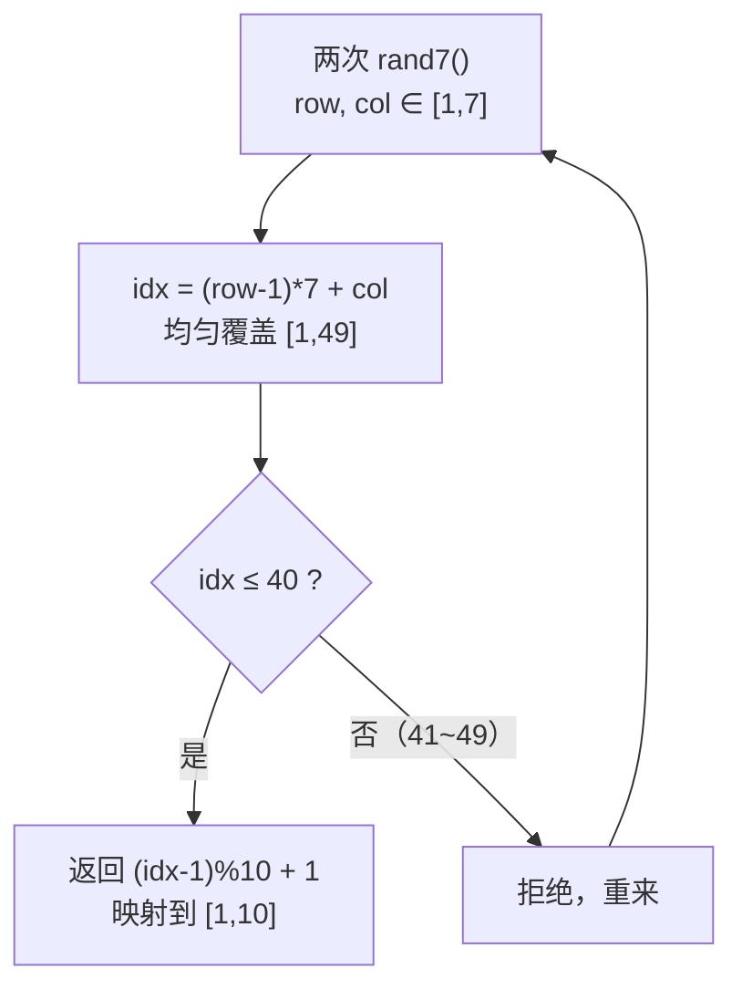

# 470. 用 Rand7() 实现 Rand10()

## 📌 题目

给定已有方法 `rand7()` 可生成 `[1, 7]` 范围内的**均匀随机整数**。请实现方法 `rand10()`，生成 `[1, 10]` 范围内的均匀随机整数。

**注意**：只能调用 `rand7()`，不能使用系统的 `random` 等库。

🔗 [LeetCode 470](https://leetcode.cn/problems/implement-rand10-using-rand7/)

## 🎯 字节考察

> **CodeTop 字节后端榜 13 次**——字节特色的**概率 / 拒绝采样**题，Hot100 没有，区分度高，面试官爱用来筛人。

- 来源：[CodeTop 字节后端榜](https://github.com/afatcoder/LeetcodeTop/blob/master/bytedance/backend.md)
- 考点：**均匀分布**、**拒绝采样（rejection sampling）**

## 🛒 人话理解 & 🧠 思路演进



### 生活中的算法

你只有一个 7 面骰，要等概率掷出 1~10。办法：**掷两次**，第一次当「十位」、第二次当「个位」，能均匀凑出 49 种结果（1~49）。但 49 不是 10 的倍数，41~49 这 9 个结果会破坏均匀性——所以**直接丢掉它们重新掷**，只用前 40 个（40 = 4×10，正好 4 个映射到 1 个输出）。

### 思路演进

1. **错误做法**：`rand7() % 10 + 1`——`1~7` 映射后 `8,9,10` 永远不会出现，且分布严重不均。
2. **拒绝采样（推荐）**：
   - 两次 `rand7()` 构造 `(row-1)*7 + col`，得到 `[1,49]` 的**均匀分布**。
   - 拒绝 `41~49`（保留 `[1,40]`），保证每个输出等概率。
   - `[1,40]` 按 `(idx-1) % 10 + 1` 映射到 `[1,10]`，每个数恰好对应 4 个 idx，均匀。

> 💡 为什么必须拒绝 41~49？因为 49 ÷ 10 除不尽，多余的 9 个结果若强行取模，会让 `1~9` 比 `10` 多一个来源，分布不均。丢掉它们是保证「等概率」的关键。

> 📈 期望调用次数：单轮命中概率 `40/49`，期望 `49/40 ≈ 1.225` 轮，每轮 2 次 `rand7()`，故约 **2.45 次 `rand7()` 生成 1 个 `rand10()`**。

### 复杂度

- 期望时间：`O(1)`（几何分布，期望常数次重试）
- 空间：`O(1)`

## 🐍 Python 代码

### ❌ 错误解对照

最直觉的 `rand7() % 10 + 1` 看似能映射到 `[1,10]`，实则是**错误解**——`rand7()` 只能产生 `1~7`，取模后 `8,9,10` 永远不会出现，且 `1~7` 各自的概率也参差不齐，根本不满足「均匀分布」。

```python
# ❌ 错误解：rand7() % 10 + 1
def rand10(self):
    return rand7() % 10 + 1
# rand7() ∈ {1,2,3,4,5,6,7}
# %10+1 → {2,3,4,5,6,7,8}，8,9,10 出现概率为 0，1 出现概率为 0，分布严重不均
```

- ❌ `rand7()` 只覆盖 `1~7`，`% 10` 后无法均匀映射到 `1~10`
- `1` 与 `9,10` 的出现概率为 0，其余也各不相等，**不满足均匀随机**
- ⚠️ 正确做法需先用两次 `rand7()` 拼出更宽的均匀分布，再「拒绝采样」舍弃多余的取值，见下方最优解。

### ⚡ 最优解

```python
def rand10(self):
    while True:
        row = rand7()                      # 1~7
        col = rand7()                      # 1~7
        idx = (row - 1) * 7 + col          # 均匀覆盖 1~49
        if idx <= 40:                      # 拒绝 41~49，保证均匀
            return (idx - 1) % 10 + 1      # 映射到 1~10
```

## 🔁 举一反三

- [470. 用 Rand7() 实现 Rand10()](https://leetcode.cn/problems/implement-rand10-using-rand7/) —— 本题
- 用 Rand5() 实现 Rand7() —— 同款拒绝采样，反向练习
- 水塘抽样（[384/382](https://leetcode.cn/problems/linked-list-random-node/)）—— 另一类经典概率题
